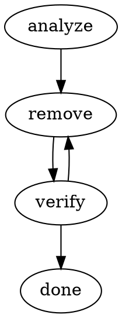

# Attractor

A non-interactive coding agent for software factories. Attractor orchestrates LLM-driven workflows defined as GraphViz DOT pipelines, executing them through an autonomous agent with tool-use capabilities.

## What It Does

Attractor lets you define multi-step coding workflows as directed acyclic graphs (DAGs) in GraphViz DOT format. Each node in the graph dispatches to a handler — typically the built-in `codergen` handler, which drives an LLM through an agentic loop of reading, writing, and editing code until the task is complete. Nodes communicate through a shared context, and edges can use conditions to route execution based on results.



```bash
attractor run refactor.dot --model claude-sonnet-4-20250514 --verbose
```

## Key Features

- **Pipeline-as-code** — Define workflows in GraphViz DOT with conditional branching, priority-based routing, and goal gates
- **Autonomous agent** — Agentic loop with file read/write/edit, shell execution, grep, glob, and patch tools
- **Multi-provider LLM support** — Anthropic (Claude), OpenAI (GPT), and Google (Gemini) through a unified interface
- **Checkpoint & resume** — Automatic checkpointing after every node; resume failed pipelines from where they stopped
- **Extensible** — Protocol-based architecture for custom handlers, LLM adapters, tools, and middleware

## Installation

Requires **Python 3.11+** and at least one LLM provider API key.

```bash
# Clone and install with uv (recommended)
git clone https://github.com/jawhnycooke/attractor.git
cd attractor
uv venv && source .venv/bin/activate
uv pip install -e ".[dev]"

# Or with pip
python -m venv .venv && source .venv/bin/activate
pip install -e ".[dev]"
```

Set your API key(s):

```bash
export ANTHROPIC_API_KEY="sk-..."   # For Claude models
export OPENAI_API_KEY="sk-..."      # For GPT models
export GOOGLE_API_KEY="..."         # For Gemini models
```

## Usage

### Run a pipeline

```bash
attractor run pipeline.dot --model gpt-4o --verbose
```

### Validate without executing

```bash
attractor validate pipeline.dot --strict
```

### Resume from a checkpoint

```bash
attractor resume .attractor/checkpoints/checkpoint_*.json --pipeline-dot pipeline.dot
```

## Architecture

```
CLI (click + rich)
 └─ Pipeline Engine ── Parses DOT → validates → walks DAG → dispatches handlers
      └─ Agent Session ── Agentic loop: prompt → tool calls → results → repeat
           └─ LLM Client ── Routes to provider adapters (Anthropic, OpenAI, Gemini)
```

| Subsystem | Purpose |
|---|---|
| `attractor.pipeline` | DAG execution engine — DOT parsing, condition routing, checkpointing, stylesheets, goal gates |
| `attractor.agent` | Autonomous coding agent — session lifecycle, tool registry, loop detection, output truncation |
| `attractor.llm` | Provider-agnostic LLM client — adapter routing, middleware pipeline, streaming, structured output |

## Documentation

Full documentation follows the [Diataxis](https://diataxis.fr/) framework:

| Document | Description |
|---|---|
| [Tutorial: Getting Started](docs/tutorials/getting-started.md) | Step-by-step guide to install Attractor, create your first pipeline, and run it |
| [How-to Guides](docs/how-to/common-tasks.md) | Practical recipes for common tasks — custom handlers, new providers, conditional branching, and more |
| [API Reference](docs/reference/api-reference.md) | Complete reference for the CLI, pipeline, agent, and LLM client APIs |
| [Architecture Explanation](docs/explanation/architecture.md) | Design decisions, trade-offs, and the mental models behind Attractor's three-layer architecture |

## Development

```bash
# Run tests
pytest -v

# Run tests with coverage
pytest --cov=src/attractor --cov-report=html

# Format
black . --line-length 88

# Lint
ruff check .

# Type check
mypy . --strict
```

## License

Apache-2.0
