# Understanding Attractor's Architecture

> **Purpose**: This document explains why Attractor is designed the way it is — the forces that shaped its three-layer architecture, the reasoning behind key decisions, and the mental models that make the system coherent.
> **Audience**: Developers integrating with Attractor, contributors extending it, and architects evaluating it for adoption.
> **Prerequisite Knowledge**: Familiarity with LLM tool-use patterns, directed acyclic graphs, and Python async programming.

---

## The Big Picture

Attractor is a non-interactive coding agent designed for use in software factories — automated environments where code is generated, tested, reviewed, and deployed without human intervention on every step. The name "attractor" comes from dynamical systems theory: a basin of attraction is a region toward which a system naturally evolves. Attractor pipelines are designed to pull a codebase toward a desired state through repeated, directed LLM-driven transformations.

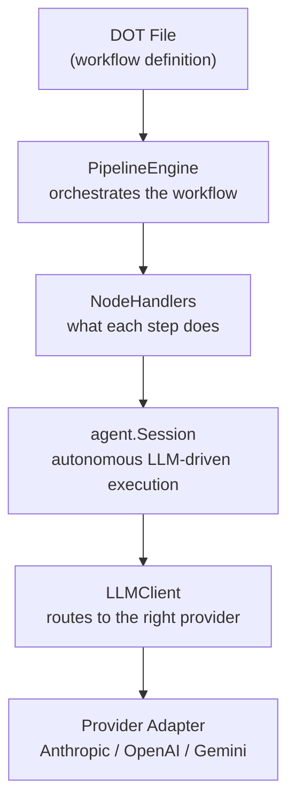

This is a composition of three concerns kept deliberately separate: the shape of the workflow (pipeline), the act of autonomous coding (agent), and the mechanics of talking to language models (LLM). Each layer knows about the layer below it and nothing about the layer above. This directionality keeps each layer independently testable and replaceable.

### Why This Matters

Understanding the architecture lets you reason about where to intervene when things go wrong, where to add new capabilities, and what guarantees each layer provides. A pipeline failure has a different root cause and remedy than an agent loop failure or an LLM adapter error. The three-layer mental model is the fastest path to correct diagnosis.

---

## Historical Context

### The Problem Space

Traditional CI/CD pipelines orchestrate deterministic steps: compile, test, deploy. The outputs are predictable given the inputs. LLM-driven workflows are different. When you ask a model to "fix the authentication bug," the path from request to resolution is not deterministic — the model makes decisions, reads files, writes code, runs tests, and adapts based on what it observes.

Early approaches to LLM automation fell into two traps. The first trap was making everything interactive: a human had to approve each action. This produces safe but slow workflows that do not scale to software factories. The second trap was making everything a single prompt: hand the model a large context and hope it produces the right output in one shot. This fails for multi-step tasks where intermediate results must inform later steps.

Attractor occupies the space between these extremes. It commits fully to non-interactive, autonomous execution while still providing structure that constrains what the LLM can do and where the workflow can go.

### The Software Factory Concept

A software factory is an industrial metaphor: a system that takes requirements as inputs and produces working software as outputs, reliably and repeatably. The factory framing emphasizes that the same process should work the same way each time it runs — not as a one-off, but as a repeatable production line.

This framing has direct architectural consequences. Factories need:

- **Defined workflow shapes** — what steps happen in what order
- **Checkpointing** — the ability to resume a partially-completed run
- **Observability** — knowing what happened at each step
- **Composability** — reusing workflow fragments across products

DOT pipelines, checkpoints, event streaming, and the handler registry exist because software factories require all four.

### Why DOT/GraphViz for Pipeline Definition

The choice of GraphViz DOT format for workflow definition deserves explanation, because it is not obvious. The alternatives considered include:

- **YAML/JSON workflow files** (as in GitHub Actions or Argo Workflows)
- **Python code** (as in Prefect or Airflow)
- **Domain-specific languages**

DOT was chosen for three reasons. First, DOT is declarative and visual: a DOT file describes a graph, and that graph can be rendered visually with standard tooling (`dot`, `xdot`, VS Code extensions). Workflow authors can see the shape of their pipeline before running it. Second, DOT has a rich ecosystem of parsers and validators. `pydot` and `networkx` give Python access to DOT files without building a parser from scratch. Third, DOT's attribute syntax is expressive enough to carry node configuration (`handler_type`, `prompt`, `model`) directly in the graph definition, avoiding the split configuration problem where workflow shape lives in one file and node configuration lives in another.

The tradeoff is that DOT is not a standard configuration format and is unfamiliar to most developers. Teams accustomed to YAML will find the syntax initially strange. The bet is that the visual rendering payoff outweighs the learning curve.

---

## Core Concepts

### The Three-Layer Architecture

Attractor separates its concerns into three layers with a strict dependency direction:

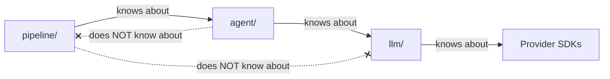

**Mental Model**: Think of the layers like a restaurant. The `llm/` layer is the kitchen — it produces responses when given requests. The `agent/` layer is the waiter — it takes a customer's goal, places orders with the kitchen, collects results, and keeps the conversation going until the customer is satisfied. The `pipeline/` layer is the restaurant manager — it decides which tables (nodes) get served in which order, and ensures the customer journey (workflow) completes according to the reservation (DOT file).

Each layer has a clean interface:

- `LLMClient.complete(request) -> Response` — kitchen produces a meal
- `Session.submit(prompt) -> AsyncIterator[AgentEvent]` — waiter handles a customer
- `PipelineEngine.run(pipeline) -> PipelineContext` — manager runs the restaurant

### PipelineContext as Shared Blackboard

`PipelineContext` is the central data structure that makes multi-step workflows coherent. It is a simple key-value store that all nodes can read from and write to. This is an implementation of the Blackboard architectural pattern, common in AI planning systems.

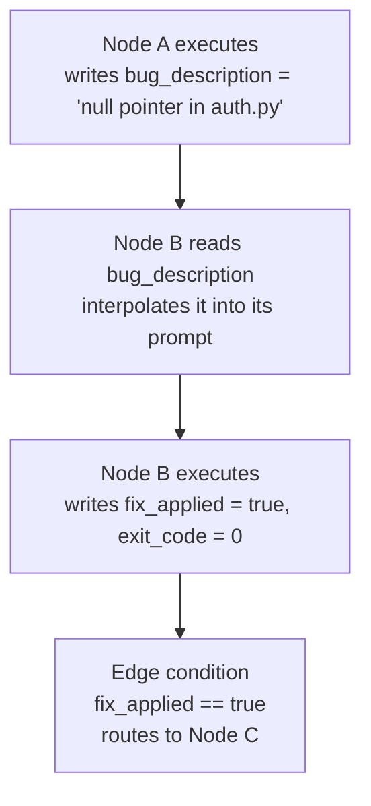

The blackboard is flat (no nesting) but uses naming conventions for organization. Internal engine keys are prefixed with `_` (`_last_error`, `_failed_node`, `_completed_nodes`). Handler-produced keys use plain names (`exit_code`, `approved`, `last_codergen_output`). Dotted keys like `branch_name.result` appear when `ParallelHandler` merges scoped sub-contexts back into the main context.

**Why flat rather than hierarchical?** Because condition expressions are evaluated by a simple AST walker, not a full expression language. A flat namespace with dotted key support (`result.status`) covers the practical cases without requiring a query language. Hierarchy would complicate both the expression evaluator and the checkpoint serialization without commensurate benefit.

---

## The Pipeline Execution Model

### DAG Traversal Strategy

The `PipelineEngine` walks the pipeline graph sequentially, one node at a time, in a `while` loop with a `max_steps` safety limit. This is single-threaded at the pipeline level — no two nodes execute simultaneously (unless a node explicitly fans out via `ParallelHandler`).

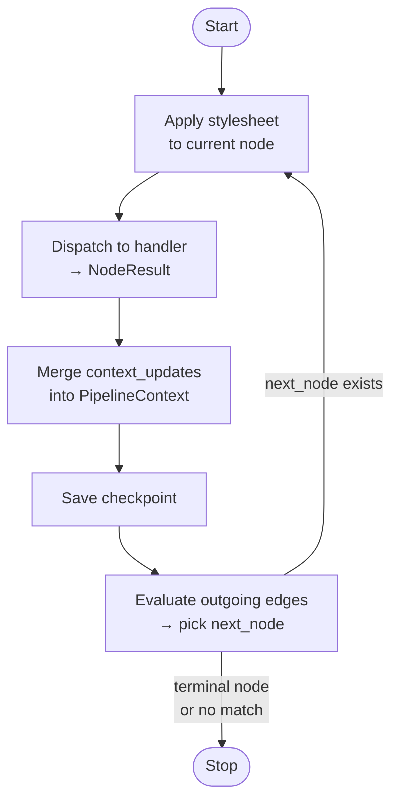

**Why single-threaded?** Because the pipeline's value is its predictability. Parallel execution of pipeline nodes would create race conditions on the shared `PipelineContext`, complicate checkpointing (which snapshot do you save?), and make debugging much harder. The tool-level parallelism that matters — the concurrent execution of multiple tool calls within a single agent invocation — happens inside the agent layer, where the scope is well-defined.

The tradeoff is that independent pipeline branches (for example, "generate tests" and "generate documentation" simultaneously) must be explicit: either a `ParallelHandler` node fans out to concurrent sub-executions, or the workflow accepts sequential execution. For most software factory use cases, sequential execution is not a bottleneck because each node's LLM call dominates the runtime.

### Edge Routing and Priority-Based Conditions

After each node completes, the engine evaluates outgoing edges to determine the next node. Edges are sorted by `priority` (ascending — lower number means higher priority), and the first edge whose condition evaluates to `True` wins. An unconditional edge (`condition=None`) serves as the fallback — the default route if no conditional edge matches.

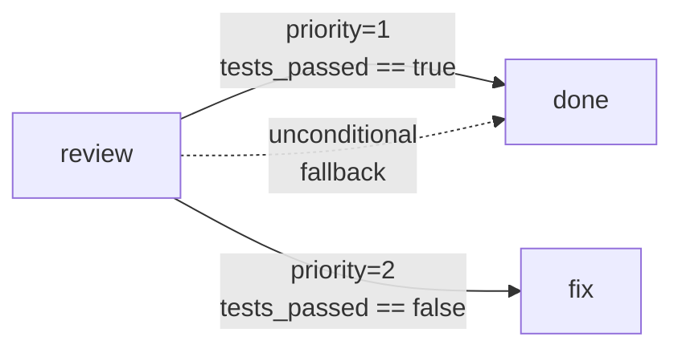

A handler can bypass this mechanism entirely by returning a `NodeResult` with `next_node` set. This allows handlers that understand the workflow shape (like `ConditionalHandler`) to perform their own routing logic before the engine's edge evaluation runs.

**Why priority numbers rather than order of declaration?** DOT files do not preserve edge declaration order reliably across all parsers. An explicit `priority` attribute makes the routing intent clear in the file itself and survives any parsing reordering.

### AST-Based Condition Evaluation

Edge conditions like `"exit_code == 0 and retries < 3"` must be evaluated against the pipeline context at runtime. Python's built-in `exec` and dynamic code execution functions could handle this — but at significant cost to security.

Dynamic code execution runs arbitrary code. In a software factory context, DOT pipeline files might come from external sources, version control, or generated tooling. Allowing arbitrary code execution in conditions would make the pipeline a code injection vector — any attacker who could modify a DOT file could execute arbitrary code in the pipeline process.

The AST-based evaluator in `conditions.py` parses the expression into an abstract syntax tree and then walks only the specific node types it explicitly supports: comparisons (`==`, `!=`, `<`, `>`, `<=`, `>=`), boolean operations (`and`, `or`, `not`), identifiers (resolved to context values), and literals. Any other AST node type raises a `ConditionError`. The condition grammar is intentionally small and verifiable.

```python
# Supported: safe, predictable
"exit_code == 0 and tests_passed == true"
"review_score >= 7 or approved == true"

# Rejected by the evaluator: unsupported AST node type
"__import__('os').system('rm -rf /')"
```

The tradeoff is expressive power. Conditions cannot call functions, perform arithmetic, or use list operations. Complex routing logic must be pushed into the handler's `next_node` return value rather than expressed as an edge condition. This is an acceptable tradeoff for the safety guarantee.

### Checkpoint-Based Resumability

After every node completes, the engine writes a `Checkpoint` to disk if a checkpoint directory is configured. The checkpoint captures the pipeline name, the node that just executed, the full `PipelineContext`, and the list of completed nodes.

```json
{
  "pipeline_name": "fix_auth_bug",
  "current_node": "run_tests",
  "context": {"fix_applied": true, "exit_code": 0},
  "completed_nodes": ["analyze", "generate_fix", "apply_fix", "run_tests"],
  "timestamp": 1708000000.0
}
```

The `resume` command reads a checkpoint file and calls `PipelineEngine.run()` with the checkpoint as the starting state. The engine skips directly to the node recorded in the checkpoint rather than starting from the beginning.

**Why checkpoint after every node rather than at intervals?** Because LLM calls are expensive in time and money. If a ten-node pipeline fails on node eight, rerunning from the start wastes seven completed LLM calls. Checkpointing after every node ensures that a resume always picks up at the most recent completed state.

The tradeoff is storage overhead. A ten-step pipeline produces ten checkpoint files. The `checkpoint_{timestamp_ms}.json` naming scheme with millisecond timestamps ensures uniqueness and allows the `latest_checkpoint()` function to find the most recent file by sorting lexicographically. Old checkpoints accumulate and require manual or automated cleanup.

### Goal Gates

A `GoalGate` is an optional guard checked before the engine exits through a terminal node. It specifies two things: a set of node names that must appear in the completed list, and a set of context conditions that must all be true.

```python
GoalGate(
    required_nodes=["run_tests", "security_scan"],
    context_conditions=["tests_passed == true", "vulnerabilities == 0"],
)
```

If the gate fails, the engine records the unmet requirements in the context under `_goal_gate_unmet` and logs a warning, but still exits. It does not block completion — the goal gate is an observability mechanism, not a hard constraint. The rationale is that blocking exit on an unmet goal gate would create pipelines that cannot terminate in failure cases, which is worse than pipelines that complete but record their failure.

**Mental Model**: The goal gate is a postcondition checker, not a precondition enforcer. It answers "did this pipeline achieve what it set out to do?" rather than "is it allowed to finish?"

### Stylesheets: Separating Workflow Shape from Model Configuration

A `ModelStylesheet` decouples the workflow's structural definition (the DOT file) from its model configuration (which model to use, at what temperature, with what token limit).

Without stylesheets, a DOT file that uses a specific model is tied to that model. Switching from `gpt-4o` to `claude-3-5-sonnet` requires editing the DOT file, which conflates workflow shape with deployment configuration.

With stylesheets, the DOT file describes the workflow's intent, and the stylesheet applies model defaults by matching handler types or node name patterns:

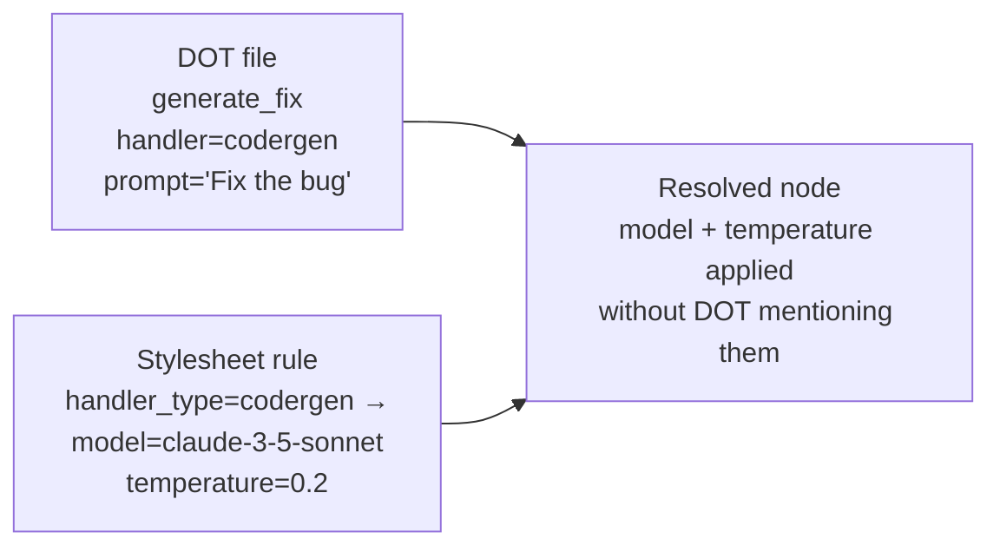

Node-specific attributes always override stylesheet defaults, so the DOT file retains the ability to pin a specific model for nodes where it matters. The stylesheet is the policy; the DOT file is the exception list.

---

## The Agentic Loop

### The Prompt-Tool-Result Cycle

The core mechanism of the agent layer is a loop that repeats until the LLM produces a response with no tool calls:

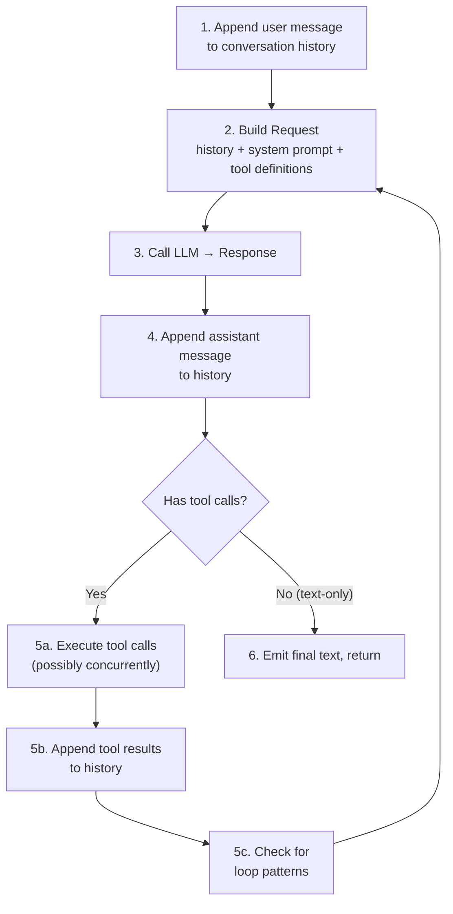

Each iteration of this loop is called a "turn." The conversation history grows with each turn — user input, assistant response, tool calls, tool results, the next assistant response, and so on. The model sees the entire conversation on every LLM call, which is how it accumulates knowledge about the work it has done.

**Mental Model**: Think of the loop as a terminal session where the LLM is typing commands. The system prompt describes the terminal environment, the tool calls are the commands, the tool results are the terminal output, and the final text response is the "work is done" message the LLM types before logging out.

### Async-First Design

Every I/O operation in Attractor is async. File reads, shell command execution, LLM API calls, and event delivery all use `async/await`. This is not just a stylistic choice.

The key benefit is that when the LLM returns multiple tool calls in a single response, those tools execute concurrently via `asyncio.gather`. If the model decides to read three files simultaneously, those three reads happen in parallel rather than sequentially. For I/O-bound operations — which is most of what the agent does — this produces meaningful speedups.

The secondary benefit is that the event delivery mechanism (streaming agent events to callers via `AsyncIterator`) does not require spawning additional threads. The `EventEmitter` uses `asyncio.Queue` internally: the loop puts events onto the queue, and the caller drains the queue by iterating asynchronously. This is more efficient and compositional than a callback-based design.

```python
# The loop runs as a background task
task = asyncio.create_task(_run_loop())

# The caller iterates events as they arrive
async for event in emitter:
    print(event.type, event.data)

await task  # ensure the loop finishes cleanly
```

**Why `AsyncIterator` instead of callbacks?** Callbacks invert control. The caller must register callbacks before starting the loop, and the callback's execution context is inside the loop's execution. This makes it difficult to pause the loop, apply backpressure, or compose multiple event sources. An `AsyncIterator` restores normal control flow: the caller drives the iteration at its own pace, and the `asyncio.Queue` buffers events between the producer (the loop) and the consumer (the caller).

### Loop Detection: Preventing Infinite Cycles

LLMs can get stuck. A model might repeatedly call `grep` with the same pattern, or `read_file` and `write_file` in an alternating cycle, never making progress. Without intervention, the agent loop would run until it hits a turn limit or exhausts the token budget.

The `LoopDetector` watches the sequence of tool calls and looks for repeating patterns of length one, two, or three within a sliding window of ten calls. A pattern must repeat at least three consecutive times before triggering a warning. The pattern is fingerprinted by hashing the tool name plus a hash of the arguments, so `read_file(path="a.py")` and `read_file(path="b.py")` are different fingerprints even though they call the same tool.

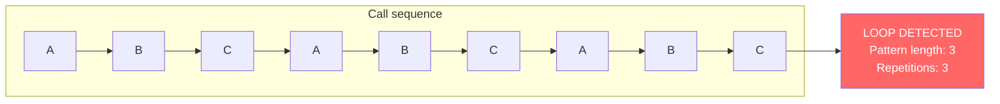

When a loop is detected, the warning is injected as a user message into the conversation history, so the model can read it and adjust its strategy. This is more effective than silently breaking the loop because the model needs to understand why it stopped and choose a different path.

**Why fingerprint by arguments and not just tool name?** A model that calls `read_file` on different files each turn is exploring the codebase — that is progress, not a loop. Fingerprinting by arguments distinguishes genuine exploration from being stuck.

### Output Truncation: Managing Context Window Limits

LLM context windows are finite. When the agent reads a large file or runs a shell command with extensive output, the raw result might consume most of the available context, crowding out the conversation history and reducing the model's ability to reason about prior actions.

Attractor applies a two-stage truncation pipeline to every tool result before it enters conversation history. Stage one trims by character count, keeping the head and tail of the output and replacing the middle with a warning marker. Stage two trims by line count, applying the same head-tail strategy.

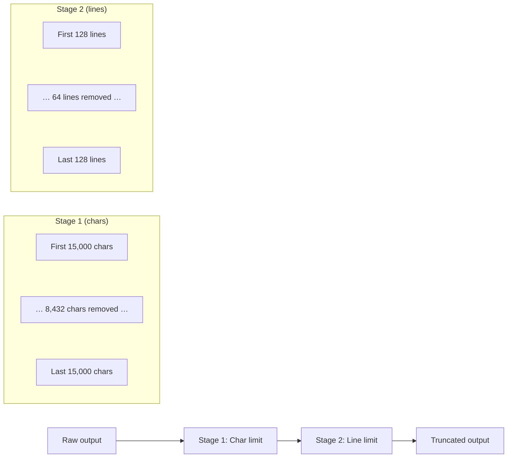

Each tool has its own limits, calibrated to its typical output characteristics. `read_file` gets a generous character limit because reading files is fundamental. `write_file` gets a minimal limit because its output is just a confirmation. `shell` gets a strict line limit because command output often contains thousands of repetitive log lines.

The original untruncated output is preserved in `ToolResult.full_output` and reported in the `TOOL_CALL_END` event, so external observers (like a logging system or a human reviewing a run) can see the complete output even though the model cannot.

**Why head-plus-tail rather than just head?** The end of a file or command output is often where the most important information lives — the final error message, the test summary, the last log entry. Truncating only from the middle preserves both context (the beginning) and conclusion (the end).

### The ExecutionEnvironment Abstraction

Every file operation, shell command, and search query goes through the `ExecutionEnvironment` protocol rather than calling `os`, `pathlib`, or `subprocess` directly.

```python
# The agent tool calls this:
await env.read_file("src/auth.py", offset=10, limit=50)

# In production: LocalExecutionEnvironment reads from disk
# In tests: MockEnvironment returns fixture data
# In future: RemoteEnvironment reads from a container
```

This indirection serves several purposes. In tests, mock environments provide deterministic responses without touching the filesystem, making tests fast and hermetic. In the future, a `RemoteExecutionEnvironment` could route file operations to a container or VM, enabling sandboxed agent execution. The protocol boundary makes this substitution invisible to the rest of the system.

The `LocalExecutionEnvironment` adds one important security feature: it filters sensitive environment variables (`*_API_KEY`, `*_SECRET`, `*_TOKEN`, `*_PASSWORD`) before passing the environment to subprocess calls. This prevents a shell command from exfiltrating API keys that happen to be present in the parent process's environment.

---

## The Provider Abstraction

### Why a Unified LLM Interface

The LLM provider landscape is fragmented and rapidly evolving. Anthropic, OpenAI, and Google each have distinct API shapes, message formats, tool-call conventions, and streaming protocols. Building directly against any one provider's SDK would tie Attractor to that provider's design decisions.

The `LLMClient` and `ProviderAdapter` protocol provide a unified interface that hides provider differences behind a common model: `Request` to `Response`, with `Message`, `ContentPart`, and `ToolDefinition` as the shared vocabulary.

Provider-specific quirks are isolated to their adapters. For example, the Anthropic API requires strict alternation between `user` and `assistant` roles in the message list — consecutive messages with the same role cause an API error. The `AnthropicAdapter` handles this by inserting synthetic placeholder messages when it detects consecutive same-role messages. The rest of the system is completely unaware this normalization happens.

Similarly, Anthropic's "extended thinking" feature maps to a `reasoning_effort` parameter in the unified model. The adapter translates this to the provider-specific thinking budget configuration. OpenAI and Gemini interpret `reasoning_effort` in their own ways. The unified model abstracts this diversity.

### Adapter Pattern and Model Detection

Each provider adapter implements the `ProviderAdapter` protocol with three methods: `provider_name()` (a string identifier), `detect_model()` (returns `True` if this adapter handles the given model string), and `complete()` / `stream()` (the actual API calls).

Model detection is string-based and prefix-driven:

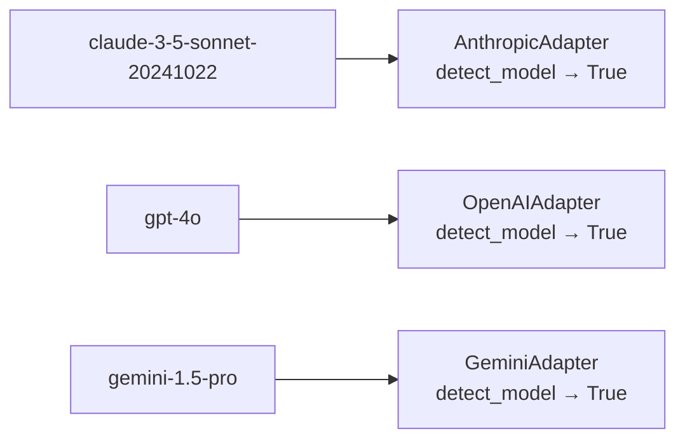

The `LLMClient` iterates through registered adapters in order, returning the first one that claims the model. This means adapters are ordered (OpenAI, then Anthropic, then Gemini in the default list), and that order matters for ambiguous model strings — though in practice, current model naming conventions are unambiguous.

### Lazy Loading: Graceful Degradation

Provider adapters are loaded lazily with `try/except ImportError` guards around each import. If the `anthropic` package is not installed, the Anthropic adapter is silently skipped. The client starts with whatever adapters are available.

This design makes Attractor installable in environments where not all providers are needed. A team using only OpenAI does not need to install `anthropic` or `google-genai`. The `pyproject.toml` lists all three providers as hard dependencies (a consequence of packaging simplicity), but the adapter loading logic is already prepared for a future where they become optional extras.

**Why not just let the import fail at runtime?** Because the error would surface at LLM call time, deep inside an agent execution, rather than at startup. Silent skipping at load time means the error surfaces cleanly when the model string does not match any available adapter: "No provider adapter found for model 'claude-...'". This is a much clearer failure mode.

### The Middleware Pipeline

Cross-cutting concerns like logging, token tracking, and caching should not be woven into the core request/response path. The middleware pipeline applies these concerns in a defined order around every LLM call:

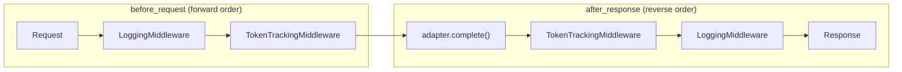

`before_request` hooks run in forward order; `after_response` hooks run in reverse. This mirrors the onion model of HTTP middleware in web frameworks — outer layers wrap inner layers.

The middleware protocol is minimal: two async methods, both taking and returning the relevant model. Each middleware can inspect or transform the request/response, or pass it through unchanged. The protocol imposes no inheritance hierarchy; any object with the right methods satisfies the `Middleware` protocol check.

### Content Type System

The `ContentPart` tagged union represents every kind of content that can appear in an LLM message: plain text, images, audio, documents, tool calls, tool results, and model reasoning. Each type carries a `kind` discriminator, making dispatch straightforward.

```python
for part in message.content:
    match part.kind:
        case ContentKind.TEXT:       handle_text(part.text)
        case ContentKind.TOOL_CALL:  handle_tool(part.tool_name, part.arguments)
        case ContentKind.THINKING:   handle_reasoning(part.text)
```

The `ThinkingContent` and `RedactedThinkingContent` types exist because Anthropic's extended thinking feature returns model reasoning as a distinct content type, not embedded in the text. The unified model surfaces this rather than hiding it, because some callers (loggers, evaluators, human reviewers) want to inspect the model's reasoning chain even when the agent loop treats it as internal.

---

## Protocol-Based Extensibility

### Why Protocols Over Abstract Base Classes

Python offers two primary mechanisms for defining interfaces: abstract base classes (`ABC`) with `@abstractmethod`, and `Protocol` from `typing`. Attractor uses `Protocol` throughout.

The difference is nominative vs. structural typing. With `ABC`, a class must explicitly inherit from the base class to satisfy the interface. With `Protocol`, any class with the right methods satisfies the interface, regardless of its inheritance chain. This is structural typing, sometimes called duck typing with static verification.

The practical consequence for Attractor is that extension points are open. A user writing a custom `NodeHandler` does not need to import anything from `attractor.pipeline.handlers` — they just need to define an async `execute` method with the right signature. The same applies to `ProviderAdapter`, `ExecutionEnvironment`, `Middleware`, and `Interviewer`.

```python
# This satisfies NodeHandler without importing NodeHandler
class MyHandler:
    async def execute(self, node: PipelineNode, context: PipelineContext) -> NodeResult:
        ...
```

The `runtime_checkable` decorator on most protocols allows `isinstance()` checks at runtime, which the `HandlerRegistry` uses to validate registrations. The combination of static verification (mypy catches protocol violations at type-check time) and runtime checking (invalid handlers fail fast at registration rather than at execution) provides good safety without coupling.

### Extension Points

| Protocol | Purpose | Where to Implement |
|---|---|---|
| `NodeHandler` | New pipeline step types | Register with `HandlerRegistry` |
| `ProviderAdapter` | New LLM providers | Add to `LLMClient._default_adapters()` |
| `ExecutionEnvironment` | New execution contexts | Pass to `agent.Session` constructor |
| `Middleware` | Cross-cutting LLM concerns | Add to `LLMClient` middleware list |
| `Interviewer` | Human-in-the-loop gates | Pass to `create_default_registry()` |

The handler registry accepts any handler type as a string key. New handler types do not modify the registry code — they call `registry.register("my_type", MyHandler())`. The validator must also know about valid handler types (there is a known types set in `validator.py`), which is the only coordination point between handler extensions and the core engine.

---

## Design Trade-offs

### Single-Threaded Pipeline vs. Parallel Node Execution

Attractor executes pipeline nodes sequentially. Independent branches that could theoretically run in parallel do not, unless explicitly mediated by a `ParallelHandler` node.

The alternative — parallel pipeline execution — would require either pessimistic locking on `PipelineContext` (reducing the benefit of parallelism) or optimistic isolation (separate contexts per branch that merge on join, which is what `ParallelHandler` does). The current design makes the simple case simple: most pipelines are sequential, and sequential execution requires no synchronization.

For pipelines that genuinely benefit from parallelism, `ParallelHandler` provides controlled fan-out: specified branch nodes run concurrently within `asyncio.gather`, each with its own scoped context, and results are merged back into the parent context with a name prefix.

### Text-Based Tool Results vs. Structured Returns

Agent tools return text strings, not structured objects. `read_file` returns the file contents as a string with line numbers prepended. `shell` returns stdout as a string. The LLM reads these strings directly as conversation history.

The alternative — structured returns with typed fields — would allow the agent loop to inspect tool results programmatically and make routing decisions without re-prompting the model. But this would require the agent to understand the semantics of each tool's return type, which varies per tool and evolves as tools are added.

Text-based returns keep the interface uniform and place the burden of interpretation on the model, which is exactly what LLMs are good at. The model is better at extracting meaning from shell output than a programmed parser would be. The downside is that text results can be ambiguous, and the two-stage truncation pipeline means the model sometimes sees incomplete output.

### Per-Provider Profiles vs. Unified Tool Sets

Different LLM providers have different tool-use capabilities and conventions. Rather than presenting a single unified tool set to all providers, Attractor uses `ProviderProfile` objects that define which tools are available per provider, what the system prompt template looks like, and how model-specific parameters are mapped.

This means a tool might be available to Claude but not Gemini, or vice versa. The tradeoff is accuracy (each provider gets tools suited to its capabilities) against complexity (the tool set is not portable across providers without checking profiles).

The alternative — a single tool set for all providers — would require the lowest common denominator of tool support, potentially excluding tools that work well on some providers. Given that Anthropic's tool-use protocol differs structurally from OpenAI's function-calling convention, per-provider profiles reflect reality more accurately than a false unified front.

### Checkpointing After Every Node vs. At Intervals

Checkpointing after every node maximizes resumability at the cost of I/O overhead and checkpoint accumulation. For short pipelines with fast nodes, the overhead is negligible. For very long pipelines with many lightweight nodes, writing a JSON file after every step adds meaningful latency.

The current design prioritizes correctness over performance. The checkpoint is the primary recovery mechanism; an incomplete checkpoint (from a crash mid-write) is handled by the naming convention — the latest complete file is identified by timestamp, and a partial write leaves no complete file at the expected path. In production deployments where latency matters, the checkpoint directory could be pointed at an in-memory filesystem or a fast SSD. The design makes this substitution transparent.

---

## Common Misconceptions

### Misconception: The Pipeline Calls the LLM Directly

The pipeline layer does not know about the LLM layer. `PipelineEngine` calls `NodeHandler.execute()`. It is `CodergenHandler` (a handler) that calls `agent.Session`, which eventually calls `LLMClient`. The pipeline layer is completely isolated from LLM concerns.

**Why the confusion**: The end-to-end flow is "DOT file to LLM call," which makes it seem like the pipeline drives the LLM. In reality, the pipeline drives the handler, which drives the agent, which drives the LLM. Each arrow is a separate layer boundary.

### Misconception: The Agent Loop Is Stateless

`AgentLoop` is stateless between `run()` calls — all conversation state lives in the `history` list passed in from `Session`. But `Session` is stateful — it accumulates conversation history across multiple `submit()` calls. The session can handle follow-up prompts that build on the previous conversation.

**Why it matters**: If you discard the session after a single prompt and create a new one, the agent starts fresh with no memory of prior work. This is sometimes desirable (pipeline isolation) and sometimes not (iterative refinement workflows).

### Misconception: Middleware Can Re-Execute Requests

The `Middleware` protocol intercepts requests before they are sent and responses after they return. It cannot re-execute a request. The `after_response` hook runs once on the response; it cannot decide to retry. Retry logic lives in `LLMClient._complete_with_retry()`, which wraps the adapter call in a loop before middleware sees it.

**Why it matters**: If you implement a caching middleware that wants to retry on cache miss, it cannot do so by returning early from `after_response`. It must hook into `before_request` to check the cache and return a cached response before the adapter call, which requires storing the cached response somewhere the middleware can access it.

---

## Implications for Practice

### When Working with Attractor

Understanding the three-layer separation means:

- Debugging a pipeline routing error means looking at the DOT file, condition expressions, and `_last_error` in the context — not the agent or LLM layers.
- Debugging an agent that gets stuck in a tool loop means looking at loop detection settings, tool results, and conversation history — not the pipeline or LLM adapter.
- Debugging an LLM call failure means looking at the adapter, middleware, and retry policy — not the pipeline or agent layers.

### Design Patterns That Emerge

Based on these principles, you will often see:

- **Context threading**: Nodes that produce data write it to `PipelineContext`; downstream nodes read it via prompt interpolation (`{key}`) or condition expressions.
- **Handler delegation**: Complex handler logic is often split between the DOT file (which nodes exist and in what order) and the handler implementation (what each node does), rather than embedding routing logic inside handlers.
- **Checkpoint-driven restarts**: Failure workflows often have an error-handling branch that leads back to an earlier node, relying on the checkpoint to avoid repeating already-completed work.
- **Profile-aware tools**: Agent tools are registered per-profile, so the tool set changes based on the model being used. Prompts should not assume all tools are always available.

---

## Connecting to Broader Concepts

### Relationship to Workflow Orchestration Systems

Attractor shares DNA with systems like Airflow, Prefect, and Temporal. All of these model workflows as directed graphs with checkpointing and retry. Attractor's distinguishing characteristic is that its nodes are LLM-driven rather than deterministic function calls. This means the per-node execution time is unbounded, the outputs are probabilistic, and loop detection is a necessary primitive rather than an edge case.

### The Blackboard Pattern in AI Systems

The `PipelineContext` blackboard has a long history in AI. The original Blackboard architecture from the 1970s (used in speech recognition systems) allowed independent "knowledge sources" to read and write to a shared workspace without knowing about each other. Attractor's pipeline nodes are the knowledge sources; the context is the blackboard. The edge conditions are the "triggers" that determine which knowledge source runs next.

### Future Directions

The architecture anticipates several extensions that are not yet implemented:

- **Remote execution environments**: The `ExecutionEnvironment` protocol is ready for a container-backed implementation that sandboxes agent tool calls.
- **Sub-pipeline composition**: `PipelineEngine.run_sub_pipeline()` is a hook for recursive pipeline execution — a pipeline node that invokes another named pipeline. The `SupervisorHandler` uses this hook for iterative refinement loops.
- **Multi-agent coordination**: The `spawn_agent`, `send_input`, `wait`, and `close_agent` tools enable a parent agent to delegate subtasks to child agents. The depth is capped by `SessionConfig.max_subagent_depth`.
- **Streaming pipeline events**: The agent layer already streams events via `AsyncIterator[AgentEvent]`. A future pipeline-level event system would expose node start/complete/error events at the same granularity.

---

## Summary: The Mental Model

After understanding all of this, think of Attractor as a programmable automation framework where the computation units are LLM sessions rather than function calls.

The **DOT file** is the program. It defines the control flow — which steps happen in what order, under what conditions. The **PipelineContext** is the memory. It holds the results of each step and makes them available to subsequent steps. The **handlers** are the instructions. They define what each step actually does. The **agent** is the processor. It takes a handler's instruction (a prompt) and executes it through repeated LLM calls until the instruction is fulfilled. The **LLM client** is the arithmetic unit. It does the actual computation, routing work to whichever provider is available for the requested model.

Key insights to remember:

1. The three layers are strictly separated: pipeline knows agent, agent knows LLM, nothing looks upward. Violations of this layering create tight coupling that defeats the design's flexibility.

2. `PipelineContext` is the integration point. Everything a node needs from prior nodes comes through context. Everything a node produces for subsequent nodes goes into context. Handlers that bypass this (by calling other handlers directly, for example) break the pipeline model.

3. Protocols over inheritance means the system is open by default. Any object with the right methods is a valid handler, adapter, or middleware — no registration ceremony, no base class imports, no monkey-patching.

---

## Further Exploration

- **Ready to try it?** Start with the [Tutorial](../tutorials/getting-started.md)
- **For practical tasks**, see [How-to Guides](../how-to/common-tasks.md)
- **For complete API details**, see [Reference](../reference/api-reference.md)
- **Blackboard architecture**: Nii Attoh-Okine, "Blackboard Systems," in *Computational Intelligence Paradigms in Advanced Pattern Classification* (2012)
- **GraphViz DOT language reference**: https://graphviz.org/doc/info/lang.html
- **Python structural typing**: PEP 544 — Protocols: Structural subtyping (static duck typing)
