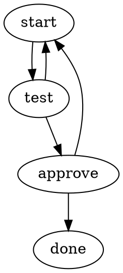
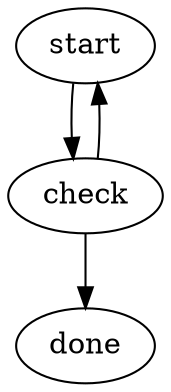
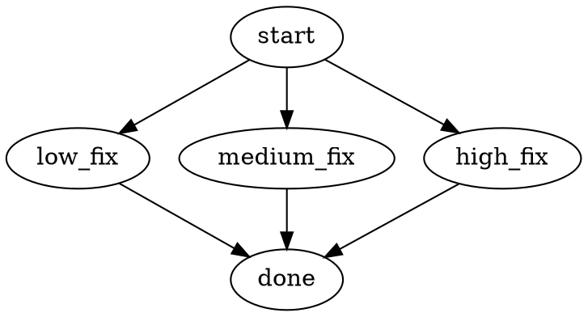
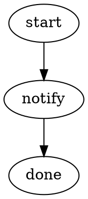

# How to Accomplish Common Tasks in Attractor

> **Audience**: Developers who have Attractor installed and understand the basic architecture (pipeline, agent, llm subsystems).
> **Goal**: Solve specific real-world extension and integration problems efficiently.

---

## Table of Contents

1. [How to Create a Pipeline](#1-how-to-create-a-pipeline)
2. [How to Use Conditional Branching](#2-how-to-use-conditional-branching)
3. [How to Add a Custom Node Handler](#3-how-to-add-a-custom-node-handler)
4. [How to Add a New LLM Provider](#4-how-to-add-a-new-llm-provider)
5. [How to Add a New Tool to the Agent](#5-how-to-add-a-new-tool-to-the-agent)
6. [How to Use Model Stylesheets](#6-how-to-use-model-stylesheets)
7. [How to Resume a Failed Pipeline](#7-how-to-resume-a-failed-pipeline)
8. [How to Use Goal Gates](#8-how-to-use-goal-gates)
9. [How to Configure Middleware](#9-how-to-configure-middleware)
10. [How to Use the Agent Programmatically](#10-how-to-use-the-agent-programmatically)
11. [How to Use Structured Output](#11-how-to-use-structured-output)
12. [How to Manage Subagents](#12-how-to-manage-subagents)

---

## 1. How to Create a Pipeline

> **Goal**: Define a working pipeline as a GraphViz DOT file and run it.
> **Time required**: 5 minutes

### Prerequisites

- Attractor installed (`pip install -e .` or via the install script)
- At least one provider API key set (`ANTHROPIC_API_KEY`, `OPENAI_API_KEY`, or `GOOGLE_API_KEY`)

### Step 1: Write the DOT file

A pipeline is a directed graph (`digraph`). Each node maps to a handler via the `handler` attribute. The `start=true` attribute or a node named `"start"` marks the entry point. Nodes with no outgoing edges, or marked `terminal=true`, end execution.



**Node attributes** (all optional unless noted):

| Attribute      | Purpose                                             | Default     |
|----------------|-----------------------------------------------------|-------------|
| `handler`      | Handler type dispatched by the engine               | `codergen`  |
| `prompt`       | Prompt string; `{key}` interpolates context values  | `""`        |
| `model`        | Model override for this node                        | stylesheet  |
| `temperature`  | Temperature override                                | stylesheet  |
| `max_tokens`   | Max tokens override                                 | stylesheet  |
| `command`      | Shell command (required for `tool` handler)         |             |
| `timeout`      | Timeout in seconds for `tool` handler               | `300`       |
| `start`        | `true` to designate the start node                  | `false`     |
| `terminal`     | `true` to force terminal status                     | `false`     |

**Edge attributes**:

| Attribute   | Purpose                                              | Default |
|-------------|------------------------------------------------------|---------|
| `condition` | Boolean expression evaluated against context         | none    |
| `priority`  | Lower value = evaluated first among outgoing edges   | `0`     |
| `label`     | Human-readable label for visualization               | `""`    |

### Step 2: Validate the pipeline

```bash
attractor validate fix_bug.dot
```

Use `--strict` to promote warnings (unreachable nodes, non-supervisor cycles) to errors:

```bash
attractor validate fix_bug.dot --strict
```

### Step 3: Run the pipeline

```bash
attractor run fix_bug.dot --verbose
```

Override the default model for all `codergen` nodes from the CLI:

```bash
attractor run fix_bug.dot --model gpt-4o
```

**Expected result**: The engine walks the graph, prints each node name as it executes, and prints a final context table.

### Troubleshooting

**Problem**: `No start node found`
**Solution**: Add `start=true` to one node attribute, or name a node `"start"`.

**Problem**: `Unknown handler type 'my_type'`
**Solution**: Either use one of the built-in types (`codergen`, `tool`, `human_gate`, `conditional`, `parallel`, `supervisor`) or register a custom handler before running — see [section 3](#3-how-to-add-a-custom-node-handler).

**Problem**: `No provider adapter found for model '...'`
**Solution**: Ensure the correct API key environment variable is set and the provider SDK is installed.

---

## 2. How to Use Conditional Branching

> **Goal**: Route pipeline execution differently depending on context values set by previous nodes.
> **Time required**: 10 minutes

### How edge conditions work

After each node completes, the engine evaluates outgoing edges in `priority` order (lowest first). The first edge whose `condition` evaluates to `true` determines the next node. An edge with no `condition` acts as the unconditional fallback and is always tried last.

Conditions are evaluated with a safe AST-based evaluator — no `eval` or `exec`. Bare names resolve to values in `PipelineContext`.

**Supported syntax**:

```
exit_code == 0
approved != false
retries < 3
exit_code != 0 and retries < 5
quality_score >= 8 or approved == true
not tests_failed
result.status == "ok"          # dotted key lookup
```

**Boolean literals**: `true`, `false`, `null`, `none` (case-insensitive in conditions).

### Pattern: retry loop with a counter



### Pattern: multi-branch routing

Nodes can write arbitrary keys to context via `context_updates` in their `NodeResult`. Use those keys in subsequent edge conditions.



### Pattern: using internal context keys

The engine sets internal keys automatically. Use them in conditions to react to failures:

| Key               | Set when                                       |
|-------------------|------------------------------------------------|
| `_last_error`     | The most recent handler returned `success=False` |
| `_failed_node`    | Name of the node whose handler failed          |
| `_completed_nodes`| List of all completed node names (at pipeline end) |

```dot
error_handler -> retry [condition="_last_error != null" priority=0]
```

### Troubleshooting

**Problem**: `Invalid condition syntax`
**Solution**: Run `attractor validate pipeline.dot` — the validator reports the exact edge and syntax error. Conditions use `==` not `=`, and string literals require double quotes.

**Problem**: Edge condition never matches, pipeline halts at non-terminal node
**Solution**: Add an unconditional fallback edge (no `condition` attribute) to catch unmatched cases.

---

## 3. How to Add a Custom Node Handler

> **Goal**: Register a new handler type so it can be used in DOT files via `handler="my_type"`.
> **Time required**: 15 minutes

### Step 1: Implement the NodeHandler protocol

A handler is any object with an `async execute(node, context) -> NodeResult` method. No base class is required — this is structural typing via `Protocol`.

```python
# my_handlers.py
from __future__ import annotations

import asyncio
from attractor.pipeline.models import NodeResult, PipelineContext, PipelineNode


class SlackNotifyHandler:
    """Post a Slack message and continue the pipeline."""

    def __init__(self, webhook_url: str) -> None:
        self._webhook_url = webhook_url

    async def execute(
        self, node: PipelineNode, context: PipelineContext
    ) -> NodeResult:
        import httpx

        message = node.attributes.get("message", "Pipeline step completed.")

        # Interpolate context values using {key} syntax
        for key, value in context.data.items():
            message = message.replace(f"{{{key}}}", str(value))

        async with httpx.AsyncClient() as client:
            resp = await client.post(
                self._webhook_url,
                json={"text": message},
                timeout=10,
            )

        if resp.status_code != 200:
            return NodeResult(
                success=False,
                error=f"Slack returned {resp.status_code}: {resp.text}",
            )

        return NodeResult(
            success=True,
            output="Notification sent",
            context_updates={"slack_notified": True},
        )
```

**NodeResult fields**:

| Field             | Purpose                                                   |
|-------------------|-----------------------------------------------------------|
| `success`         | Whether the handler succeeded                             |
| `output`          | Arbitrary output payload (stored in context if needed)    |
| `error`           | Error description when `success=False`                    |
| `next_node`       | Force routing to a specific node, bypassing edge conditions |
| `context_updates` | Dict merged into `PipelineContext` after execution        |

### Step 2: Register the handler

Build a `HandlerRegistry`, register your handler, and pass it to `PipelineEngine`:

```python
import asyncio
from attractor.pipeline.engine import PipelineEngine
from attractor.pipeline.handlers import create_default_registry
from attractor.pipeline.parser import parse_dot_file

pipeline = parse_dot_file("notify.dot")

# Start with the default registry, then add yours
registry = create_default_registry(pipeline=pipeline)
registry.register("slack_notify", SlackNotifyHandler(webhook_url="https://hooks.slack.com/..."))

engine = PipelineEngine(registry=registry)
ctx = asyncio.run(engine.run(pipeline))
```

### Step 3: Add the handler type to the validator

The static validator checks handler types against `_KNOWN_HANDLERS`. Add your type there to suppress validation errors:

```python
# src/attractor/pipeline/validator.py
_KNOWN_HANDLERS = {
    "codergen",
    "human_gate",
    "conditional",
    "parallel",
    "tool",
    "supervisor",
    "slack_notify",   # add your type here
}
```

### Step 4: Use it in a DOT file



### Troubleshooting

**Problem**: Handler executes but context values are not available in the next node
**Solution**: Return them in `context_updates`, not as attributes on the node. Context updates are merged into the shared `PipelineContext` blackboard after each node executes.

**Problem**: Handler needs access to the full pipeline graph
**Solution**: Accept `pipeline: Pipeline` in the constructor. The engine passes pipeline-aware arguments when calling `create_default_registry(pipeline=pipeline)`, so pattern your handler like `ConditionalHandler` or `ParallelHandler`.

---

## 4. How to Add a New LLM Provider

> **Goal**: Integrate a new LLM provider API so the agent and pipeline can route requests to it.
> **Time required**: 30 minutes

### Step 1: Create the adapter file

Create `src/attractor/llm/adapters/myprovider_adapter.py` and implement the `ProviderAdapter` protocol:

```python
# src/attractor/llm/adapters/myprovider_adapter.py
from __future__ import annotations

from collections.abc import AsyncIterator

from attractor.llm.models import (
    FinishReason,
    Message,
    Request,
    Response,
    Role,
    StreamEvent,
    StreamEventType,
    TextContent,
    TokenUsage,
)


class MyProviderAdapter:
    """Adapter for MyProvider's chat completions API."""

    def provider_name(self) -> str:
        return "myprovider"

    def detect_model(self, model: str) -> bool:
        # Return True for model strings this adapter owns
        return model.startswith("myprovider-") or model.startswith("mp-")

    async def complete(self, request: Request) -> Response:
        import myprovider_sdk  # the provider's Python SDK

        client = myprovider_sdk.Client()

        # Map attractor's Request to the provider's format
        sdk_messages = [
            {"role": msg.role.value, "content": msg.text()}
            for msg in request.messages
        ]

        raw = await client.chat.create(
            model=request.model,
            messages=sdk_messages,
            temperature=request.temperature,
            max_tokens=request.max_tokens,
        )

        # Map the provider's response back to attractor's Response
        text = raw.choices[0].message.content or ""
        return Response(
            message=Message(
                role=Role.ASSISTANT,
                content=[TextContent(text=text)],
            ),
            model=raw.model,
            finish_reason=FinishReason.STOP,
            usage=TokenUsage(
                input_tokens=raw.usage.input_tokens,
                output_tokens=raw.usage.output_tokens,
            ),
        )

    async def stream(self, request: Request) -> AsyncIterator[StreamEvent]:
        # Implement streaming; yield StreamEvent objects
        # Minimum: yield TEXT_DELTA events, then a FINISH event
        yield StreamEvent(type=StreamEventType.STREAM_START)
        # ... streaming implementation ...
        yield StreamEvent(type=StreamEventType.FINISH, finish_reason=FinishReason.STOP)
```

### Step 2: Register the adapter in LLMClient

Add the import inside `LLMClient._default_adapters()` with a `try/except` guard so the client degrades gracefully if the SDK is not installed:

```python
# src/attractor/llm/client.py  — inside _default_adapters()
@staticmethod
def _default_adapters() -> list[Any]:
    adapters: list[Any] = []
    # ... existing adapters ...
    try:
        from attractor.llm.adapters.myprovider_adapter import MyProviderAdapter
        adapters.append(MyProviderAdapter())
    except Exception:
        logger.debug("MyProvider adapter unavailable")
    return adapters
```

### Step 3: Add a provider profile (optional, for agent use)

If the new provider needs a distinct tool set or system prompt, create `src/attractor/agent/profiles/myprovider_profile.py`:

```python
from __future__ import annotations

from attractor.agent.profiles.base import ProviderProfile
from attractor.agent.tools.core_tools import (
    EDIT_FILE_DEF, GLOB_DEF, GREP_DEF, READ_FILE_DEF, SHELL_DEF, WRITE_FILE_DEF,
)
from attractor.llm.models import ToolDefinition

_SYSTEM_PROMPT = """\
You are a coding assistant. Working directory: {working_dir}
{user_instructions}
"""


class MyProviderProfile(ProviderProfile):

    @property
    def provider_name(self) -> str:
        return "myprovider"

    @property
    def tool_definitions(self) -> list[ToolDefinition]:
        return [READ_FILE_DEF, WRITE_FILE_DEF, EDIT_FILE_DEF, SHELL_DEF, GREP_DEF, GLOB_DEF]

    @property
    def system_prompt_template(self) -> str:
        return _SYSTEM_PROMPT

    @property
    def context_window_size(self) -> int:
        return 128_000
```

### Step 4: Verify routing

```python
from attractor.llm.client import LLMClient

client = LLMClient()
adapter = client.detect_provider("myprovider-large")
print(adapter.provider_name())  # "myprovider"
```

### Troubleshooting

**Problem**: `No provider adapter found for model '...'`
**Cause**: `detect_model()` returned `False` for that string, or the import in `_default_adapters()` raised an exception.
**Solution**: Add `logging.basicConfig(level=logging.DEBUG)` — the client logs a debug message when an adapter fails to load. Fix the import or the `detect_model()` prefix check.

**Problem**: Anthropic API raises `400 Bad Request` about message alternation
**Cause**: The Anthropic API requires strict `user / assistant / user / assistant` alternation. The `AnthropicAdapter` inserts synthetic placeholder messages, but this only applies to the built-in adapter.
**Solution**: In your adapter's `complete()`, check for consecutive same-role messages and insert placeholders before sending.

---

## 5. How to Add a New Tool to the Agent

> **Goal**: Make a new capability available to the LLM as a callable tool.
> **Time required**: 20 minutes

### Step 1: Write the handler function

Tool handlers are plain async functions with the signature:

```python
async def my_tool(
    arguments: dict[str, Any],
    environment: ExecutionEnvironment,
) -> ToolResult: ...
```

```python
# src/attractor/agent/tools/core_tools.py  (or a new file)
from __future__ import annotations

import json
from typing import Any

import httpx

from attractor.agent.environment import ExecutionEnvironment
from attractor.agent.tools.registry import ToolResult
from attractor.llm.models import ToolDefinition


async def fetch_url(
    arguments: dict[str, Any],
    environment: ExecutionEnvironment,
) -> ToolResult:
    """Fetch a URL and return the response body."""
    url: str = arguments["url"]
    timeout = arguments.get("timeout_ms", 10_000) / 1000

    try:
        async with httpx.AsyncClient() as client:
            resp = await client.get(url, timeout=timeout, follow_redirects=True)
        output = f"Status: {resp.status_code}\n\n{resp.text}"
        is_error = resp.status_code >= 400
    except Exception as exc:
        output = f"Error fetching {url}: {exc}"
        is_error = True

    return ToolResult(output=output, is_error=is_error, full_output=output)


FETCH_URL_DEF = ToolDefinition(
    name="fetch_url",
    description="Fetch the contents of a URL. Returns status code and response body.",
    parameters={
        "type": "object",
        "properties": {
            "url": {
                "type": "string",
                "description": "The URL to fetch.",
            },
            "timeout_ms": {
                "type": "integer",
                "description": "Request timeout in milliseconds (default 10000).",
            },
        },
        "required": ["url"],
    },
)
```

### Step 2: Register the tool in Session._build_registry

Add the handler and definition to the `_tool_map` dict inside `Session._build_registry()`:

```python
# src/attractor/agent/session.py — inside _build_registry()
from attractor.agent.tools.core_tools import fetch_url, FETCH_URL_DEF

_tool_map = {
    # ... existing entries ...
    "fetch_url": (fetch_url, FETCH_URL_DEF),
}
```

### Step 3: Expose the tool in provider profiles

Add the definition to each profile that should expose it:

```python
# src/attractor/agent/profiles/anthropic_profile.py
from attractor.agent.tools.core_tools import FETCH_URL_DEF

class AnthropicProfile(ProviderProfile):
    @property
    def tool_definitions(self) -> list[ToolDefinition]:
        return [
            EDIT_FILE_DEF,
            READ_FILE_DEF,
            WRITE_FILE_DEF,
            SHELL_DEF,
            GREP_DEF,
            GLOB_DEF,
            SPAWN_AGENT_DEF,
            FETCH_URL_DEF,   # add here
        ]
```

### Step 4: Add truncation limits (if output can be large)

If the tool produces potentially large output, add limits in `TruncationConfig`:

```python
# src/attractor/agent/truncation.py — inside TruncationConfig defaults
char_limits: dict[str, int] = field(default_factory=lambda: {
    # ... existing ...
    "fetch_url": 50_000,  # add here
})
```

### Troubleshooting

**Problem**: The LLM never calls the new tool
**Cause**: The tool was not added to the active `ProviderProfile.tool_definitions`, so it was never sent to the API.
**Solution**: Confirm the tool name appears in `session._registry.tool_names()` at runtime.

**Problem**: `Error: unknown tool 'fetch_url'`
**Cause**: The definition is in the profile but the handler was not added to `_tool_map` in `_build_registry`.
**Solution**: The `ToolRegistry.dispatch()` returns an error `ToolResult` rather than raising — inspect `TOOL_CALL_END` events for `is_error=True`.

---

## 6. How to Use Model Stylesheets

> **Goal**: Apply default model, temperature, and token settings to classes of nodes without repeating attributes on every node.
> **Time required**: 10 minutes

### How stylesheets work

A `ModelStylesheet` holds an ordered list of `StyleRule` entries. When the engine processes a node, it evaluates all rules top-to-bottom, collecting matching defaults. Later rules override earlier ones. Node-specific attributes in the DOT file always override everything.

Rules match nodes by any combination of:
- `handler_type` — exact match (e.g., `"codergen"`)
- `name_pattern` — glob pattern matched against the node name (e.g., `"review_*"`)
- `match_attributes` — dict of attributes that must be present on the node

### Step 1: Build a stylesheet programmatically

```python
from attractor.pipeline.stylesheet import ModelStylesheet, StyleRule

stylesheet = ModelStylesheet(rules=[
    # All codergen nodes default to claude-opus-4-6 with precise settings
    StyleRule(
        handler_type="codergen",
        model="claude-opus-4-6",
        temperature=0.2,
        max_tokens=8192,
    ),
    # Nodes whose names match "review_*" get a higher temperature
    StyleRule(
        name_pattern="review_*",
        temperature=0.7,
    ),
    # A specific node override via attribute presence
    StyleRule(
        match_attributes={"role": "draft"},
        model="claude-sonnet-4-6",
        temperature=0.9,
        max_tokens=4096,
    ),
])
```

### Step 2: Build from a dict (e.g., loaded from YAML)

```python
import yaml
from attractor.pipeline.stylesheet import ModelStylesheet

with open("stylesheet.yaml") as f:
    data = yaml.safe_load(f)

stylesheet = ModelStylesheet.from_dict(data)
```

Example `stylesheet.yaml`:

```yaml
rules:
  - handler_type: codergen
    model: claude-opus-4-6
    temperature: 0.2
    max_tokens: 8192

  - name_pattern: "test_*"
    timeout: 120
    retry_count: 3

  - handler_type: tool
    timeout: 60
```

### Step 3: Pass the stylesheet to PipelineEngine

```python
from attractor.pipeline.engine import PipelineEngine

engine = PipelineEngine(
    registry=registry,
    stylesheet=stylesheet,
    checkpoint_dir=".attractor/checkpoints",
)
```

From the CLI, the `--model` flag applies a stylesheet rule that sets `model` for all `codergen` nodes:

```bash
attractor run pipeline.dot --model gpt-4o
```

### Rule precedence (highest to lowest)

1. Node attribute in the DOT file
2. Last matching stylesheet rule (later rules win over earlier)
3. First matching stylesheet rule
4. Handler defaults

### Troubleshooting

**Problem**: A node ignores the stylesheet model and uses a different one
**Cause**: The node has an explicit `model` attribute in the DOT file, which always wins.
**Solution**: Remove the `model` attribute from the node definition and let the stylesheet supply it.

**Problem**: A stylesheet rule applies to more nodes than intended
**Solution**: Add a `name_pattern` or `match_attributes` constraint to narrow the match.

---

## 7. How to Resume a Failed Pipeline

> **Goal**: Continue a pipeline from the point of failure after fixing the underlying issue.
> **Time required**: 5 minutes

### How checkpoints work

The engine writes a checkpoint file after every successfully completed node. Files are named `checkpoint_{timestamp_ms}.json` and saved in the configured checkpoint directory (default: `.attractor/checkpoints/`). Each checkpoint captures:

- The pipeline name
- The node that was about to execute next
- The full `PipelineContext` (all key-value pairs)
- The list of completed node names

### Step 1: Identify the latest checkpoint

```bash
ls -lt .attractor/checkpoints/
```

Or use the Python helper:

```python
from attractor.pipeline.state import latest_checkpoint

cp = latest_checkpoint(".attractor/checkpoints")
print(f"Pipeline: {cp.pipeline_name}")
print(f"Resume from: {cp.current_node}")
print(f"Completed: {cp.completed_nodes}")
```

### Step 2: Resume from the CLI

```bash
attractor resume .attractor/checkpoints/checkpoint_1712345678000.json \
    --pipeline-dot pipeline.dot \
    --verbose
```

The `--pipeline-dot` flag is required. The engine restores the saved context and begins execution from the checkpointed node.

To auto-select the most recent checkpoint:

```bash
# Find the newest checkpoint
CHECKPOINT=$(ls -t .attractor/checkpoints/checkpoint_*.json | head -1)
attractor resume "$CHECKPOINT" --pipeline-dot pipeline.dot
```

### Step 3: Resume programmatically

```python
import asyncio
from attractor.pipeline.engine import PipelineEngine
from attractor.pipeline.models import Checkpoint
from attractor.pipeline.parser import parse_dot_file
from attractor.pipeline.handlers import create_default_registry
from attractor.pipeline.state import latest_checkpoint

pipeline = parse_dot_file("pipeline.dot")
cp = latest_checkpoint(".attractor/checkpoints")

registry = create_default_registry(pipeline=pipeline)
engine = PipelineEngine(registry=registry)

ctx = asyncio.run(engine.run(pipeline, checkpoint=cp))
```

### Controlling checkpoint frequency

Disable checkpointing (not recommended for long pipelines):

```python
engine = PipelineEngine(registry=registry, checkpoint_dir=None)
```

Use a custom directory:

```python
engine = PipelineEngine(registry=registry, checkpoint_dir="/tmp/my_checkpoints")
```

### Troubleshooting

**Problem**: `Failed to load checkpoint: KeyError`
**Cause**: The checkpoint JSON schema is incompatible with the current code (after an upgrade).
**Solution**: Checkpoints are plain JSON — open the file, inspect the structure, and compare with `Checkpoint.from_dict()`. Manually edit the JSON or start the pipeline fresh.

**Problem**: Pipeline resumes at the wrong node
**Cause**: `current_node` in the checkpoint is the node that was executing when the checkpoint was written, not the node that failed. The failed node will re-execute on resume.
**Solution**: This is expected behavior. The pipeline re-runs the node that checkpointed; if that node is idempotent, this is safe.

**Problem**: `Start node '...' not found in pipeline` on resume
**Cause**: The DOT file was modified and a node name changed between the original run and the resume.
**Solution**: Restore the original node name in the DOT file, or manually edit `current_node` in the checkpoint JSON.

---

## 8. How to Use Goal Gates

> **Goal**: Prevent the pipeline from exiting through a terminal node unless required work has been completed.
> **Time required**: 10 minutes

### What goal gates do

A `GoalGate` checks two things before the engine accepts a terminal exit:

1. **Required nodes**: A set of node names that must all appear in the `completed_nodes` list.
2. **Context conditions**: Boolean expressions that must hold against the final `PipelineContext`.

If the gate is not satisfied, the engine logs a warning and sets `_goal_gate_unmet` in the context. Execution still stops — the gate does not force re-routing. Use it to detect incomplete runs in post-run checks or CI.

### Step 1: Define a goal gate

```python
from attractor.pipeline.goals import GoalGate

gate = GoalGate(
    required_nodes=["test", "security_scan", "approve"],
    context_conditions=[
        "exit_code == 0",
        "approved == true",
    ],
)
```

### Step 2: Pass it to PipelineEngine

```python
from attractor.pipeline.engine import PipelineEngine

engine = PipelineEngine(
    registry=registry,
    goal_gate=gate,
)

ctx = asyncio.run(engine.run(pipeline))

# Check if the gate was satisfied
if ctx.has("_goal_gate_unmet"):
    unmet = ctx.get("_goal_gate_unmet")
    print("Pipeline completed without meeting all goals:")
    for issue in unmet:
        print(f"  - {issue}")
    raise SystemExit(1)
```

### Step 3: Check gate status in CI

```python
import asyncio
import sys
from attractor.pipeline.engine import PipelineEngine
from attractor.pipeline.goals import GoalGate
from attractor.pipeline.handlers import create_default_registry
from attractor.pipeline.parser import parse_dot_file

pipeline = parse_dot_file("release.dot")
registry = create_default_registry(pipeline=pipeline)

gate = GoalGate(
    required_nodes=["build", "test", "security_scan"],
    context_conditions=["exit_code == 0"],
)

engine = PipelineEngine(registry=registry, goal_gate=gate)
ctx = asyncio.run(engine.run(pipeline))

if ctx.has("_goal_gate_unmet"):
    for issue in ctx.get("_goal_gate_unmet", []):
        print(f"UNMET: {issue}", file=sys.stderr)
    sys.exit(1)
```

### Troubleshooting

**Problem**: Gate reports a required node as unmet even though the DOT file includes it
**Cause**: The pipeline took a conditional branch that skipped the node.
**Solution**: Ensure all branches of the pipeline lead through the required nodes, or restructure the graph so required nodes are on the critical path.

**Problem**: `_goal_gate_unmet` is set but execution continued to the terminal node
**Cause**: The gate logs a warning but does not halt execution. This is by design — the gate enforces post-run checking, not mid-pipeline blocking.
**Solution**: Check `_goal_gate_unmet` after `engine.run()` returns and raise a non-zero exit code accordingly.

---

## 9. How to Configure Middleware

> **Goal**: Intercept and transform LLM requests and responses for logging, token tracking, or content modification.
> **Time required**: 15 minutes

### How middleware works

Middleware forms a pipeline around every `LLMClient.complete()` call:

- `before_request` hooks run in **registration order** before the request is sent.
- `after_response` hooks run in **reverse registration order** after the response arrives.

This mirrors standard middleware stack semantics (first-in, last-out on the response side).

### Built-in middleware

```python
from attractor.llm.middleware import LoggingMiddleware, TokenTrackingMiddleware
from attractor.llm.client import LLMClient
import logging

tracker = TokenTrackingMiddleware()

client = LLMClient(middleware=[
    LoggingMiddleware(log_level=logging.DEBUG),
    tracker,
])

# After running requests:
print(f"Total input tokens: {tracker.total_usage.input_tokens}")
print(f"Total output tokens: {tracker.total_usage.output_tokens}")
```

### Write a custom middleware

Implement `before_request` and `after_response`. Both must be `async` and return the (potentially modified) request or response:

```python
from __future__ import annotations

import time
from attractor.llm.models import Request, Response


class LatencyBudgetMiddleware:
    """Abort requests that take longer than a budget."""

    def __init__(self, max_latency_ms: float = 30_000) -> None:
        self._max_ms = max_latency_ms
        self._start: float = 0.0

    async def before_request(self, request: Request) -> Request:
        self._start = time.monotonic()
        return request

    async def after_response(self, response: Response) -> Response:
        elapsed_ms = (time.monotonic() - self._start) * 1000
        if elapsed_ms > self._max_ms:
            import warnings
            warnings.warn(
                f"LLM call exceeded latency budget: {elapsed_ms:.0f}ms > {self._max_ms:.0f}ms"
            )
        return response


class ContentRedactionMiddleware:
    """Strip PII patterns from request messages before sending."""

    import re
    _EMAIL_RE = re.compile(r"[a-zA-Z0-9._%+-]+@[a-zA-Z0-9.-]+\.[a-zA-Z]{2,}")

    async def before_request(self, request: Request) -> Request:
        from attractor.llm.models import TextContent
        for msg in request.messages:
            for part in msg.content:
                if isinstance(part, TextContent):
                    part.text = self._EMAIL_RE.sub("[REDACTED_EMAIL]", part.text)
        return request

    async def after_response(self, response: Response) -> Response:
        return response
```

Register alongside built-in middleware:

```python
client = LLMClient(middleware=[
    LoggingMiddleware(),
    LatencyBudgetMiddleware(max_latency_ms=20_000),
    ContentRedactionMiddleware(),
    tracker,
])
```

### Caching middleware example

```python
import hashlib
import json
from attractor.llm.models import Request, Response


class SimpleCacheMiddleware:
    """In-memory response cache keyed on request content."""

    def __init__(self) -> None:
        self._cache: dict[str, Response] = {}
        self._pending_key: str = ""

    def _key(self, request: Request) -> str:
        payload = {
            "model": request.model,
            "messages": [
                {"role": m.role.value, "text": m.text()}
                for m in request.messages
            ],
        }
        return hashlib.sha256(json.dumps(payload, sort_keys=True).encode()).hexdigest()

    async def before_request(self, request: Request) -> Request:
        self._pending_key = self._key(request)
        return request

    async def after_response(self, response: Response) -> Response:
        self._cache[self._pending_key] = response
        return response

    def get_cached(self, request: Request) -> Response | None:
        return self._cache.get(self._key(request))
```

### Troubleshooting

**Problem**: `before_request` modifies the request but the change is not visible to the adapter
**Cause**: The middleware did not return the modified request object.
**Solution**: Always `return request` at the end of `before_request`, even if unchanged.

**Problem**: Middleware order produces unexpected results
**Solution**: Log in both hooks to trace execution order. Remember: `before_request` runs A→B→C, `after_response` runs C→B→A.

---

## 10. How to Use the Agent Programmatically

> **Goal**: Drive the agent from Python code, consuming events as they stream in.
> **Time required**: 15 minutes

### Prerequisites

- A provider API key in the environment
- The `anthropic` or `openai` package installed

### Step 1: Assemble a Session

```python
from attractor.agent.session import Session, SessionConfig
from attractor.agent.environment import LocalExecutionEnvironment
from attractor.agent.profiles.anthropic_profile import AnthropicProfile
from attractor.llm.client import LLMClient

profile = AnthropicProfile()
env = LocalExecutionEnvironment(working_dir="/path/to/your/project")
config = SessionConfig(
    model_id="claude-opus-4-6",
    max_turns=50,
    default_command_timeout_ms=30_000,
    enable_loop_detection=True,
)
llm_client = LLMClient()

session = Session(
    profile=profile,
    environment=env,
    config=config,
    llm_client=llm_client,
)
```

### Step 2: Submit a prompt and consume events

`Session.submit()` is an async generator — iterate it to receive `AgentEvent` objects as the agent works.

```python
import asyncio
from attractor.agent.events import AgentEventType

async def run_agent(session: Session, prompt: str) -> str:
    final_text = ""

    async for event in session.submit(prompt):
        match event.type:
            case AgentEventType.TOOL_CALL_START:
                print(f"  [tool] {event.data['tool_name']}({event.data['arguments']})")

            case AgentEventType.TOOL_CALL_END:
                status = "error" if event.data.get("is_error") else "ok"
                print(f"  [tool done] {event.data['tool_name']} -> {status}")

            case AgentEventType.ASSISTANT_TEXT_DELTA:
                print(event.data["text"], end="", flush=True)

            case AgentEventType.ASSISTANT_TEXT_END:
                final_text = event.data["text"]

            case AgentEventType.ERROR:
                print(f"  [error] {event.data['error']}")

            case AgentEventType.LOOP_DETECTION:
                print(f"  [warning] {event.data['warning']}")

    return final_text


asyncio.run(run_agent(session, "Refactor the database module to use connection pooling."))
```

### AgentEvent types reference

| Event type             | When it fires                                    | Key `data` fields                            |
|------------------------|--------------------------------------------------|----------------------------------------------|
| `SESSION_START`        | Begin of `submit()`                              | `state`                                      |
| `USER_INPUT`           | User message appended to history                 | `text`                                       |
| `TOOL_CALL_START`      | Before a tool executes                           | `tool_name`, `tool_call_id`, `arguments`     |
| `TOOL_CALL_OUTPUT_DELTA` | Tool output available (truncated)              | `tool_call_id`, `output`                     |
| `TOOL_CALL_END`        | After a tool executes                            | `tool_name`, `output`, `full_output`, `is_error` |
| `ASSISTANT_TEXT_START` | Model produced a text-only response              |                                              |
| `ASSISTANT_TEXT_DELTA` | Text content                                     | `text`                                       |
| `ASSISTANT_TEXT_END`   | All text delivered                               | `text`                                       |
| `TURN_LIMIT`           | Max turns or tool rounds reached                 | `turns`, `limit`                             |
| `LOOP_DETECTION`       | Repeated tool call pattern detected              | `warning`                                    |
| `STEERING_INJECTED`    | Steering message injected mid-loop               | `text`                                       |
| `ERROR`                | Unhandled exception in session or LLM call       | `error`, `phase`                             |
| `SESSION_END`          | End of `submit()`                                | `state`                                      |

### Sending follow-up prompts

The session maintains conversation history across multiple `submit()` calls:

```python
async def multi_turn() -> None:
    async for _ in session.submit("Add type annotations to utils.py"):
        pass  # consume first task

    # Session history is preserved; this is a continuation
    async for event in session.submit("Now write tests for the same file"):
        if event.type == AgentEventType.ASSISTANT_TEXT_END:
            print(event.data["text"])
```

### Step 3: Shut down the session

```python
await session.shutdown()
```

This marks the session as `CLOSED` and calls `environment.cleanup()`.

### Troubleshooting

**Problem**: `RuntimeError: Session is closed`
**Solution**: Create a new `Session` instance. Sessions cannot be reused after `shutdown()`.

**Problem**: The agent loops on the same tool call repeatedly
**Cause**: Loop detection fires after 3 repetitions of the same tool call fingerprint.
**Solution**: `LOOP_DETECTION` events carry a `warning` message that is injected into the conversation as a system warning. If the agent still loops, lower `max_turns` in `SessionConfig` or increase `max_tool_rounds_per_input`.

---

## 11. How to Use Structured Output

> **Goal**: Have the LLM return a JSON object conforming to a schema rather than free text.
> **Time required**: 10 minutes

### When to use this

Use `generate_object()` when you need a machine-readable result from the LLM — for example, a structured analysis report, a list of extracted items, or a classification with confidence scores.

### Step 1: Define a JSON Schema

```python
schema = {
    "type": "object",
    "properties": {
        "severity": {
            "type": "string",
            "enum": ["low", "medium", "high", "critical"],
        },
        "affected_files": {
            "type": "array",
            "items": {"type": "string"},
        },
        "summary": {
            "type": "string",
        },
        "estimated_fix_hours": {
            "type": "number",
        },
    },
    "required": ["severity", "affected_files", "summary"],
}
```

### Step 2: Call generate_object

```python
import asyncio
from attractor.llm.client import LLMClient

client = LLMClient()

result = asyncio.run(client.generate_object(
    prompt="Analyze this Python traceback and classify the bug:\n\n" + traceback_text,
    model="gpt-4o",
    schema=schema,
    schema_name="bug_report",
    strict=True,
))

print(result["severity"])           # "high"
print(result["affected_files"])     # ["src/auth.py", "src/db.py"]
print(result["summary"])            # "Token expiry not checked..."
```

### Step 3: Use a list of messages for multi-turn context

```python
from attractor.llm.models import Message

messages = [
    Message.user("Here is the codebase structure:\n" + structure),
    Message.assistant("Understood. I've analyzed the structure."),
    Message.user("Now classify the bug severity from this traceback:\n" + traceback_text),
]

result = asyncio.run(client.generate_object(
    prompt=messages,
    model="claude-opus-4-6",
    schema=schema,
    schema_name="bug_report",
))
```

### Troubleshooting

**Problem**: `ValueError: Model output is not valid JSON`
**Cause**: The model produced text that could not be parsed as JSON — often a preamble before the JSON object.
**Solution**: Use `strict=True` (the default). If the provider does not support strict structured output, add explicit instructions to the prompt: `"Respond only with a valid JSON object. No prose, no markdown."`.

**Problem**: Provider returns `400 Bad Request` for `response_format`
**Cause**: Not all models and providers support JSON schema-constrained output (e.g., some Gemini model versions).
**Solution**: Check the provider's documentation for structured output support. Fall back to prompt-based JSON extraction with a regular `generate()` call and manual `json.loads()`.

---

## 12. How to Manage Subagents

> **Goal**: Delegate parallel subtasks to child agent sessions from within the main agent's tool loop.
> **Time required**: 20 minutes

### How subagents work

Four tools expose multi-agent coordination to the LLM:

| Tool          | Purpose                                                   |
|---------------|-----------------------------------------------------------|
| `spawn_agent` | Create a new subagent working on a delegated task         |
| `send_input`  | Send a follow-up message to a running subagent            |
| `wait`        | Block until a subagent completes and return its result    |
| `close_agent` | Terminate a subagent and free its resources               |

The `spawn_agent` tool is included in `AnthropicProfile` and `OpenAIProfile` by default. Subagent depth is capped by `SessionConfig.max_subagent_depth` (default: 1 level).

### Enabling subagents in a session

```python
from attractor.agent.session import Session, SessionConfig

config = SessionConfig(
    model_id="claude-opus-4-6",
    max_subagent_depth=2,   # allow up to 2 levels of nesting
)
```

### What the LLM sees

When the agent calls `spawn_agent`, it receives an `agent_id` back. It can then call `wait(agent_id=...)` to block until the subagent finishes, or `send_input(agent_id=..., message=...)` to steer it mid-run. Finally, `close_agent(agent_id=...)` releases the handle.

A typical LLM-driven multi-agent flow in natural language prompts looks like:

```
1. spawn_agent(task="Write unit tests for src/auth.py", model="claude-opus-4-6")
   -> returns agent_id="subagent_a1b2c3d4"

2. spawn_agent(task="Write unit tests for src/db.py", model="claude-opus-4-6")
   -> returns agent_id="subagent_e5f6a7b8"

3. wait(agent_id="subagent_a1b2c3d4")   -> test output for auth.py
4. wait(agent_id="subagent_e5f6a7b8")   -> test output for db.py

5. close_agent(agent_id="subagent_a1b2c3d4")
6. close_agent(agent_id="subagent_e5f6a7b8")
```

### Monitoring active subagents

```python
from attractor.agent.tools.subagent import get_active_subagents

active = get_active_subagents()
for agent_id, handle in active.items():
    status = "closed" if handle.closed else "running"
    print(f"{agent_id}: {status}")
```

### Invoking spawn_agent from Python (bypassing the LLM)

For programmatic use, call the tool function directly:

```python
import asyncio
from attractor.agent.tools.subagent import spawn_agent, wait_agent, close_agent

async def delegate_task() -> str:
    # Spawn
    spawn_result = await spawn_agent(
        arguments={"task": "Audit src/ for unused imports", "model": "claude-opus-4-6"},
        environment=None,
    )
    # Extract agent_id from the output message
    agent_id = spawn_result.output.split("'")[1]

    # Wait for result
    wait_result = await wait_agent(arguments={"agent_id": agent_id}, environment=None)

    # Close
    await close_agent(arguments={"agent_id": agent_id}, environment=None)

    return wait_result.output

result = asyncio.run(delegate_task())
```

### Troubleshooting

**Problem**: `Error: no subagent with id '...'`
**Cause**: `close_agent` was called before `wait`, or the `agent_id` was mistyped.
**Solution**: Always `wait()` before `close_agent()` to ensure results are captured. The LLM may concatenate or truncate `agent_id` values — use the exact string returned by `spawn_agent`.

**Problem**: Subagent depth limit exceeded
**Cause**: `max_subagent_depth` in `SessionConfig` defaults to 1, preventing a subagent from spawning its own subagents.
**Solution**: Increase `max_subagent_depth` in the parent `SessionConfig`. Be aware that deeper nesting multiplies API costs and increases the chance of runaway loops.

**Problem**: Spawned subagent produces no result (empty `wait()` response)
**Cause**: The subagent `handle.task` is `None` in the current implementation — `spawn_agent` registers the handle but does not wire an actual `asyncio.Task` unless the `Session` injects one.
**Solution**: The current `spawn_agent` implementation is a coordination scaffold. For full execution, wire the parent `Session` to create a child `Session` and assign its coroutine to `handle.task` after spawning.

---

## Cross-References

- New to Attractor? Start with the [Tutorial](../tutorials/getting-started.md)
- For complete API details, see [Reference](../reference/api-reference.md)
- To understand design decisions, read [Explanation](../explanation/architecture.md)
