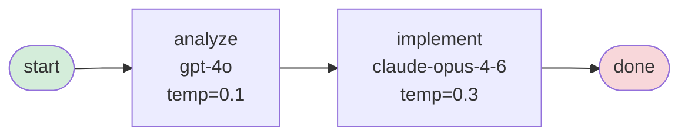

# How to Accomplish Common Tasks in Attractor

> **Audience**: Developers who have Attractor installed and understand the basic architecture (pipeline, agent, llm subsystems).
> **Goal**: Solve specific real-world extension and integration problems efficiently.

---

## Table of Contents

### Pipeline Authoring
1. [How to Create a Basic Pipeline](#1-how-to-create-a-basic-pipeline)
2. [How to Add Conditional Branching](#2-how-to-add-conditional-branching)
3. [How to Use Prompt Interpolation](#3-how-to-use-prompt-interpolation)
4. [How to Configure Node Attributes](#4-how-to-configure-node-attributes)
5. [How to Add a Model Stylesheet](#5-how-to-add-a-model-stylesheet)

### Pipeline Execution
6. [How to Validate a Pipeline](#6-how-to-validate-a-pipeline)
7. [How to Run a Pipeline](#7-how-to-run-a-pipeline)
8. [How to Resume from a Checkpoint](#8-how-to-resume-from-a-checkpoint)
9. [How to Use Goal Gates](#9-how-to-use-goal-gates)

### Agent Configuration
10. [How to Switch LLM Providers](#10-how-to-switch-llm-providers)
11. [How to Configure Shell Timeouts](#11-how-to-configure-shell-timeouts)
12. [How to Use the Agent Tools](#12-how-to-use-the-agent-tools)

### Extension
13. [How to Add a Custom Node Handler](#13-how-to-add-a-custom-node-handler)
14. [How to Add a New LLM Provider Adapter](#14-how-to-add-a-new-llm-provider-adapter)
15. [How to Add Middleware](#15-how-to-add-middleware)

### Troubleshooting
16. [How to Debug Edge Routing](#16-how-to-debug-edge-routing)
17. [How to Handle Common Errors](#17-how-to-handle-common-errors)

---

## 1. How to Create a Basic Pipeline

> **Goal**: Define a working pipeline as a GraphViz DOT file and run it.
> **Use case**: Automating a multi-step coding task (implement, test, review) against a codebase.
> **Time required**: 5 minutes

### Prerequisites

- Attractor installed (`bash .claude/scripts/install.sh` or `pip install -e .`)
- At least one provider API key set (`ANTHROPIC_API_KEY`, `OPENAI_API_KEY`, or `GOOGLE_API_KEY`)
- Basic familiarity with GraphViz DOT syntax

### Problem Context

You want to encode a repeatable coding workflow — for example, implement a fix, run tests, and review the result — without manually orchestrating each step. Attractor executes this workflow as a DAG of LLM-driven nodes.

### Solution Overview

We'll solve this by writing a DOT file that describes the graph, then running it with the CLI:
1. Write the DOT file with start node, work nodes, and terminal node
2. Validate the DOT file
3. Run the pipeline

### Step 1: Write the DOT file

A pipeline is a directed graph (`digraph`). Mark the entry point with `shape=Mdiamond` or name a node `"start"`. Mark the exit with `shape=Msquare`, name a node `"exit"` or `"end"`, or leave a node with no outgoing edges. Assign handler types using the `type` attribute.


**Node attributes reference**:

| Attribute     | Purpose                                              | Default    |
|---------------|------------------------------------------------------|------------|
| `type`        | Handler type dispatched by the engine                | `codergen` |
| `shape`       | `Mdiamond` = start node, `Msquare` = terminal node   |            |
| `prompt`      | Prompt string; `{key}` interpolates context values   | `""`       |
| `model`       | Model override for this node                         | stylesheet |
| `temperature` | Temperature override                                 | stylesheet |
| `max_tokens`  | Max token limit override                             | stylesheet |
| `max_retries` | Number of retry attempts on handler failure          | `0`        |
| `timeout`     | Timeout in seconds for execution                     | provider   |

**Edge attributes reference**:

| Attribute   | Purpose                                                      | Default |
|-------------|--------------------------------------------------------------|---------|
| `condition` | Boolean expression evaluated against `PipelineContext`       | none    |
| `weight`    | Higher value = higher priority when evaluating edges         | `0`     |
| `label`     | Human-readable label for visualization                       | `""`    |

**Expected result**: A valid DOT file that Attractor can parse and execute.

### Step 2: Validate the pipeline

```bash
attractor validate fix_bug.dot
```

**Verify it worked**: No errors printed to stdout. Exit code is 0.

### Step 3: Run the pipeline

```bash
attractor run fix_bug.dot --verbose
```

**Success criteria**: The engine prints each node name as it executes and prints a final context table when complete.

### Troubleshooting

**Problem**: `No start node found`
**Symptoms**: Validation or run fails immediately with this message.
**Cause**: Neither `shape=Mdiamond` nor a node named `"start"` (case-insensitive) exists.
**Solution**: Add `shape=Mdiamond` to your entry node, or name it `start`.

**Problem**: `Unknown handler type 'codergen'` or similar
**Symptoms**: Validation or run fails with an unknown handler error.
**Cause**: The `type` attribute uses a value not registered in the `HandlerRegistry`.
**Solution**: Use `type="codergen"` for LLM-driven coding nodes. Register custom types before running — see [section 13](#13-how-to-add-a-custom-node-handler).

**Problem**: The `handler` attribute is silently ignored
**Symptoms**: Nodes execute with the wrong handler or fall back to the default.
**Cause**: The correct DOT attribute is `type`, not `handler`. The parser maps `type` to the internal `handler_type` field.
**Solution**: Replace `handler="codergen"` with `type="codergen"` in your DOT file.

---

## 2. How to Add Conditional Branching

> **Goal**: Route pipeline execution differently depending on context values set by previous nodes.
> **Use case**: Retry a failing step, branch by classification result, or short-circuit to an error handler.
> **Time required**: 10 minutes

### Prerequisites

- A working basic pipeline (see [section 1](#1-how-to-create-a-basic-pipeline))
- Understanding that handlers write results to `PipelineContext` via `NodeResult.context_updates`

### Problem Context

After a node runs, the engine needs to decide which node comes next. Conditional edges let you express branching logic in the DOT file itself, without writing a custom handler.

### How edge conditions work

After each node completes, the engine evaluates outgoing edges sorted by `weight` descending (higher weight = evaluated first). The first edge whose `condition` evaluates to `true` determines the next node. An edge with no `condition` acts as an unconditional fallback and matches last. If no edge matches on a non-terminal node, execution fails.

Conditions are evaluated by a custom tokenizer/parser — no `eval` or `exec`. Variables resolve by bare name from `PipelineContext`.

**Supported operators**:

| Operator | Meaning       | Example                               |
|----------|---------------|---------------------------------------|
| `=`      | Equality      | `tests_passed = true`                 |
| `!=`     | Inequality    | `review_result != approved`           |
| `&&`     | Logical AND   | `tests_passed = true && score != low` |

**Unsupported** (will cause a parse error): `==`, `<`, `>`, `<=`, `>=`, `and`, `or`, `not`.

**Boolean literals**: `true` and `false` (bare, unquoted).

**String literals**: Use double quotes — `severity = "high"`.

### Step 1: Write a retry loop


**Expected result**: The pipeline loops through implement and verify until tests pass, then exits.

### Step 2: Write a multi-branch routing pattern


### Step 3: React to engine-internal context keys

The engine writes these internal keys automatically. Use them in conditions to detect failures:

| Key                | Set when                                             |
|--------------------|------------------------------------------------------|
| `_last_error`      | Most recent handler returned `success=False`         |
| `_failed_node`     | Name of the node whose handler failed                |
| `_completed_nodes` | List of all completed node names (at pipeline end)   |
| `_goal_gate_unmet` | Set when the GoalGate conditions were not satisfied  |

```dot
# Route to an error handler if the previous node failed
some_node -> error_handler [condition="_last_error != false" weight=2]
some_node -> next_step                                        [weight=1]
```

### Troubleshooting

**Problem**: `Invalid condition syntax` or parse error on an edge condition
**Symptoms**: Validation fails and reports the specific edge.
**Cause**: Using `==` instead of `=`, using `and`/`or` instead of `&&`, or using comparison operators like `<` or `>`.
**Solution**: Replace `==` with `=`. Replace `and` with `&&`. Remove `<`/`>` — restructure the pipeline so nodes set categorical context values that can be compared with `=` or `!=`.

**Problem**: Pipeline halts with "no matching edge" on a non-terminal node
**Symptoms**: Runtime error after a node completes.
**Cause**: None of the outgoing edges matched the current context state.
**Solution**: Add an unconditional fallback edge (no `condition` attribute) as the lowest-weight option to catch all unmatched cases.

```dot
# Fallback catches everything that doesn't match higher-weight edges
some_node -> fallback_handler [weight=0]
```

---

## 3. How to Use Prompt Interpolation

> **Goal**: Inject context values from previous nodes into a node's prompt at execution time.
> **Use case**: Passing a file path, error message, or classification result from one node to the next.
> **Time required**: 5 minutes

### Prerequisites

- A working pipeline where upstream nodes set context values via `NodeResult.context_updates`

### Problem Context

You want node prompts to be dynamic — for example, telling a review node which file was changed by the implement node, without hardcoding filenames in the DOT file.

### Step 1: Have an upstream node set a context value

When a `codergen` node's agent completes, it can set context values. In your prompt, instruct the agent to set a specific key:

```dot
implement [
    type="codergen"
    prompt="Fix the auth bug in src/auth.py. When done, set context key 'changed_file' to 'src/auth.py'."
]
```

### Step 2: Reference the context value in a downstream prompt

Use `{key}` syntax in any node's `prompt` attribute. The engine substitutes the value before the handler executes:

```dot
review [
    type="codergen"
    prompt="Review the changes made to {changed_file}. Check for security issues and style violations."
]
```

### Step 3: Use multiple interpolations


**Expected result**: The `refactor` node receives a prompt with the actual file path and issue count substituted in.

### Troubleshooting

**Problem**: `{key}` appears literally in the prompt instead of being substituted
**Symptoms**: The agent receives `{target_file}` as the string, not the resolved value.
**Cause**: The upstream node did not set the context key, or the key name is misspelled.
**Solution**: Add `--verbose` to the `attractor run` command and inspect the printed context table after each node. Verify the upstream node's context_updates contain the expected key.

**Problem**: Prompt interpolation uses a stale value from a previous run on resume
**Symptoms**: After resuming from a checkpoint, `{key}` resolves to an old value.
**Cause**: Checkpoint files preserve the full `PipelineContext`, including all previously set values.
**Solution**: This is expected behavior — the checkpoint restores the full state. If you need a fresh value, restructure the pipeline so the upstream node runs again before the interpolating node.

---

## 4. How to Configure Node Attributes

> **Goal**: Set model, temperature, token limits, retry counts, and timeouts on individual nodes.
> **Use case**: Using a fast cheap model for analysis nodes and a powerful model for implementation nodes.
> **Time required**: 5 minutes

### Prerequisites

- A working pipeline (see [section 1](#1-how-to-create-a-basic-pipeline))

### Problem Context

Different nodes in a pipeline have different requirements. An analysis node might need a large context window but low temperature. An implementation node might need high token limits. You can configure these per-node in the DOT file.

### Step 1: Set model and generation parameters




### Step 2: Configure reliability attributes

```dot
flaky_step [
    type="codergen"
    prompt="Run the integration test suite and report results."
    max_retries="3"
    timeout="120"
    allow_partial="true"
]
```

**All node attributes**:

| Attribute      | Type    | Purpose                                                       |
|----------------|---------|---------------------------------------------------------------|
| `type`         | string  | Handler type (`codergen`, or custom registered types)         |
| `prompt`       | string  | Prompt with optional `{key}` interpolation                    |
| `model`        | string  | Model ID (overrides stylesheet; routes to matching adapter)   |
| `temperature`  | float   | Sampling temperature (0.0–1.0)                               |
| `max_tokens`   | int     | Maximum output tokens                                         |
| `max_retries`  | int     | Retry attempts on handler failure                             |
| `allow_partial`| bool    | Accept partial results if the handler fails after retries     |
| `fidelity`     | string  | Fidelity hint passed to the handler (handler-specific)        |
| `timeout`      | int     | Execution timeout in seconds                                  |
| `shape`        | string  | `Mdiamond` = start, `Msquare` = terminal                      |

### Troubleshooting

**Problem**: Node `model` attribute is ignored and the stylesheet model is used
**Symptoms**: The agent uses a different model than specified in the DOT file.
**Cause**: Stylesheet rules can be overridden by node attributes, but the reverse is also true — a misconfigured stylesheet with an ID selector (`#node_id`) would win over a node attribute.
**Solution**: Check for ID-specific stylesheet rules (`#node_name`). Node attributes in the DOT file take final precedence over universal (`*`) and class (`.class`) stylesheet rules, but a correctly applied ID rule in a custom stylesheet would also override. Confirm the engine logs show the correct model.

**Problem**: `timeout` has no effect on a node
**Symptoms**: The node runs longer than the configured timeout.
**Cause**: Timeout enforcement depends on the handler implementation. The `codergen` handler passes timeout to the agent's `SessionConfig`, which governs shell command timeouts, not the total node execution time.
**Solution**: For hard wall-clock limits on node execution, wrap the `engine.run()` call with `asyncio.wait_for()` in your Python code.

---

## 5. How to Add a Model Stylesheet

> **Goal**: Apply default model, temperature, and token settings to classes of nodes without repeating attributes on every node.
> **Use case**: Standardizing all codergen nodes to use a specific model, or giving review nodes higher temperature.
> **Time required**: 10 minutes

### Prerequisites

- Attractor installed and importable as a Python library
- A pipeline DOT file

### Problem Context

Large pipelines with many nodes become hard to maintain when model settings are repeated on every node. Stylesheets let you set defaults in one place, using CSS-style selectors.

### How stylesheet selectors work

The `ModelStylesheet` evaluates rules in specificity order. Higher specificity overrides lower. Node attributes in the DOT file always override all stylesheet rules.

| Selector type | Syntax   | Example           | Specificity |
|---------------|----------|-------------------|-------------|
| Universal     | `*`      | Matches all nodes | Lowest      |
| Class         | `.class` | `.review`         | Medium      |
| ID            | `#id`    | `#implement`      | Highest     |

When multiple rules match, the more specific rule wins. Among rules of equal specificity, the later rule wins.

### Step 1: Build a stylesheet

```python
from attractor.pipeline.stylesheet import ModelStylesheet, StyleRule

stylesheet = ModelStylesheet(rules=[
    # Universal: all nodes default to gpt-4o
    StyleRule(
        selector="*",
        model="gpt-4o",
        temperature=0.2,
        max_tokens=8192,
    ),
    # Class: nodes with class="implementation" get higher token limit
    StyleRule(
        selector=".implementation",
        model="claude-opus-4-6",
        max_tokens=32768,
    ),
    # ID: the specific "final_review" node gets a custom temperature
    StyleRule(
        selector="#final_review",
        temperature=0.7,
    ),
])
```

### Step 2: Reference classes in the DOT file

Assign a class to a node using the `class` attribute in DOT:


### Step 3: Pass the stylesheet to PipelineEngine

```python
import asyncio
from attractor.pipeline.engine import PipelineEngine
from attractor.pipeline.handlers import create_default_registry
from attractor.pipeline.parser import parse_dot_file

pipeline = parse_dot_file("styled_pipeline.dot")
registry = create_default_registry(pipeline=pipeline)

engine = PipelineEngine(
    registry=registry,
    stylesheet=stylesheet,
    checkpoint_dir=".attractor/checkpoints",
)

ctx = asyncio.run(engine.run(pipeline))
```

**Verify it worked**: Enable verbose output or add logging to confirm each node receives the expected model from the stylesheet.

### Alternative Approaches

### For CLI use
The `--model` flag on `attractor run` applies a universal default model for all codergen nodes:

```bash
attractor run pipeline.dot --model gpt-4o
```

**When to use**: Quick overrides during development. The CLI model flag applies universally and cannot express per-class or per-node specificity.

### Troubleshooting

**Problem**: A stylesheet rule applies to more nodes than intended
**Solution**: Add an ID selector (`#node_name`) for the specific node, or narrow a universal rule to a class selector by assigning classes in the DOT file.

**Problem**: A node ignores the stylesheet entirely and uses a different model
**Cause**: The node has an explicit `model` attribute in the DOT file, which always wins over stylesheet rules.
**Solution**: Remove the inline `model` attribute from the DOT node definition and rely on the stylesheet.

---

## 6. How to Validate a Pipeline

> **Goal**: Catch structural errors in a DOT file before running it.
> **Use case**: CI pre-flight check before executing a pipeline in production.
> **Time required**: 2 minutes

### Prerequisites

- Attractor installed
- A pipeline DOT file

### Step 1: Run basic validation

```bash
attractor validate pipeline.dot
```

The validator checks:
- Exactly one start node exists (shape=Mdiamond or name "start")
- At least one terminal node exists
- All edge endpoint node names match defined nodes
- All `type` attribute values are known handler types
- All nodes are reachable from the start node
- No invalid cycle structures

**Expected result**: No output and exit code 0 on success. Errors are printed to stderr on failure.

### Step 2: Enable strict mode

Strict mode promotes warnings to errors:

```bash
attractor validate pipeline.dot --strict
```

**Verify it worked**: Exit code 0 means the pipeline passed all checks including warnings.

### Step 3: Validate programmatically

```python
from attractor.pipeline.parser import parse_dot_file
from attractor.pipeline.validator import validate_pipeline

pipeline = parse_dot_file("pipeline.dot")
errors = validate_pipeline(pipeline, strict=False)

if errors:
    for error in errors:
        print(f"ERROR: {error}")
else:
    print("Pipeline is valid.")
```

### Troubleshooting

**Problem**: `No start node found`
**Solution**: Ensure one node has `shape=Mdiamond` or is named `start` (case-insensitive).

**Problem**: `Unknown handler type '...'`
**Solution**: The `type` attribute value is not in the known handler types set in `validator.py`. Use `type="codergen"` for the built-in handler, or register your custom type — see [section 13](#13-how-to-add-a-custom-node-handler).

**Problem**: `Edge references undefined node '...'`
**Solution**: A node name in an edge definition (`a -> b`) does not match any defined node. Check for typos in node names.

**Problem**: `Node '...' is not reachable from start`
**Solution**: The node exists but no path leads to it from the start node. Either remove the node or add an edge connecting it to the reachable subgraph.

---

## 7. How to Run a Pipeline

> **Goal**: Execute a validated pipeline from the command line.
> **Use case**: Running a coding agent workflow against a local repository.
> **Time required**: 2 minutes

### Prerequisites

- A valid pipeline DOT file
- At least one provider API key in the environment

### Step 1: Run with default settings

```bash
attractor run pipeline.dot
```

### Step 2: Specify a model

The `--model` flag applies a default model to all codergen nodes. The model string determines which provider adapter is used — see [section 10](#10-how-to-switch-llm-providers) for routing details.

```bash
attractor run pipeline.dot --model claude-opus-4-6
attractor run pipeline.dot --model gpt-4o
attractor run pipeline.dot --model gemini-2.0-flash
```

### Step 3: Enable verbose output

```bash
attractor run pipeline.dot --model gpt-4o --verbose
```

Verbose mode prints node names, context updates, tool calls, and the final context table.

**Success criteria**: The engine reaches a terminal node and exits with code 0. The final context table is printed to the terminal.

### Troubleshooting

**Problem**: `No provider adapter found for model '...'`
**Cause**: The model string did not match any loaded adapter's `detect_model()` check, or the provider SDK is not installed.
**Solution**: Check that the relevant package is installed (`anthropic`, `openai`, or `google-genai`) and that the model string uses the correct prefix. See [section 10](#10-how-to-switch-llm-providers).

**Problem**: Pipeline runs but produces no output
**Solution**: Add `--verbose` to see node-level progress.

**Problem**: `ANTHROPIC_API_KEY` not found (or other provider key)
**Solution**: Export the key in the shell before running:
```bash
export ANTHROPIC_API_KEY="sk-ant-..."
attractor run pipeline.dot --model claude-opus-4-6
```

---

## 8. How to Resume from a Checkpoint

> **Goal**: Continue a pipeline from the point of failure after fixing the underlying issue.
> **Use case**: A long-running pipeline failed mid-way due to a network error or API timeout.
> **Time required**: 5 minutes

### How checkpoints work

The engine writes a checkpoint file after every successfully completed node. Files are named `checkpoint_{timestamp_ms}.json` in the configured checkpoint directory (default: `.attractor/checkpoints/`). Each checkpoint captures:

- The pipeline name
- The next node to execute
- The full `PipelineContext` (all key-value pairs)
- The list of completed node names

### Step 1: Identify the latest checkpoint

```bash
ls -lt .attractor/checkpoints/
```

Or use the Python helper:

```python
from attractor.pipeline.state import latest_checkpoint

cp = latest_checkpoint(".attractor/checkpoints")
print(f"Pipeline: {cp.pipeline_name}")
print(f"Resume from: {cp.current_node}")
print(f"Completed: {cp.completed_nodes}")
```

### Step 2: Resume from the CLI

```bash
attractor resume .attractor/checkpoints/checkpoint_1712345678000.json \
    --pipeline-dot pipeline.dot \
    --verbose
```

The `--pipeline-dot` flag is required. The engine restores the saved context and begins execution from the checkpointed node.

**Verify it worked**: The engine prints "Resuming from checkpoint" and starts at the correct node, skipping already-completed nodes.

### Step 3: Resume programmatically

```python
import asyncio
from attractor.pipeline.engine import PipelineEngine
from attractor.pipeline.handlers import create_default_registry
from attractor.pipeline.parser import parse_dot_file
from attractor.pipeline.state import latest_checkpoint

pipeline = parse_dot_file("pipeline.dot")
cp = latest_checkpoint(".attractor/checkpoints")

registry = create_default_registry(pipeline=pipeline)
engine = PipelineEngine(registry=registry)

ctx = asyncio.run(engine.run(pipeline, checkpoint=cp))
```

### Best Practices

- Checkpointing is enabled by default. Disable only for short, fast pipelines where restart from scratch is acceptable.
- The failed node re-executes on resume. Design handlers to be idempotent where possible.
- Checkpoint files are plain JSON — safe to inspect and edit if you need to manually advance the resume point.

### Troubleshooting

**Problem**: `Start node '...' not found in pipeline` on resume
**Cause**: The DOT file was modified and a node name changed between the original run and the resume.
**Solution**: Restore the original node name in the DOT file, or open the checkpoint JSON and update `current_node` to the correct node name.

**Problem**: Pipeline resumes at an unexpected node
**Cause**: `current_node` in the checkpoint is the node that was about to execute when the checkpoint was written. If the pipeline failed during a node, that node will re-run.
**Solution**: This is expected. The checkpoint saves state after each successfully completed node.

**Problem**: `KeyError` when loading a checkpoint
**Cause**: The checkpoint JSON schema is incompatible with the current code version after an upgrade.
**Solution**: Checkpoints are plain JSON. Open the file, compare with the `Checkpoint` dataclass fields, and manually correct any missing or renamed fields.

---

## 9. How to Use Goal Gates

> **Goal**: Prevent a pipeline from being considered successful unless specific nodes ran and specific context conditions are met.
> **Use case**: CI enforcement — ensure that security scanning and testing nodes always execute, regardless of branching paths.
> **Time required**: 10 minutes

### What goal gates do

A `GoalGate` checks two things when the engine reaches a terminal node:

1. **Required nodes**: A set of node names that must all appear in `_completed_nodes`.
2. **Context conditions**: Boolean expressions (same syntax as edge conditions) that must hold against the final `PipelineContext`.

If the gate is not satisfied, the engine sets `_goal_gate_unmet` in the context. Execution still reaches the terminal node — the gate does not force re-routing. Check `_goal_gate_unmet` after `engine.run()` returns to enforce a non-zero exit code.

### Step 1: Define a goal gate

```python
from attractor.pipeline.goals import GoalGate

gate = GoalGate(
    required_nodes=["test", "security_scan", "approve"],
    context_conditions=[
        "tests_passed = true",
        "approved = true",
    ],
)
```

### Step 2: Pass it to PipelineEngine

```python
import asyncio
from attractor.pipeline.engine import PipelineEngine
from attractor.pipeline.handlers import create_default_registry
from attractor.pipeline.parser import parse_dot_file

pipeline = parse_dot_file("release.dot")
registry = create_default_registry(pipeline=pipeline)

engine = PipelineEngine(
    registry=registry,
    goal_gate=gate,
)

ctx = asyncio.run(engine.run(pipeline))

if ctx.has("_goal_gate_unmet"):
    unmet = ctx.get("_goal_gate_unmet")
    print("Pipeline completed without meeting all goals:")
    for issue in unmet:
        print(f"  - {issue}")
    raise SystemExit(1)
```

### Step 3: Use in CI

```python
import asyncio
import sys
from attractor.pipeline.engine import PipelineEngine
from attractor.pipeline.goals import GoalGate
from attractor.pipeline.handlers import create_default_registry
from attractor.pipeline.parser import parse_dot_file

pipeline = parse_dot_file("release.dot")
registry = create_default_registry(pipeline=pipeline)

gate = GoalGate(
    required_nodes=["build", "test", "security_scan"],
    context_conditions=["exit_code = 0"],
)

engine = PipelineEngine(registry=registry, goal_gate=gate)
ctx = asyncio.run(engine.run(pipeline))

if ctx.has("_goal_gate_unmet"):
    for issue in ctx.get("_goal_gate_unmet", []):
        print(f"UNMET: {issue}", file=sys.stderr)
    sys.exit(1)
```

**Success criteria**: Exit code 0 means all required nodes ran and all context conditions held at pipeline completion.

### Troubleshooting

**Problem**: Gate reports a required node as unmet even though the DOT file includes it
**Cause**: The pipeline took a conditional branch that skipped the node.
**Solution**: Ensure all execution paths lead through the required nodes, or restructure the graph so required nodes are on the critical path with no bypass edges.

**Problem**: `_goal_gate_unmet` is set but the pipeline exited with code 0
**Cause**: `_goal_gate_unmet` is set in the context, but the exit code is your responsibility to check. The engine does not automatically fail.
**Solution**: Check `ctx.has("_goal_gate_unmet")` after `engine.run()` and call `sys.exit(1)` explicitly, as shown in the example above.

---

## 10. How to Switch LLM Providers

> **Goal**: Route pipeline nodes to different LLM providers by specifying model names.
> **Use case**: Using Claude for implementation, GPT-4o for analysis, and Gemini for fast classification.
> **Time required**: 5 minutes

### Prerequisites

- API keys set for the providers you want to use
- Provider SDKs installed (`anthropic`, `openai`, `google-genai`)

### How model routing works

`LLMClient` contains a list of `ProviderAdapter` instances. When a request arrives, it calls each adapter's `detect_model(model_str)` in order. The first adapter to return `True` handles the request. Adapters are lazy-loaded — if a provider's SDK is not installed, that adapter is silently skipped.

**Model name prefixes by provider**:

| Model prefix      | Provider  | Required env var       | Required package |
|-------------------|-----------|------------------------|------------------|
| `claude-*`        | Anthropic | `ANTHROPIC_API_KEY`    | `anthropic`      |
| `gpt-*`           | OpenAI    | `OPENAI_API_KEY`       | `openai`         |
| `o1-*`, `o3-*`    | OpenAI    | `OPENAI_API_KEY`       | `openai`         |
| `gemini-*`        | Gemini    | `GOOGLE_API_KEY`       | `google-genai`   |

### Step 1: Set the provider API key

```bash
# Anthropic
export ANTHROPIC_API_KEY="sk-ant-..."

# OpenAI
export OPENAI_API_KEY="sk-..."

# Gemini
export GOOGLE_API_KEY="AIza..."
```

Or place them in a `.env` file in the project root — Attractor loads it automatically.

### Step 2: Specify the model in the DOT file or CLI

In the DOT file (per node):

```dot
analyze [type="codergen" model="gpt-4o"          prompt="Analyze the codebase."]
code    [type="codergen" model="claude-opus-4-6"  prompt="Implement the fix."]
check   [type="codergen" model="gemini-2.0-flash" prompt="Verify correctness."]
```

From the CLI (all codergen nodes):

```bash
attractor run pipeline.dot --model claude-opus-4-6
```

### Step 3: Verify routing

```python
from attractor.llm.client import LLMClient

client = LLMClient()

# Test which adapter handles each model string
for model in ["claude-opus-4-6", "gpt-4o", "gemini-2.0-flash"]:
    try:
        adapter = client._find_adapter(model)
        print(f"{model} -> {adapter.provider_name()}")
    except Exception as e:
        print(f"{model} -> ERROR: {e}")
```

### Troubleshooting

**Problem**: `No provider adapter found for model '...'`
**Cause**: No loaded adapter's `detect_model()` matched the model string, or the provider SDK failed to import.
**Solution**:
1. Confirm the correct package is installed: `pip show anthropic openai google-genai`
2. Check that the model string uses the correct prefix
3. Enable debug logging to see which adapters loaded: `import logging; logging.basicConfig(level=logging.DEBUG)`

**Problem**: Adapter loaded but API returns authentication error
**Solution**: Verify the API key environment variable is set correctly. The variable names are case-sensitive.

---

## 11. How to Configure Shell Timeouts

> **Goal**: Control how long the agent waits for shell commands to complete.
> **Use case**: Allowing long-running test suites to finish, or cutting off hung processes quickly.
> **Time required**: 5 minutes

### How timeouts work

Shell command timeouts are controlled at two levels:

1. **Profile default**: Each provider profile sets a default `command_timeout_ms` used when no override is provided.
2. **SessionConfig override**: Passed programmatically when creating a `Session`.

**Profile default timeouts**:

| Profile            | Default command timeout |
|--------------------|-------------------------|
| `AnthropicProfile` | 120,000 ms (120 s)      |
| `OpenAIProfile`    | 10,000 ms (10 s)        |
| `GeminiProfile`    | 10,000 ms (10 s)        |

### Step 1: Override timeout in SessionConfig

```python
from attractor.agent.session import Session, SessionConfig
from attractor.agent.environment import LocalExecutionEnvironment
from attractor.agent.profiles.anthropic_profile import AnthropicProfile
from attractor.llm.client import LLMClient

config = SessionConfig(
    model_id="claude-opus-4-6",
    default_command_timeout_ms=300_000,  # 5 minutes for long test suites
)

session = Session(
    profile=AnthropicProfile(),
    environment=LocalExecutionEnvironment(working_dir="/path/to/project"),
    config=config,
    llm_client=LLMClient(),
)
```

### Step 2: Set timeout at the node level

For a specific pipeline node, set the `timeout` attribute in the DOT file. This value (in seconds) is passed to the handler and then to `SessionConfig`:

```dot
long_test [
    type="codergen"
    prompt="Run the full integration test suite: pytest tests/integration/ -v"
    timeout="300"
]
```

### Best Practices

- Use short timeouts (10–30 s) for quick shell commands like `grep`, `ls`, or `git status`.
- Use longer timeouts (120–600 s) for test suites, build steps, or package installations.
- The `LocalExecutionEnvironment` uses signal handling to terminate hung processes cleanly.
- Sensitive environment variables are filtered from subprocess environments automatically.

### Troubleshooting

**Problem**: Shell commands time out even with a long `timeout` set
**Cause**: The `timeout` node attribute sets the session-level default, but individual shell invocations inside the agent loop use `default_command_timeout_ms` from `SessionConfig`.
**Solution**: Set `default_command_timeout_ms` in `SessionConfig` programmatically. The node `timeout` attribute is the primary control when using the CLI.

---

## 12. How to Use the Agent Tools

> **Goal**: Understand which tools the agent can call during its agentic loop and how output is handled.
> **Use case**: Debugging why an agent is not reading or writing files as expected.
> **Time required**: 10 minutes

### Tool availability by provider

Not all tools are available on all providers. The active `ProviderProfile` determines which tools are sent to the API.

| Tool           | Anthropic | OpenAI | Gemini |
|----------------|:---------:|:------:|:------:|
| `read_file`    | Yes       | Yes    | Yes    |
| `write_file`   | Yes       | Yes    | Yes    |
| `edit_file`    | Yes       | Yes    | Yes    |
| `shell`        | Yes       | Yes    | Yes    |
| `grep`         | Yes       | Yes    | Yes    |
| `glob`         | Yes       | Yes    | Yes    |
| `list_dir`     | No        | No     | Yes    |
| `apply_patch`  | Yes       | Yes    | No     |
| `spawn_agent`  | Yes       | Yes    | No     |

### Core tool reference

**`read_file`** — Read the contents of a file.
- Parameters: `path` (string, required)
- Output: File contents, truncated if large (stage 1: char limit, stage 2: line limit; head + tail preserved with `...` in the middle)

**`write_file`** — Write or overwrite a file.
- Parameters: `path` (string, required), `content` (string, required)
- Output: Confirmation message

**`edit_file`** — Apply a targeted string replacement within a file.
- Parameters: `path` (string, required), `old_string` (string, required), `new_string` (string, required)
- Output: Confirmation or error if `old_string` not found

**`shell`** — Execute a shell command in the working directory.
- Parameters: `command` (string, required)
- Output: Combined stdout + stderr, truncated if large
- Timeout: `default_command_timeout_ms` from `SessionConfig`

**`grep`** — Search file contents with a regex pattern.
- Parameters: `pattern` (string, required), `path` (string, optional), `include` (glob pattern, optional)
- Output: Matching lines with file and line number

**`glob`** — Find files matching a glob pattern.
- Parameters: `pattern` (string, required), `path` (string, optional)
- Output: List of matching file paths

**`list_dir`** (Gemini only) — List directory contents with file sizes.
- Parameters: `path` (string, required)
- Output: Directory listing with sizes

**`apply_patch`** (Anthropic + OpenAI) — Apply a unified diff patch to files.
- Parameters: `patch` (string, required, unified diff format)
- Output: Confirmation or error details

### How output truncation works

Large tool outputs are truncated in two stages to fit within context windows:

1. **Stage 1 — character limit**: If output exceeds the per-tool character limit, it is truncated.
2. **Stage 2 — line limit**: Applied to the stage-1 result if it still exceeds the line limit.

Both stages keep the head and tail of the output, inserting a `...` marker in the middle. The full untruncated output is stored separately and available via `TOOL_CALL_END` events as `full_output`.

### Troubleshooting

**Problem**: The agent does not call `list_dir` even when asked to list files
**Cause**: `list_dir` is only available in `GeminiProfile`. Anthropic and OpenAI sessions do not expose it.
**Solution**: Use `glob` with pattern `"**/*"` and a `path` argument as an equivalent on Anthropic and OpenAI sessions.

**Problem**: `edit_file` returns an error saying `old_string` was not found
**Cause**: The string to replace does not appear verbatim in the file, or whitespace/line ending differences.
**Solution**: Have the agent call `read_file` first to confirm the exact content, then retry `edit_file` with the exact matching string.

**Problem**: Shell command output is truncated and important information is in the middle
**Cause**: Two-stage truncation keeps head and tail and removes the middle.
**Solution**: Either pipe the command output through `grep` or `tail` to retrieve specific sections, or split the command into smaller targeted invocations.

---

## 13. How to Add a Custom Node Handler

> **Goal**: Register a new handler type so it can be used in DOT files via `type="my_type"`.
> **Use case**: Adding a Slack notification step, a database write step, or a human approval gate.
> **Time required**: 15 minutes

### Prerequisites

- Attractor installed as an editable package (`pip install -e .`)
- Understanding of `PipelineContext` as a key-value blackboard

### Step 1: Implement the NodeHandler protocol

A handler is any object with an `async execute(node, context) -> NodeResult` method. No base class is required — this is structural typing via `Protocol`.

```python
# my_handlers.py
from __future__ import annotations

from attractor.pipeline.models import NodeResult, PipelineContext, PipelineNode


class SlackNotifyHandler:
    """Post a Slack message and continue the pipeline."""

    def __init__(self, webhook_url: str) -> None:
        self._webhook_url = webhook_url

    async def execute(
        self, node: PipelineNode, context: PipelineContext
    ) -> NodeResult:
        import httpx

        message = node.attributes.get("message", "Pipeline step completed.")

        # Interpolate context values using {key} syntax
        for key, value in context.data.items():
            message = message.replace(f"{{{key}}}", str(value))

        async with httpx.AsyncClient() as client:
            resp = await client.post(
                self._webhook_url,
                json={"text": message},
                timeout=10,
            )

        if resp.status_code != 200:
            return NodeResult(
                success=False,
                error=f"Slack returned {resp.status_code}: {resp.text}",
            )

        return NodeResult(
            success=True,
            output="Notification sent",
            context_updates={"slack_notified": "true"},
        )
```

**NodeResult fields**:

| Field             | Purpose                                                     |
|-------------------|-------------------------------------------------------------|
| `success`         | Whether the handler succeeded                               |
| `output`          | Arbitrary output payload                                    |
| `error`           | Error description when `success=False`                      |
| `next_node`       | Force routing to a specific node, bypassing edge conditions |
| `context_updates` | Dict merged into `PipelineContext` after execution          |

### Step 2: Register the handler

Build a `HandlerRegistry`, register your handler, and pass it to `PipelineEngine`:

```python
import asyncio
from attractor.pipeline.engine import PipelineEngine
from attractor.pipeline.handlers import create_default_registry
from attractor.pipeline.parser import parse_dot_file

pipeline = parse_dot_file("notify.dot")

registry = create_default_registry(pipeline=pipeline)
registry.register(
    "slack_notify",
    SlackNotifyHandler(webhook_url="https://hooks.slack.com/..."),
)

engine = PipelineEngine(registry=registry)
ctx = asyncio.run(engine.run(pipeline))
```

### Step 3: Add the handler type to the validator

The static validator checks handler types against `_KNOWN_HANDLERS`. Add your type to suppress validation errors:

```python
# src/attractor/pipeline/validator.py
_KNOWN_HANDLERS = {
    "codergen",
    "start",
    "exit",
    "slack_notify",   # add your type here
}
```

### Step 4: Use it in a DOT file


```mermaid
graph LR
    start(["start"]) --> deploy["deploy<br/>codergen"]
    deploy --> notify["notify<br/>slack_notify"]
    notify --> done(["done"])

    style start fill:#d4edda
    style done fill:#f8d7da
```

### Troubleshooting

**Problem**: Handler executes but context values are not available in the next node
**Cause**: Context values must be returned in `context_updates`, not set on the node object.
**Solution**: Return `NodeResult(context_updates={"my_key": "my_value"})`. The engine merges this dict into `PipelineContext` after each node execution.

**Problem**: Handler needs access to the full pipeline graph
**Solution**: Accept `pipeline: Pipeline` in the constructor. The engine passes pipeline-aware arguments when calling `create_default_registry(pipeline=pipeline)`, so pattern your handler similarly to how `CodergenHandler` accepts a pipeline reference.

**Problem**: `attractor validate` reports `Unknown handler type 'slack_notify'`
**Solution**: The validator runs before your custom handler is registered at runtime. Add your type string to `_KNOWN_HANDLERS` in `src/attractor/pipeline/validator.py`.

---

## 14. How to Add a New LLM Provider Adapter

> **Goal**: Integrate a new LLM provider API so the agent and pipeline can route requests to it by model name.
> **Use case**: Adding a self-hosted model, a fine-tuned model endpoint, or a new commercial provider.
> **Time required**: 30 minutes

### Prerequisites

- The provider's Python SDK installed
- Understanding of `LLMClient`'s adapter detection mechanism

### Step 1: Create the adapter file

Create `src/attractor/llm/adapters/myprovider_adapter.py` and implement the `ProviderAdapter` protocol:

```python
# src/attractor/llm/adapters/myprovider_adapter.py
from __future__ import annotations

from collections.abc import AsyncIterator

from attractor.llm.models import (
    FinishReason,
    Message,
    Request,
    Response,
    Role,
    StreamEvent,
    StreamEventType,
    TextContent,
    TokenUsage,
)


class MyProviderAdapter:
    """Adapter for MyProvider's chat completions API."""

    def provider_name(self) -> str:
        return "myprovider"

    def detect_model(self, model: str) -> bool:
        # Return True for model strings this adapter owns
        return model.startswith("myprovider-") or model.startswith("mp-")

    async def complete(self, request: Request) -> Response:
        import myprovider_sdk  # the provider's Python SDK

        client = myprovider_sdk.Client()

        sdk_messages = [
            {"role": msg.role.value, "content": msg.text()}
            for msg in request.messages
        ]

        raw = await client.chat.create(
            model=request.model,
            messages=sdk_messages,
            temperature=request.temperature,
            max_tokens=request.max_tokens,
        )

        text = raw.choices[0].message.content or ""
        return Response(
            message=Message(
                role=Role.ASSISTANT,
                content=[TextContent(text=text)],
            ),
            model=raw.model,
            finish_reason=FinishReason.STOP,
            usage=TokenUsage(
                input_tokens=raw.usage.input_tokens,
                output_tokens=raw.usage.output_tokens,
            ),
        )

    async def stream(self, request: Request) -> AsyncIterator[StreamEvent]:
        # Minimum: yield STREAM_START, TEXT_DELTA events, then FINISH
        yield StreamEvent(type=StreamEventType.STREAM_START)
        # ... streaming implementation ...
        yield StreamEvent(type=StreamEventType.FINISH, finish_reason=FinishReason.STOP)
```

### Step 2: Register the adapter in LLMClient

Add the import inside `LLMClient._default_adapters()` with a `try/except` guard so the client degrades gracefully if the SDK is not installed:

```python
# src/attractor/llm/client.py  — inside _default_adapters()
@staticmethod
def _default_adapters() -> list[Any]:
    adapters: list[Any] = []
    # ... existing adapters ...
    try:
        from attractor.llm.adapters.myprovider_adapter import MyProviderAdapter
        adapters.append(MyProviderAdapter())
    except Exception:
        pass  # SDK not installed; skip silently
    return adapters
```

### Step 3: Add a ProviderProfile for agent use (optional)

If the provider needs a distinct tool set or system prompt, create `src/attractor/agent/profiles/myprovider_profile.py`:

```python
from __future__ import annotations

from attractor.agent.tools.core_tools import (
    EDIT_FILE_DEF, GLOB_DEF, GREP_DEF, READ_FILE_DEF, SHELL_DEF, WRITE_FILE_DEF,
)
from attractor.llm.models import ToolDefinition

_SYSTEM_PROMPT = """\
You are a coding assistant. Working directory: {working_dir}
{user_instructions}
"""


class MyProviderProfile:

    @property
    def provider_name(self) -> str:
        return "myprovider"

    @property
    def tool_definitions(self) -> list[ToolDefinition]:
        return [READ_FILE_DEF, WRITE_FILE_DEF, EDIT_FILE_DEF, SHELL_DEF, GREP_DEF, GLOB_DEF]

    @property
    def system_prompt_template(self) -> str:
        return _SYSTEM_PROMPT
```

### Step 4: Verify routing

```python
from attractor.llm.client import LLMClient

client = LLMClient()
# Should not raise — confirms the adapter loaded and detected the model
adapter = client._find_adapter("myprovider-large")
print(adapter.provider_name())  # "myprovider"
```

### Troubleshooting

**Problem**: `No provider adapter found for model 'myprovider-large'`
**Cause**: `detect_model()` returned `False`, or the import in `_default_adapters()` raised an exception.
**Solution**: Enable debug logging — the client logs when adapters fail to load. Fix the import or the `detect_model()` prefix check.

```python
import logging
logging.basicConfig(level=logging.DEBUG)
```

**Problem**: Anthropic API raises `400 Bad Request` about message alternation after adding a new adapter
**Cause**: Unrelated — the Anthropic adapter inserts synthetic placeholder messages to enforce strict user/assistant alternation. Your new adapter does not need to do this for Anthropic; the built-in adapter handles it.
**Solution**: If your provider also requires alternation, add the same placeholder insertion logic in your adapter's `complete()` method before sending to the API.

---

## 15. How to Add Middleware

> **Goal**: Intercept and transform LLM requests and responses for logging, token tracking, caching, or content modification.
> **Use case**: Tracking token usage across a pipeline run, or redacting PII from prompts before sending.
> **Time required**: 15 minutes

### How middleware works

Middleware forms a pipeline around every `LLMClient.complete()` call:

- `before_request` hooks run in **registration order** before the request is sent.
- `after_response` hooks run in **reverse registration order** after the response arrives.

This mirrors standard middleware stack semantics (first-in, last-out on the response side).

### Step 1: Implement the Middleware protocol

Both methods must be `async` and must return the (potentially modified) request or response:

```python
from __future__ import annotations

import time
from attractor.llm.models import Request, Response


class LatencyTrackingMiddleware:
    """Log wall-clock time for each LLM call."""

    def __init__(self) -> None:
        self._start: float = 0.0
        self.latencies: list[float] = []

    async def before_request(self, request: Request) -> Request:
        self._start = time.monotonic()
        return request  # always return the request

    async def after_response(self, response: Response) -> Response:
        elapsed_ms = (time.monotonic() - self._start) * 1000
        self.latencies.append(elapsed_ms)
        print(f"LLM call: {elapsed_ms:.0f}ms | model={response.model}")
        return response  # always return the response
```

### Step 2: Register middleware with LLMClient

```python
from attractor.llm.client import LLMClient

tracker = LatencyTrackingMiddleware()

client = LLMClient(middleware=[
    tracker,
])

# After running requests:
avg = sum(tracker.latencies) / len(tracker.latencies)
print(f"Average latency: {avg:.0f}ms over {len(tracker.latencies)} calls")
```

### Step 3: Chain multiple middleware

```python
from attractor.llm.middleware import LoggingMiddleware, TokenTrackingMiddleware
import logging

token_tracker = TokenTrackingMiddleware()

client = LLMClient(middleware=[
    LoggingMiddleware(log_level=logging.DEBUG),  # runs first on request
    LatencyTrackingMiddleware(),
    token_tracker,                                # runs last on request
    # On response: token_tracker -> LatencyTrackingMiddleware -> LoggingMiddleware
])

# After running:
print(f"Total input tokens:  {token_tracker.total_usage.input_tokens}")
print(f"Total output tokens: {token_tracker.total_usage.output_tokens}")
```

### Best Practices

- Always `return request` at the end of `before_request`, even if the request is unmodified.
- Always `return response` at the end of `after_response`, even if the response is unmodified.
- Keep middleware stateless where possible. Stateful middleware (like `LatencyTrackingMiddleware` above) must handle concurrent calls carefully if `LLMClient` is shared across async tasks.

### Troubleshooting

**Problem**: `before_request` modifies the request but the change is not visible to the adapter
**Cause**: The middleware returned the original request object instead of the modified one, or forgot to return at all.
**Solution**: Ensure `before_request` always returns the (modified) request at the end of the method.

**Problem**: Middleware order produces unexpected results
**Solution**: Log in both hooks to trace execution order. Remember: given middleware `[A, B, C]`, `before_request` runs A → B → C, `after_response` runs C → B → A.

---

## 16. How to Debug Edge Routing

> **Goal**: Diagnose why the pipeline is taking the wrong branch, getting stuck, or failing with "no matching edge".
> **Use case**: A condition never evaluates to `true` even though you expect it to.
> **Time required**: 10 minutes

### How edge evaluation works (detailed)

After a node completes:
1. The engine collects all outgoing edges from the completed node.
2. Edges are sorted by `weight` descending (higher weight = evaluated first).
3. The engine evaluates each edge's `condition` expression against the current `PipelineContext`.
4. The first edge whose condition evaluates to `true` wins.
5. Edges with no `condition` attribute match unconditionally and act as the fallback.
6. If no edge matches and the node is not terminal, execution fails with an error.

### Step 1: Print the context after each node

Run with `--verbose` to see the context table after each node completes:

```bash
attractor run pipeline.dot --verbose
```

Look for your expected context key in the printed table. If it is missing or has an unexpected value, the upstream node did not set it correctly.

### Step 2: Check condition syntax

The condition parser supports only `=`, `!=`, and `&&`. Common mistakes:

```dot
# WRONG — == is not supported
review -> done [condition="approved == true"]

# WRONG — and is not supported
review -> done [condition="approved = true and score = high"]

# WRONG — > is not supported
review -> retry [condition="retries > 3"]

# CORRECT
review -> done  [condition="approved = true"]
review -> done  [condition="approved = true && score = high"]
```

### Step 3: Check weight ordering

Higher weight is evaluated first. If two edges match, only the higher-weight one executes:

```dot
# Edge with weight=2 is evaluated before weight=1
node -> fast_path [condition="status = done"  weight=2]
node -> slow_path [condition="status != done" weight=1]
node -> fallback                               # weight=0 (default), unconditional
```

**Common mistake**: Setting all edges to the same weight (or leaving all at the default `0`). When weights are equal, evaluation order is undefined. Use distinct weights to make priority explicit.

### Step 4: Verify variable names match context keys

Condition variables resolve from `PipelineContext` by exact bare name. There is no `$` prefix or `{}` wrapper in conditions (those are for prompt interpolation only).

```dot
# Context key set by handler: "tests_passed"
# Condition variable: tests_passed (bare name, no prefix)
verify -> done [condition="tests_passed = true"]
```

### Troubleshooting

**Problem**: Pipeline halts with "no matching edge" error
**Solution**: Add an unconditional fallback edge (no `condition` attribute) as the lowest-weight exit:

```dot
some_node -> error_handler  # no condition = always matches if nothing else did
```

**Problem**: Edge condition uses a value that was set by an earlier node but is now stale
**Cause**: `PipelineContext` is cumulative — values set in earlier nodes persist unless overwritten.
**Solution**: Upstream nodes should explicitly reset or overwrite context keys if you need fresh values on each iteration. Design loops so the classification node always overwrites the routing key.

**Problem**: `condition="severity = \"high\""` causes a DOT parse error
**Cause**: Escaped quotes inside DOT attribute values can be finicky depending on the DOT writer.
**Solution**: Use single-quoted DOT attribute values to avoid escaping: `condition='severity = "high"'`.

---

## 17. How to Handle Common Errors

> **Goal**: Diagnose and resolve the most frequently encountered errors in Attractor.
> **Time required**: Varies by error

### Error: `No provider adapter found for model '...'`

**Symptoms**: `attractor run` fails immediately or a pipeline node fails with this message.
**Cause**: No loaded adapter's `detect_model()` matched the model string, or the provider SDK is not installed.

**Solution**:
```bash
# Verify SDK is installed
pip show anthropic openai google-genai

# Verify API key is set
echo $ANTHROPIC_API_KEY   # for Claude models
echo $OPENAI_API_KEY      # for GPT/o-series models
echo $GOOGLE_API_KEY      # for Gemini models

# Enable debug logging to see which adapters loaded
python -c "
import logging
logging.basicConfig(level=logging.DEBUG)
from attractor.llm.client import LLMClient
LLMClient()
"
```

### Error: `No start node found`

**Symptoms**: Validation or run fails immediately.
**Cause**: No node has `shape=Mdiamond` and no node is named `"start"` (case-insensitive).

**Solution**: Add `shape=Mdiamond` to your entry node, or rename it to `start`:

```dot
start [shape=Mdiamond]
# OR
start []  # name "start" is detected case-insensitively
```

### Error: `Invalid condition syntax` on an edge

**Symptoms**: Validation fails and reports a specific edge.
**Cause**: Using unsupported operators or syntax in a condition expression.

**Solution**: Check the condition for:
- `==` (use `=` instead)
- `and` / `or` / `not` (use `&&` for AND; restructure for OR/NOT)
- `<`, `>`, `<=`, `>=` (not supported — use categorical context values instead)

### Error: Agent tool call returns `is_error=True`

**Symptoms**: A tool call event shows an error. The agent may retry or halt.
**Cause**: The tool execution failed (file not found, shell command failed, etc.).

**Solution**: Inspect the `output` field of the `TOOL_CALL_END` event for the specific error message. Common causes:
- `read_file`: File path does not exist. Have the agent call `glob` first to find the file.
- `edit_file`: The `old_string` does not appear verbatim. Have the agent call `read_file` first.
- `shell`: Command not found or permission denied. Check that the command is available in the working directory.

### Error: `CodergenHandler fallback: agent.Session could not be imported`

**Symptoms**: Pipeline nodes complete instantly with no LLM output.
**Cause**: `agent.Session` import failed (missing dependency). The handler falls back to an echo stub.
**Solution**: Ensure the full Attractor package is installed, not just the pipeline submodule:

```bash
pip install -e ".[full]"
# or
bash .claude/scripts/install.sh
```

### Error: Anthropic `400 Bad Request` about message alternation

**Symptoms**: API request to Anthropic fails with a 400 error mentioning "message alternation" or "consecutive messages".
**Cause**: The Anthropic API requires strict `user/assistant/user/assistant` alternation. The built-in adapter inserts synthetic placeholder messages, but something bypassed it.
**Solution**: If you are calling `LLMClient` directly with a hand-constructed `Request`, ensure messages alternate between `Role.USER` and `Role.ASSISTANT`. The `AnthropicAdapter` will insert placeholders for consecutive same-role messages automatically, but verify you are routing through the adapter (not calling the Anthropic SDK directly).

---

## Related Tasks

- [How to Create a Basic Pipeline](#1-how-to-create-a-basic-pipeline) — Start here if you are new to writing DOT pipelines
- [How to Add Conditional Branching](#2-how-to-add-conditional-branching) — Add routing logic to your pipeline
- [How to Add a Custom Node Handler](#13-how-to-add-a-custom-node-handler) — Extend Attractor with new handler types

## Further Reading

- **New to Attractor?** Start with the [Getting Started Tutorial](../tutorials/getting-started.md)
- **Need complete API details?** Check the [API Reference](../reference/api-reference.md)
- **Want to understand design decisions?** Read the [Architecture Explanation](../explanation/architecture.md)
