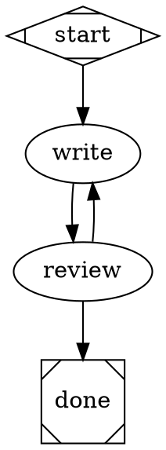

# Attractor Documentation

Attractor is a non-interactive coding agent for software factories. It orchestrates LLM-driven workflows defined as GraphViz DOT pipelines, executing them through an autonomous agent with tool-use capabilities across Anthropic, OpenAI, and Gemini.

## Documentation Guide

- **[Tutorial](tutorials/getting-started.md)** — Start here if you're new. Walk through installation, your first pipeline, and running it against a real LLM.
- **[How-to Guides](how-to/common-tasks.md)** — Practical recipes for specific tasks: custom handlers, new providers, conditional branching, stylesheets, goal gates, and more.
- **[API Reference](reference/api-reference.md)** — Complete specifications for the CLI, DOT format, pipeline engine, agent session, LLM client, and tool APIs.
- **[Architecture Explanation](explanation/architecture.md)** — Understand why Attractor is designed the way it is, the trade-offs involved, and how the pieces fit together.

## Quick Navigation

| I want to... | Go to |
|---|---|
| Get started from scratch | [Tutorial](tutorials/getting-started.md) |
| Create a pipeline with conditional branching | [How-to: Conditional Branching](how-to/common-tasks.md#how-to-add-conditional-branching) |
| Configure node attributes (model, temperature) | [How-to: Node Attributes](how-to/common-tasks.md#how-to-configure-node-attributes) |
| Add a model stylesheet | [How-to: Stylesheets](how-to/common-tasks.md#how-to-add-a-model-stylesheet) |
| Add a custom node handler | [How-to: Custom Handlers](how-to/common-tasks.md#how-to-add-a-custom-node-handler) |
| Add a new LLM provider | [How-to: New Provider](how-to/common-tasks.md#how-to-add-a-new-llm-provider-adapter) |
| Switch between LLM providers | [How-to: Switch Providers](how-to/common-tasks.md#how-to-switch-llm-providers) |
| Resume a failed pipeline | [How-to: Checkpoints](how-to/common-tasks.md#how-to-resume-from-a-checkpoint) |
| Look up CLI options | [Reference: CLI](reference/api-reference.md#1-cli-reference) |
| Look up DOT file syntax | [Reference: DOT Format](reference/api-reference.md#2-dot-file-format-reference) |
| Look up condition expression syntax | [Reference: Conditions](reference/api-reference.md#3-condition-expression-reference) |
| Understand the three-layer architecture | [Explanation: Architecture](explanation/architecture.md#system-architecture) |
| Understand the blackboard pattern | [Explanation: Context](explanation/architecture.md#blackboard-pattern-pipelinecontext) |
| Understand provider abstraction | [Explanation: Providers](explanation/architecture.md#provider-abstraction) |

## Quick Example



```bash
attractor run code_review.dot --model claude-sonnet-4-20250514 --verbose
```
