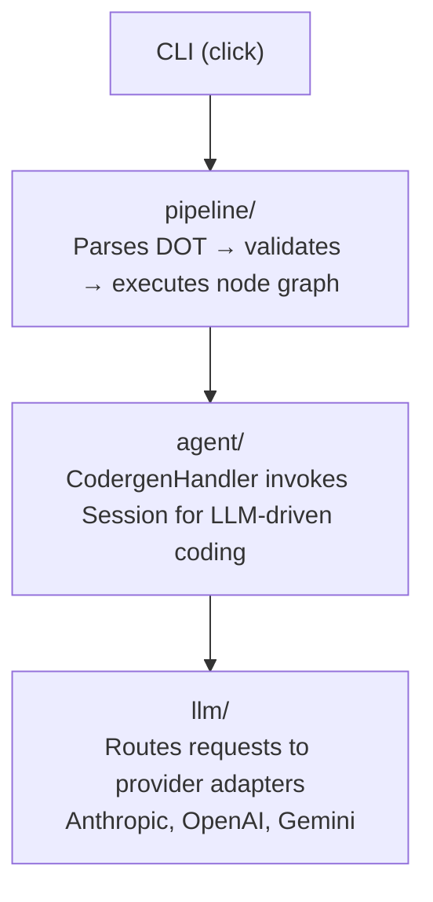
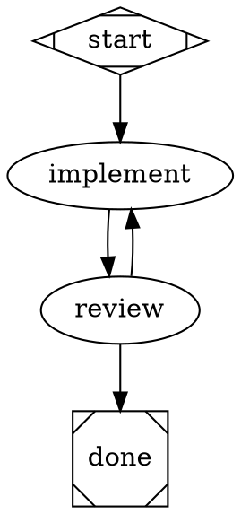
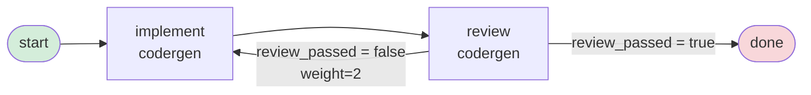
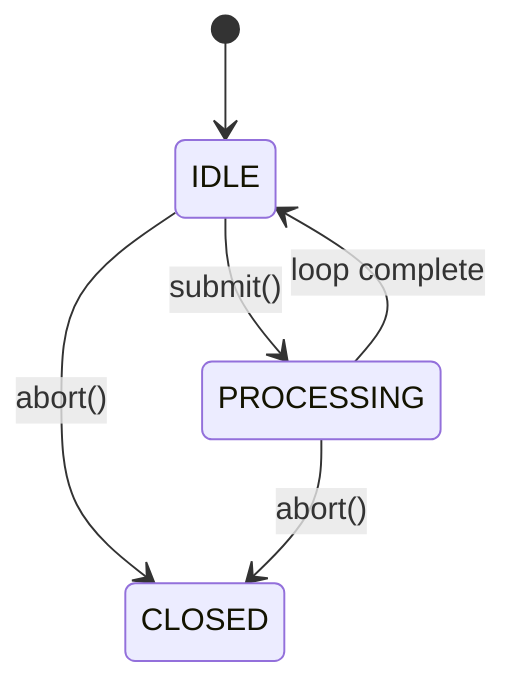

# Attractor API Reference

**Version**: 0.1.0
**Python**: >= 3.11

Attractor is a non-interactive coding agent for software factories. It orchestrates LLM-driven workflows defined as GraphViz DOT pipelines, executing them through an autonomous agent with tool-use capabilities.

**Architecture**:


---

## Contents

1. [CLI Reference](#1-cli-reference)
2. [DOT File Format Reference](#2-dot-file-format-reference)
3. [Condition Expression Reference](#3-condition-expression-reference)
4. [Pipeline Module Reference](#4-pipeline-module-reference)
5. [Agent Module Reference](#5-agent-module-reference)
6. [LLM Client Reference](#6-llm-client-reference)
7. [Tool Reference](#7-tool-reference)
8. [Configuration Reference](#8-configuration-reference)

---

## 1. CLI Reference

### Synopsis

```bash
attractor [OPTIONS] COMMAND [ARGS]...
```

### Global Options

#### --version

Show the installed version and exit.

#### --help

Show help and exit.

---

### `attractor run`

Execute a pipeline from a DOT file.

**Synopsis**:
```bash
attractor run [OPTIONS] PIPELINE_DOT
```

**Arguments**:

- `PIPELINE_DOT` (required): Path to a GraphViz DOT file. Must exist.

**Options**:

#### --model MODEL
- **Type**: String
- **Description**: Default model string for `codergen` nodes. Applied via an implicit stylesheet rule. Node-level `model` attributes override this.
- **Default**: None

#### --provider PROVIDER
- **Type**: String
- **Description**: LLM provider name override.
- **Default**: None

#### --verbose, -v
- **Type**: Flag
- **Description**: Enable DEBUG-level logging. Without this flag, INFO-level logging is used.
- **Default**: False

#### --checkpoint-dir PATH
- **Type**: Directory path
- **Description**: Directory where checkpoint JSON files are written after each completed node.
- **Default**: `.attractor/checkpoints`

**Behavior**:
1. Parses and validates the DOT file. Exits with code 1 on validation errors.
2. Prints warnings for non-fatal validation findings.
3. Executes the pipeline from its start node.
4. Prints the final context (non-internal keys) on completion.

**Example**:
```bash
attractor run pipeline.dot --model claude-opus-4-6 --verbose
attractor run pipeline.dot --checkpoint-dir /tmp/checkpoints
```

**Exit codes**:

| Code | Meaning |
|------|---------|
| 0 | Pipeline completed successfully |
| 1 | Parse error, validation error, or pipeline failure |

---

### `attractor validate`

Validate a pipeline DOT file without executing it.

**Synopsis**:
```bash
attractor validate [OPTIONS] PIPELINE_DOT
```

**Arguments**:

- `PIPELINE_DOT` (required): Path to a GraphViz DOT file. Must exist.

**Options**:

#### --strict
- **Type**: Flag
- **Description**: Treat warnings as errors. With this flag, any finding (including warnings) causes exit code 1.
- **Default**: False

**Output**: A Rich table showing level, location (node name or edge), and message for each finding.

**Example**:
```bash
attractor validate pipeline.dot
attractor validate pipeline.dot --strict
```

**Exit codes**:

| Code | Meaning |
|------|---------|
| 0 | No errors (warnings allowed unless `--strict`) |
| 1 | One or more errors found (or warnings with `--strict`) |

---

### `attractor resume`

Resume a pipeline from a checkpoint file.

**Synopsis**:
```bash
attractor resume [OPTIONS] CHECKPOINT_PATH
```

**Arguments**:

- `CHECKPOINT_PATH` (required): Path to a checkpoint JSON file. Must exist.

**Options**:

#### --pipeline-dot PATH
- **Type**: File path (must exist)
- **Description**: Path to the pipeline DOT file. Required — the checkpoint does not store the full pipeline definition.
- **Default**: None (required)

#### --verbose, -v
- **Type**: Flag
- **Description**: Enable DEBUG-level logging.
- **Default**: False

**Example**:
```bash
attractor resume .attractor/checkpoints/checkpoint_1706000000000.json \
  --pipeline-dot pipeline.dot
```

**Exit codes**: Same as `attractor run`.

---

## 2. DOT File Format Reference

Attractor pipelines are defined as GraphViz `digraph` DOT files parsed via `pydot`.

### Minimal Example





### Node Attributes

Set as key=value pairs inside node brackets: `nodename [attr="value"]`.

| Attribute | Type | Description | Default |
|-----------|------|-------------|---------|
| `type` | string | Handler type dispatch key. Parsed to `PipelineNode.handler_type`. If absent, inferred from `shape`. | Inferred from shape |
| `shape` | string | GraphViz shape. `Mdiamond` = start; `Msquare` = terminal/exit. | `box` |
| `label` | string | Human-readable display label. Used as prompt fallback when `prompt` is absent. | `""` |
| `prompt` | string | LLM prompt template. Supports `{key}` interpolation from `PipelineContext`. | `""` |
| `model` | string | LLM model override for this node. | Stylesheet or CLI default |
| `temperature` | float | LLM temperature override. | Provider default |
| `max_tokens` | integer | Maximum output tokens for LLM calls on this node. | Provider default |
| `max_retries` | integer | Maximum retry count for this node. 0 inherits pipeline default. | 0 |
| `allow_partial` | boolean | When true, exhausted retries produce `PARTIAL_SUCCESS` instead of `FAIL`. | `false` |
| `fidelity` | string | Context fidelity mode for this node. | Inherited |
| `timeout` | float | Maximum execution time in seconds. | None |
| `goal_gate` | boolean | Whether this node must complete before the pipeline can exit. | `false` |
| `retry_target` | string | Node to jump to when this node fails. | None |
| `fallback_retry_target` | string | Secondary retry target. | None |
| `thread_id` | string | Thread grouping identifier. | None |
| `reasoning_effort` | string | `low`, `medium`, or `high`. | `high` |
| `auto_status` | boolean | Whether the engine synthesizes a status note if the handler provides none. | `false` |
| `class` | string | CSS-like class names for stylesheet matching (space-separated). | `""` |

**CRITICAL**: The DOT attribute is `type` (not `handler` or `handler_type`). The parser maps `type` to the internal `PipelineNode.handler_type` field.

**Built-in handler types**:

| `type` value | Description |
|-------------|-------------|
| `start` | Entry point. No-op. Detected via `shape=Mdiamond` or case-insensitive name `start`. |
| `exit` | Terminal exit. No-op. Detected via `shape=Msquare` or case-insensitive name `exit`/`end`. |
| `codergen` | Invokes the Attractor coding agent for LLM-driven code generation. |
| `wait.human` | Presents a prompt to a human interviewer; gates on their selection. |
| `conditional` | No-op routing node. Succeeds immediately; edge evaluation handles routing. |
| `parallel` | Fan-out handler. Executes outgoing edge targets as concurrent branches. |
| `parallel.fan_in` | Consolidates results from a prior `parallel` node. |
| `tool` | Executes a shell command. Requires `tool_command` attribute. |
| `stack.manager_loop` | Orchestrates sprint-based iteration over a child pipeline. |

**Shape-to-handler inference**:

| `shape` value | Inferred handler type |
|---------------|----------------------|
| `Mdiamond` | `start` |
| `Msquare` | `exit` |
| Any other | `codergen` (default) |

**Start node detection** (in order):
1. Node with `shape=Mdiamond`
2. Node whose name matches `start` (case-insensitive)

**Terminal node detection** (any of):
- `shape=Msquare` (handler type `exit`)
- Name matches `exit` or `end` (case-insensitive)
- Node has no outgoing edges

### Edge Attributes

Set as key=value pairs inside edge brackets: `source -> target [attr="value"]`.

| Attribute | Type | Description | Default |
|-----------|------|-------------|---------|
| `condition` | string | Boolean expression evaluated against `PipelineContext`. See Section 3. | None (unconditional) |
| `weight` | integer | Priority. Higher values evaluated first. | 0 |
| `label` | string | Human-readable label. Used for preferred-label routing. | `""` |
| `fidelity` | string | Context fidelity mode override. Highest precedence. | None |
| `thread_id` | string | Thread grouping identifier. | None |
| `loop_restart` | boolean | When true, traversing this edge resets `completed_nodes` and `node_outcomes`. | `false` |

**CRITICAL**: Edge priority uses `weight` (higher = higher priority). `weight=2` takes precedence over `weight=0`.

### Fidelity Values

| Value | Behavior |
|-------|----------|
| `full` | No transformation; all context data preserved. |
| `truncate` | String values exceeding 500 characters are truncated with a `[truncated]` marker. |
| `compact` | Large strings replaced with byte-count placeholder. Default. |
| `summary:low` | Marks context for low-detail summarization. |
| `summary:medium` | Marks context for medium-detail summarization. |
| `summary:high` | Marks context for high-detail summarization. |

**Fidelity precedence** (highest to lowest):
1. Edge `fidelity` attribute
2. Node `fidelity` attribute
3. Graph `default_fidelity` attribute
4. Default: `compact`

---

## 3. Condition Expression Reference

Edge conditions are evaluated by a custom tokenizer/parser. No `eval`, `exec`, or `ast.parse` is used.

### Operators

| Operator | Meaning | Example |
|----------|---------|---------|
| `=` | Equality (string comparison) | `outcome = success` |
| `!=` | Inequality | `exit_code != 0` |
| `&&` | Logical AND (all clauses must be true) | `outcome = success && tests_passed = true` |

### Explicitly Unsupported Operators

| Operator | Error |
|----------|-------|
| `==` | Use `=` for equality checks |
| `<`, `>`, `<=`, `>=` | Comparison operators not supported |
| `and`, `or`, `not` | Use `&&` for AND; OR and NOT are not supported |

Unsupported operators raise `ConditionError`.

### Variable Resolution

Variables are bare names resolved against `PipelineContext` and engine-injected extra variables.

**Engine-injected variables** (always available):

| Variable | Value |
|----------|-------|
| `outcome` | Handler outcome string: `success`, `partial_success`, `retry`, `fail`, `skipped` |
| `preferred_label` | Value of `NodeResult.preferred_label`, or `""` |

**Resolution order**:
1. Extra vars (`outcome`, `preferred_label` injected by engine)
2. `PipelineContext` data
3. Missing keys resolve to `""` (falsy for bare-key truthy checks)

### Syntax Forms

```
# Equality check
outcome = success

# Inequality check
exit_code != 0

# Context variable check with context. prefix
context.tests_passed = true

# Bare key truthy check (non-empty value)
tests_passed

# Multiple conditions (all must be true)
outcome = success && tests_passed = true

# Unconditional (omit condition attribute entirely)
```

### `evaluate_condition()`

```python
evaluate_condition(
    expression: str,
    context: PipelineContext,
    extra_vars: dict[str, Any] | None = None,
) -> bool
```

- **Returns**: `True` if all `&&`-joined clauses evaluate to true.
- **Raises**: `ConditionError` if the expression is syntactically invalid.
- **Empty expression**: Returns `True` (unconditional).

### `validate_condition_syntax()`

```python
validate_condition_syntax(expression: str) -> str | None
```

- **Returns**: `None` if valid; an error message string if invalid.

---

## 4. Pipeline Module Reference

Source: `src/attractor/pipeline/`

---

### `OutcomeStatus`

```python
class OutcomeStatus(str, enum.Enum):
    SUCCESS = "success"
    PARTIAL_SUCCESS = "partial_success"
    RETRY = "retry"
    FAIL = "fail"
    SKIPPED = "skipped"
```

`NodeResult.success` returns `True` for both `SUCCESS` and `PARTIAL_SUCCESS`.

---

### `PipelineNode`

Dataclass representing a single node in the pipeline graph.

```python
@dataclass
class PipelineNode:
    name: str
    handler_type: str
    attributes: dict[str, Any] = field(default_factory=dict)
    is_start: bool = False
    is_terminal: bool = False
    label: str = ""
    shape: str = "box"
    classes: list[str] = field(default_factory=list)
    prompt: str = ""
    max_retries: int = 0
    goal_gate: bool = False
    retry_target: str | None = None
    fallback_retry_target: str | None = None
    fidelity: str | None = None
    thread_id: str | None = None
    timeout: float | None = None
    llm_model: str | None = None
    llm_provider: str | None = None
    reasoning_effort: str = "high"
    auto_status: bool = False
    allow_partial: bool = False
    retry_policy: RetryPolicy | None = None
```

**Fields**:

| Field | Type | Description |
|-------|------|-------------|
| `name` | `str` | Unique node identifier. |
| `handler_type` | `str` | Dispatch key for the handler registry. |
| `attributes` | `dict[str, Any]` | Handler-specific configuration from DOT attributes and stylesheet overrides. |
| `is_start` | `bool` | Whether this is the entry point. |
| `is_terminal` | `bool` | Whether this is a terminal (exit) node. |
| `label` | `str` | Human-readable display label. |
| `shape` | `str` | GraphViz node shape. Default: `"box"`. |
| `classes` | `list[str]` | CSS-like class names for stylesheet matching. |
| `prompt` | `str` | LLM prompt template string. |
| `max_retries` | `int` | Maximum retry count. 0 inherits from pipeline default. |
| `goal_gate` | `bool` | Whether this node must complete before terminal exit. |
| `retry_target` | `str | None` | Node to jump to on failure. |
| `fallback_retry_target` | `str | None` | Secondary retry target. |
| `fidelity` | `str | None` | Context fidelity mode override. |
| `thread_id` | `str | None` | Thread grouping identifier. |
| `timeout` | `float | None` | Execution timeout in seconds. |
| `llm_model` | `str | None` | LLM model override. Set by stylesheet or DOT attribute. |
| `llm_provider` | `str | None` | LLM provider override. |
| `reasoning_effort` | `str` | Reasoning effort: `"low"`, `"medium"`, `"high"`. Default: `"high"`. |
| `auto_status` | `bool` | Synthesize auto-status note if handler provides none. |
| `allow_partial` | `bool` | Accept `PARTIAL_SUCCESS` when retries are exhausted. |
| `retry_policy` | `RetryPolicy | None` | Node-specific retry policy. Overrides engine default when set. |

---

### `PipelineEdge`

Dataclass representing a directed edge between two nodes.

```python
@dataclass
class PipelineEdge:
    source: str
    target: str
    condition: str | None = None
    label: str = ""
    weight: int = 0
    fidelity: str | None = None
    thread_id: str | None = None
    loop_restart: bool = False
```

**Fields**:

| Field | Type | Description |
|-------|------|-------------|
| `source` | `str` | Name of the originating node. |
| `target` | `str` | Name of the destination node. |
| `condition` | `str | None` | Condition expression. `None` means unconditional. |
| `label` | `str` | Display label. Used for preferred-label routing. |
| `weight` | `int` | Priority: higher values evaluated first. Default: 0. |
| `fidelity` | `str | None` | Fidelity mode override. Highest precedence in fidelity resolution. |
| `thread_id` | `str | None` | Thread grouping identifier. |
| `loop_restart` | `bool` | When `True`, traversal resets `completed_nodes` and `node_outcomes`. |

---

### `Pipeline`

Dataclass representing a complete pipeline parsed from a DOT file.

```python
@dataclass
class Pipeline:
    name: str
    nodes: dict[str, PipelineNode] = field(default_factory=dict)
    edges: list[PipelineEdge] = field(default_factory=list)
    start_node: str = ""
    metadata: dict[str, Any] = field(default_factory=dict)
    goal: str = ""
    default_max_retry: int = 50
    retry_target: str | None = None
    fallback_retry_target: str | None = None
    default_fidelity: str | None = None
    model_stylesheet: str | None = None
```

**Fields**:

| Field | Type | Description |
|-------|------|-------------|
| `name` | `str` | Pipeline identifier (DOT graph name). |
| `nodes` | `dict[str, PipelineNode]` | Node name to `PipelineNode` mapping. |
| `edges` | `list[PipelineEdge]` | All directed edges in the graph. |
| `start_node` | `str` | Name of the designated start node. |
| `metadata` | `dict[str, Any]` | Arbitrary graph-level attributes from the DOT file. |
| `goal` | `str` | Top-level goal description. |
| `default_max_retry` | `int` | Default retry count for nodes without explicit setting. Default: 50. |
| `retry_target` | `str | None` | Pipeline-level retry target. |
| `fallback_retry_target` | `str | None` | Pipeline-level fallback retry target. |
| `default_fidelity` | `str | None` | Graph-level default fidelity mode. |
| `model_stylesheet` | `str | None` | Inline stylesheet content. |

**Methods**:

#### `outgoing_edges(node_name)`

```python
def outgoing_edges(self, node_name: str) -> list[PipelineEdge]
```

Returns edges from `node_name`, sorted by weight descending, then target lexically ascending.

#### `incoming_edges(node_name)`

```python
def incoming_edges(self, node_name: str) -> list[PipelineEdge]
```

Returns all edges targeting `node_name`.

---

### `NodeResult`

Dataclass returned by a node handler after execution.

```python
@dataclass
class NodeResult:
    status: OutcomeStatus
    output: Any = None
    failure_reason: str | None = None
    next_node: str | None = None
    context_updates: dict[str, Any] = field(default_factory=dict)
    preferred_label: str | None = None
    suggested_next_ids: list[str] = field(default_factory=list)
    notes: str | None = None
```

**Fields**:

| Field | Type | Description |
|-------|------|-------------|
| `status` | `OutcomeStatus` | Outcome of handler execution. |
| `output` | `Any` | Arbitrary output payload. |
| `failure_reason` | `str | None` | Error description when status indicates failure. |
| `next_node` | `str | None` | Explicit routing override — bypasses edge evaluation entirely. |
| `context_updates` | `dict[str, Any]` | Key-value pairs merged into `PipelineContext` after execution. |
| `preferred_label` | `str | None` | Preferred edge label for routing (step 2 of edge selection). |
| `suggested_next_ids` | `list[str]` | Suggested next node IDs (step 3 of edge selection). |
| `notes` | `str | None` | Free-form notes written to `status.json`. |

**Properties**:

#### `success`

```python
@property
def success(self) -> bool
```

Returns `True` when `status` is `SUCCESS` or `PARTIAL_SUCCESS`.

---

### `PipelineContext`

Shared key-value state store (blackboard pattern) for pipeline execution. Supports JSON serialization for checkpointing.

**Internal key conventions** (all prefixed with `_`):

| Key | Set by | Description |
|-----|--------|-------------|
| `_last_error` | Engine | Error description from the most recent node failure. |
| `_failed_node` | Engine | Name of the node that most recently failed. |
| `_completed_nodes` | Engine | Ordered list of nodes that finished successfully. |
| `_goal_gate_unmet` | Engine | List of unsatisfied goal gate node names. |
| `_fidelity_mode` | Engine | Currently active fidelity mode string. |
| `_condition_error` | Engine | Condition evaluation error description. |
| `_needs_summarization` | Engine | `True` when fidelity is `summary:*`. |
| `_summary_detail` | Engine | Summary detail level when fidelity is `summary:*`. |

**Engine-set plain keys**:

| Key | Set by | Description |
|-----|--------|-------------|
| `outcome` | Engine | Handler outcome value string after each node. |
| `preferred_label` | Engine | Value of `NodeResult.preferred_label` after each node. |
| `current_node` | Engine | Name of the node just executed. |
| `last_stage` | Engine | Same as `current_node`. |
| `graph.goal` | Engine | Value of `Pipeline.goal`, set at start. |
| `last_response` | `CodergenHandler` | Text output from the most recent codergen node. |

**Methods**:

| Method | Returns | Description |
|--------|---------|-------------|
| `get(key, default=None)` | `Any` | Value for `key`, or `default`. |
| `get_string(key, default="")` | `str` | Value coerced to `str`, or `default`. |
| `set(key, value)` | `None` | Store `value` under `key`. |
| `has(key)` | `bool` | Whether `key` exists. |
| `delete(key)` | `None` | Remove `key` if present. |
| `to_dict()` | `dict[str, Any]` | Shallow copy of all context data. |
| `snapshot()` | `dict[str, Any]` | Deep copy of all context data. |
| `update(updates)` | `None` | Merge `updates` into context. |
| `clone()` | `PipelineContext` | Deep copy for branch isolation. |
| `create_scope(prefix)` | `PipelineContext` | Child context for parallel branch isolation. |
| `merge_scope(scope, prefix)` | `None` | Merge scoped context back, prefixing keys as `{prefix}.{key}`. |
| `from_dict(data)` | `PipelineContext` | Classmethod. Create from existing dictionary. |
| `append_log(entry)` | `None` | Append structured log entry. |
| `get_logs()` | `list[dict]` | Copy of all log entries. |

---

### `Checkpoint`

Serializable execution snapshot for resume-on-failure.

```python
@dataclass
class Checkpoint:
    pipeline_name: str
    current_node: str
    context: PipelineContext
    completed_nodes: list[str] = field(default_factory=list)
    timestamp: float = field(default_factory=time.time)
    node_retries: dict[str, int] = field(default_factory=dict)
    logs: list[dict[str, Any]] = field(default_factory=list)
```

**Fields**:

| Field | Type | Description |
|-------|------|-------------|
| `pipeline_name` | `str` | Name of the pipeline being executed. |
| `current_node` | `str` | Node that will execute on resume. |
| `context` | `PipelineContext` | Full pipeline context at checkpoint time. |
| `completed_nodes` | `list[str]` | Ordered list of nodes that finished successfully. |
| `timestamp` | `float` | UNIX epoch when the checkpoint was created. |
| `node_retries` | `dict[str, int]` | Per-node retry counts (key: node name, value: attempt count). |
| `logs` | `list[dict[str, Any]]` | Structured log entries. |

**Filename format**: `checkpoint_{timestamp_ms}.json`

**Methods**:

| Method | Signature | Description |
|--------|-----------|-------------|
| `to_dict()` | `() -> dict[str, Any]` | Serialize to JSON-compatible dict. |
| `from_dict(data)` | `(dict) -> Checkpoint` | Reconstruct from dict. |
| `save_to_file(path)` | `(str | Path) -> None` | Write JSON to file (creates parent dirs). |
| `load_from_file(path)` | `(str | Path) -> Checkpoint` | Load from JSON file. |

---

### `PipelineEngine`

DAG execution engine. Walks the pipeline from the start node, dispatching handlers, evaluating edges, and checkpointing.

```python
class PipelineEngine:
    def __init__(
        self,
        registry: HandlerRegistry | None = None,
        stylesheet: ModelStylesheet | None = None,
        checkpoint_dir: str | Path | None = None,
        goal_gate: GoalGate | None = None,
        max_steps: int = 1000,
        event_emitter: PipelineEventEmitter | None = None,
        logs_root: str | Path | None = None,
        default_retry_policy: RetryPolicy | None = None,
    ) -> None
```

**Constructor parameters**:

| Parameter | Type | Description | Default |
|-----------|------|-------------|---------|
| `registry` | `HandlerRegistry | None` | Handler registry. Auto-creates default if `None`. | None |
| `stylesheet` | `ModelStylesheet | None` | Stylesheet for node attribute defaults. | Empty |
| `checkpoint_dir` | `str | Path | None` | Directory for checkpoint files. No checkpoints if `None`. | None |
| `goal_gate` | `GoalGate | None` | Legacy goal gate object. Prefer `goal_gate=True` on nodes. | None |
| `max_steps` | `int` | Maximum node execution steps before stopping. | 1000 |
| `event_emitter` | `PipelineEventEmitter | None` | Emitter for pipeline observability events. | None |
| `logs_root` | `str | Path | None` | Root directory for per-run logs and artifacts. | None |
| `default_retry_policy` | `RetryPolicy | None` | Default retry policy for nodes without explicit `retry_policy`. | None |

**Methods**:

#### `run(pipeline, context=None, checkpoint=None)`

```python
async def run(
    self,
    pipeline: Pipeline,
    context: PipelineContext | None = None,
    checkpoint: Checkpoint | None = None,
) -> PipelineContext
```

Executes `pipeline` and returns the final context.

- **`context`**: Initial context. Uses empty `PipelineContext` if `None`.
- **`checkpoint`**: Resume state. Starts from `checkpoint.current_node` when provided.
- **Returns**: `PipelineContext` after pipeline completion.
- **Raises**: `EngineError` on unrecoverable errors.

**Execution flow** per node:
1. Apply stylesheet attribute defaults.
2. Resolve and apply fidelity mode.
3. Check goal gates (before terminal nodes).
4. Dispatch to handler via registry.
5. Apply retry policy (up to `max_attempts`).
6. Merge `context_updates` into context.
7. Evaluate outgoing edges (5-step algorithm).
8. Write checkpoint.

**Edge selection algorithm** (5 steps, in order):
1. Evaluate all conditional edges. Select highest-weight match if any conditions are true.
2. Match `preferred_label` against edge labels.
3. Match `suggested_next_ids` against edge targets.
4. Select unconditional edges by weight descending, then target lexically.
5. Final fallback: any edge by weight descending, then target lexically.

**Failure routing** (for `FAIL` status, in order):
1. Edge with condition referencing `outcome` and `fail`.
2. `node.retry_target`.
3. `node.fallback_retry_target`.
4. If none: raise `EngineError`.

---

### `NodeHandler` (Protocol)

```python
@runtime_checkable
class NodeHandler(Protocol):
    async def execute(
        self,
        node: PipelineNode,
        context: PipelineContext,
        graph: Pipeline | None = None,
        logs_root: Path | None = None,
    ) -> NodeResult: ...
```

All node handlers must satisfy this protocol.

---

### `HandlerRegistry`

Maps handler-type strings to handler instances.

```python
class HandlerRegistry:
    def __init__(
        self,
        default_handler: NodeHandler | None = None,
        hooks: list[HandlerHook] | None = None,
    ) -> None
```

**Methods**:

| Method | Signature | Description |
|--------|-----------|-------------|
| `register(handler_type, handler)` | `(str, NodeHandler) -> None` | Register a handler under a type key. |
| `get(handler_type)` | `(str) -> NodeHandler | None` | Return the handler for `handler_type`, or the default handler if none registered. |
| `has(handler_type)` | `(str) -> bool` | Return `True` if `handler_type` is registered. |
| `dispatch(handler_type, node, context, ...)` | `async (...) -> NodeResult` | Look up and execute a handler with hook invocation. |
| `add_hook(hook)` | `(HandlerHook) -> None` | Append a pre/post execution hook. |

**Properties**:

| Property | Type | Description |
|----------|------|-------------|
| `default_handler` | `NodeHandler | None` | Fallback handler for unknown types. Read/write. |
| `hooks` | `list[HandlerHook]` | Copy of registered hooks. Read-only. |
| `registered_types` | `list[str]` | All registered handler type strings. |

**`create_default_registry(pipeline=None, interviewer=None, event_emitter=None)`**

Factory that pre-loads all built-in handlers:

| Registered type | Handler class |
|----------------|--------------|
| `start` | `StartHandler` |
| `exit` | `ExitHandler` |
| `codergen` | `CodergenHandler` |
| `wait.human` | `WaitHumanHandler` |
| `conditional` | `ConditionalHandler` |
| `parallel` | `ParallelHandler` |
| `parallel.fan_in` | `FanInHandler` |
| `tool` | `ToolHandler` |
| `stack.manager_loop` | `ManagerLoopHandler` |

Default fallback handler: `CodergenHandler`.

---

### `HandlerHook` (Protocol)

```python
@runtime_checkable
class HandlerHook(Protocol):
    async def before_execute(
        self, node: PipelineNode, context: PipelineContext
    ) -> None: ...

    async def after_execute(
        self, node: PipelineNode, context: PipelineContext, result: NodeResult
    ) -> None: ...
```

---

### `GoalGate`

Enforces required node completions and context conditions before pipeline exit.

```python
@dataclass
class GoalGate:
    required_nodes: list[str] = field(default_factory=list)
    context_conditions: list[str] = field(default_factory=list)
```

**Fields**:

| Field | Type | Description |
|-------|------|-------------|
| `required_nodes` | `list[str]` | Node names that must appear in `_completed_nodes`. |
| `context_conditions` | `list[str]` | Condition expressions that must all evaluate to `True`. |

**Methods**:

#### `check(completed_nodes, context)`

```python
def check(self, completed_nodes: list[str], context: PipelineContext) -> bool
```

Returns `True` if all required nodes completed and all conditions hold.

#### `unmet_requirements(completed_nodes, context)`

```python
def unmet_requirements(
    self, completed_nodes: list[str], context: PipelineContext
) -> list[str]
```

Returns human-readable descriptions of unmet requirements.

---

### `ModelStylesheet`

Rule-based default attributes applied per-node before handler dispatch.

```python
@dataclass
class ModelStylesheet:
    rules: list[StyleRule] = field(default_factory=list)
```

**CSS-like selector types** (used with `parse_stylesheet(css: str)`):

| Selector | `selector_type` | Specificity | Example |
|----------|----------------|-------------|---------|
| `*` | `universal` | 0 | `* { model: gpt-4o }` |
| `shape_name` | `shape` | 1 | `Mdiamond { timeout: 30 }` |
| `.classname` | `class` | 2 | `.expensive { max_tokens: 4096 }` |
| `#nodename` | `id` | 3 | `#implement { model: claude-opus-4-6 }` |

**Attribute precedence** (lowest to highest):
1. Universal stylesheet rules.
2. Shape/class stylesheet rules (in specificity order).
3. ID stylesheet rules.
4. Node-specific DOT attributes (always win).

**Stylesheet properties**:

| Property | Type | Description |
|----------|------|-------------|
| `llm_model` | string | Sets `PipelineNode.llm_model`. |
| `llm_provider` | string | Sets `PipelineNode.llm_provider`. |
| `reasoning_effort` | string | Sets `PipelineNode.reasoning_effort`. |
| `model` | string | Legacy model default (stored in `attributes`). |
| `temperature` | float | Temperature default. |
| `max_tokens` | integer | Max tokens default. |
| `timeout` | float | Timeout default in seconds. |
| `retry_count` | integer | Retry count default. |

**`ModelStylesheet.from_dict(data)`** — builds from a dictionary:
```python
ModelStylesheet.from_dict({
    "rules": [
        {"handler_type": "codergen", "model": "gpt-4o", "timeout": 120},
    ]
})
```

**`parse_stylesheet(css)`** — parses CSS-like text:
```python
stylesheet = parse_stylesheet("""
* { model: gpt-4o }
#implement { model: claude-opus-4-6; reasoning_effort: high }
.fast { timeout: 30 }
""")
```

**`apply_stylesheet(stylesheet, node, pipeline=None)`** — resolves final attributes for a node:
```python
resolved_attrs = apply_stylesheet(stylesheet, node, pipeline=pipeline)
```

Returns merged attribute dict. Also sets `node.llm_model`, `node.llm_provider`, `node.reasoning_effort` directly when resolved.

---

### Pipeline Validation

**`validate_pipeline(pipeline, extra_rules=None)`**

```python
def validate_pipeline(
    pipeline: Pipeline,
    extra_rules: list[LintRule] | None = None,
) -> list[ValidationError]
```

Runs all static validation checks. Returns a list of `ValidationError` findings.

**`validate_or_raise(pipeline, extra_rules=None)`**

Raises `ValidationException` if any `ERROR`-level findings are present.

**`has_errors(findings)`**

Returns `True` if any finding has level `ERROR`.

**`ValidationError`**:

```python
@dataclass
class ValidationError:
    level: ValidationLevel  # ERROR, WARNING, INFO
    message: str
    node_name: str | None = None
    edge: PipelineEdge | None = None
    rule: str = ""
    fix: str | None = None
```

**Validation rules**:

| Rule | Level | Description |
|------|-------|-------------|
| `start_node` | ERROR | Missing, duplicate, or nonexistent start node. |
| `start_no_incoming` | ERROR | Start node has incoming edges. |
| `terminal_node` | ERROR | Missing terminal nodes. |
| `exit_no_outgoing` | ERROR | Exit node has outgoing edges. |
| `type_known` | WARNING | Unknown handler type (not in built-in registry). |
| `required_attributes` | ERROR | Handler-required attributes missing (e.g. `tool_command` for `tool` handler). |
| `edge_target_exists` | ERROR | Edge source or target does not exist. |
| `condition_syntax` | ERROR | Invalid condition expression syntax. |
| `reachability` | ERROR | Node unreachable from start. |
| cycles | WARNING | Node is part of a non-supervisor cycle. |
| `retry_target_exists` | WARNING | `retry_target` or `fallback_retry_target` references nonexistent node. |
| `goal_gate_has_retry` | WARNING | `goal_gate` node has no `retry_target` and no pipeline-level `retry_target`. |
| `prompt_on_llm_nodes` | WARNING | `codergen` node has neither `prompt` nor `label`. |
| `stylesheet_syntax` | ERROR | `model_stylesheet` contains invalid syntax or no rules. |
| `fidelity_valid` | WARNING | Invalid fidelity value on graph, node, or edge. |

**`register_lint_rule(rule)`** — registers a custom `LintRule` applied during every `validate_pipeline()` call.

---

### Checkpoint State Functions

**`save_checkpoint(checkpoint, directory)`**

```python
def save_checkpoint(checkpoint: Checkpoint, directory: str | Path) -> Path
```

Writes `checkpoint` to `{directory}/checkpoint_{timestamp_ms}.json`. Creates directory if needed. Returns the file path.

**`list_checkpoints(directory)`**

```python
def list_checkpoints(directory: str | Path) -> list[Path]
```

Returns all `checkpoint_*.json` files in `directory`, newest first.

**`latest_checkpoint(directory)`**

```python
def latest_checkpoint(directory: str | Path) -> Checkpoint | None
```

Loads and returns the most recent checkpoint, or `None` if none exist.

---

### `Interviewer` Protocol

```python
class Interviewer(Protocol):
    async def confirm(self, prompt: str) -> bool: ...
    async def ask(self, question: Question) -> Answer: ...
    async def inform(self, message: str) -> None: ...
```

**Concrete implementations**:

| Class | Description |
|-------|-------------|
| `CLIInterviewer` | Rich-based interactive terminal interviewer. Used by `run` and `resume` commands. |
| `QueueInterviewer` | Queue-based interviewer for testing. Pre-loads expected answers. |

**`Question`**:

```python
@dataclass
class Question:
    text: str
    type: QuestionType          # FREE_TEXT or MULTIPLE_CHOICE
    options: list[Option] = field(default_factory=list)
    stage: str = ""
    timeout_seconds: float | None = None
```

**`Answer`**:

```python
@dataclass
class Answer:
    value: str | AnswerValue
    selected_option: Option | None = None
```

`AnswerValue` enum: `SKIPPED`.

---

## 5. Agent Module Reference

Source: `src/attractor/agent/`

---

### `SessionConfig`

Configuration dataclass for an agent session.

```python
@dataclass
class SessionConfig:
    max_turns: int = 0
    max_tool_rounds_per_input: int = 0
    default_command_timeout_ms: int | None = None
    max_command_timeout_ms: int = 600_000
    reasoning_effort: ReasoningEffort | None = None
    enable_loop_detection: bool = True
    loop_detection_window: int = 10
    max_subagent_depth: int = 1
    model_id: str = ""
    user_instructions: str = ""
    truncation_config: TruncationConfig | None = None
    context_window_warning_threshold: float = 0.8
```

**Fields**:

| Field | Type | Description | Default |
|-------|------|-------------|---------|
| `max_turns` | `int` | Maximum total LLM round-trips across the entire session. 0 = unlimited. | 0 |
| `max_tool_rounds_per_input` | `int` | Maximum tool execution rounds per `submit()` call. 0 = unlimited. | 0 |
| `default_command_timeout_ms` | `int | None` | Default shell command timeout in milliseconds. `None` uses the profile default (Anthropic: 120,000ms; others: 10,000ms). | None |
| `max_command_timeout_ms` | `int` | Hard ceiling on shell command timeouts. Enforced even if the model requests longer. | 600,000 |
| `reasoning_effort` | `ReasoningEffort | None` | Optional reasoning effort override for LLM calls. | None |
| `enable_loop_detection` | `bool` | Whether to detect and warn on repeating tool call patterns. | True |
| `loop_detection_window` | `int` | Number of recent tool calls to examine for repeating patterns. | 10 |
| `max_subagent_depth` | `int` | Maximum nesting depth for subagents. | 1 |
| `model_id` | `str` | Model identifier string passed to the LLM client. | `""` |
| `user_instructions` | `str` | Extra instructions appended to the system prompt. | `""` |
| `truncation_config` | `TruncationConfig | None` | Per-tool truncation limits. Uses defaults if `None`. | None |
| `context_window_warning_threshold` | `float` | Fraction (0.0–1.0) of context window usage that triggers a `CONTEXT_WINDOW_WARNING` event. | 0.8 |

---

### `Session`

Top-level API for the autonomous coding agent.

```python
class Session:
    def __init__(
        self,
        profile: ProviderProfile,
        environment: ExecutionEnvironment,
        config: SessionConfig,
        llm_client: LLMClientProtocol,
        *,
        _depth: int = 0,
    ) -> None
```

**Constructor parameters**:

| Parameter | Type | Description |
|-----------|------|-------------|
| `profile` | `ProviderProfile` | Provider-specific tools and system prompt configuration. |
| `environment` | `ExecutionEnvironment` | OS-level file and shell operations. |
| `config` | `SessionConfig` | Session configuration. |
| `llm_client` | `LLMClientProtocol` | LLM client for completions. |

**Properties**:

| Property | Type | Description |
|----------|------|-------------|
| `id` | `str` | UUID for this session instance. |
| `state` | `SessionState` | Current lifecycle state. Read-only. |
| `conversation_history` | `list[Message]` | Defensive copy of conversation history. |
| `turns` | `list[Turn]` | Defensive copy of typed turn history. |

**State machine**:

| State | Description |
|-------|-------------|
| `IDLE` | Ready to accept `submit()`. |
| `PROCESSING` | Actively running the agentic loop. |
| `AWAITING_INPUT` | Reserved for future human-in-the-loop use. |
| `CLOSED` | Session ended via `abort()` or `shutdown()`. |



**Methods**:

#### `submit(user_input)`

```python
async def submit(self, user_input: str) -> AsyncIterator[AgentEvent]
```

Submits user input and yields `AgentEvent` instances as the agent works.

- **Accepts from**: `IDLE` or `AWAITING_INPUT` states.
- **Raises**: `RuntimeError` if state is `CLOSED` or `PROCESSING`.
- **Returns**: Async iterator of `AgentEvent` objects. Iteration ends when the loop completes.

**Example**:
```python
async for event in session.submit("Fix the bug in auth.py"):
    if event.type == AgentEventType.ASSISTANT_TEXT_DELTA:
        print(event.data.get("text", ""), end="", flush=True)
```

#### `steer(message)`

```python
def steer(self, message: str) -> None
```

Queues a steering message to inject between tool rounds. Only effective when state is `PROCESSING`.

#### `follow_up(message)`

```python
def follow_up(self, message: str) -> None
```

Queues a message for processing after the current input completes.

#### `set_reasoning_effort(effort)`

```python
def set_reasoning_effort(self, effort: ReasoningEffort) -> None
```

Changes reasoning effort for the next LLM call.

#### `abort()`

```python
def abort(self) -> None
```

Cancels the running loop and transitions to `CLOSED`. If not currently processing, transitions immediately.

#### `shutdown()`

```python
async def shutdown(self) -> None
```

Graceful shutdown — closes the execution environment and marks the session `CLOSED`.

---

### `AgentEventType`

```python
class AgentEventType(str, enum.Enum):
    SESSION_START = "session_start"
    SESSION_END = "session_end"
    USER_INPUT = "user_input"
    ASSISTANT_TEXT_START = "assistant_text_start"
    ASSISTANT_TEXT_DELTA = "assistant_text_delta"
    ASSISTANT_TEXT_END = "assistant_text_end"
    TOOL_CALL_START = "tool_call_start"
    TOOL_CALL_OUTPUT_DELTA = "tool_call_output_delta"
    TOOL_CALL_END = "tool_call_end"
    STEERING_INJECTED = "steering_injected"
    TURN_LIMIT = "turn_limit"
    LOOP_DETECTION = "loop_detection"
    CONTEXT_WINDOW_WARNING = "context_window_warning"
    ERROR = "error"
```

**Event data payloads**:

| Event type | `data` keys | Description |
|------------|-------------|-------------|
| `SESSION_START` | `state` | Session lifecycle state value string. |
| `SESSION_END` | `state` | Session lifecycle state after completion. |
| `USER_INPUT` | `text` | The submitted user input text. |
| `ASSISTANT_TEXT_START` | _(empty)_ | Model started generating text. |
| `ASSISTANT_TEXT_DELTA` | `text` | Incremental text chunk from the model. |
| `ASSISTANT_TEXT_END` | `text` | Complete assistant response text. |
| `TOOL_CALL_START` | `tool_name`, `tool_call_id`, `arguments` | Tool invocation starting. |
| `TOOL_CALL_OUTPUT_DELTA` | `text` | Incremental tool output chunk. |
| `TOOL_CALL_END` | `tool_name`, `tool_call_id`, `output`, `truncated_output`, `is_error` | Tool execution completed. `output` is full output; `truncated_output` is the LLM-facing version. |
| `STEERING_INJECTED` | `text` | Steering message injected between tool rounds. |
| `TURN_LIMIT` | `turns`, `limit` | Turn limit reached; loop terminating. |
| `LOOP_DETECTION` | `pattern`, `window` | Repeating tool call pattern detected (warning only — loop continues). |
| `CONTEXT_WINDOW_WARNING` | `usage_fraction`, `threshold` | Context window usage nearing configured threshold. |
| `ERROR` | `error`, `phase` | Unhandled exception during session execution. |

---

### `AgentEvent`

```python
@dataclass
class AgentEvent:
    type: AgentEventType
    data: dict[str, Any] = field(default_factory=dict)
    timestamp: float = field(default_factory=time.time)
    session_id: str = ""
```

---

### `ExecutionEnvironment` (Protocol)

Interface that agent tools use to interact with the filesystem and OS.

```python
@runtime_checkable
class ExecutionEnvironment(Protocol):
    async def initialize(self) -> None: ...
    async def cleanup(self) -> None: ...
    def working_directory(self) -> str: ...
    def platform(self) -> str: ...
    async def read_file(
        self, path: str, offset: int | None = None, limit: int | None = None
    ) -> str: ...
    async def write_file(self, path: str, content: str) -> None: ...
    async def file_exists(self, path: str) -> bool: ...
    async def list_directory(self, path: str, depth: int = 1) -> list[DirEntry]: ...
    async def exec_command(
        self,
        command: str,
        timeout_ms: int = 10_000,
        working_dir: str | None = None,
        env_vars: dict[str, str] | None = None,
    ) -> ExecResult: ...
    async def grep(
        self, pattern: str, path: str, options: dict[str, str] | None = None
    ) -> str: ...
    async def glob(self, pattern: str, path: str | None = None) -> list[str]: ...
```

**Method specifications**:

| Method | Returns | Description |
|--------|---------|-------------|
| `initialize()` | `None` | Setup before tool execution begins. |
| `cleanup()` | `None` | Release resources when session ends. |
| `working_directory()` | `str` | Current working directory path. |
| `platform()` | `str` | Platform identifier (e.g. `"linux"`, `"darwin"`). |
| `read_file(path, offset=None, limit=None)` | `str` | File content with `cat -n` style line numbers. `offset` is 1-based. |
| `write_file(path, content)` | `None` | Write content to file. Creates parent directories as needed. |
| `file_exists(path)` | `bool` | Whether the file at `path` exists. |
| `list_directory(path, depth=1)` | `list[DirEntry]` | Directory entries up to `depth` levels deep. |
| `exec_command(command, timeout_ms=10000, working_dir=None, env_vars=None)` | `ExecResult` | Execute shell command with timeout and signal handling. |
| `grep(pattern, path, options=None)` | `str` | Regex search across files. `options` supports `include` (glob) and `max_results`. |
| `glob(pattern, path=None)` | `list[str]` | File paths matching pattern, sorted by modification time. |

**`DirEntry`**:
```python
@dataclass
class DirEntry:
    name: str
    path: str
    is_dir: bool
    size: int = 0
```

**`ExecResult`**:
```python
@dataclass
class ExecResult:
    stdout: str = ""
    stderr: str = ""
    exit_code: int = 0
    timed_out: bool = False
    duration_ms: int = 0
```

**`LocalExecutionEnvironment`**

Concrete implementation backed by the host filesystem and OS.

```python
class LocalExecutionEnvironment:
    def __init__(self, working_dir: str | None = None) -> None
```

- **`working_dir`**: Working directory. Defaults to `Path.cwd()`.
- Resolves relative paths against `working_dir`.
- `exec_command` uses `SIGTERM` → 2s wait → `SIGKILL` for timeout handling.
- Filters sensitive environment variables from subprocess environments.

**Filtered env var patterns**: `*_API_KEY`, `*_SECRET`, `*_TOKEN`, `*_PASSWORD`, `AWS_*KEY*`, `DATABASE_URL`, `*_DATABASE_URL`, `GITHUB_TOKEN`, `GH_TOKEN`, `NPM_TOKEN`, `DOCKER_*`.

---

### `ProviderProfile` (Protocol)

Provider-specific configuration for tools and system prompts.

```python
@runtime_checkable
class ProviderProfile(Protocol):
    @property
    def provider_name(self) -> str: ...
    @property
    def tool_definitions(self) -> list[ToolDefinition]: ...
    @property
    def system_prompt_template(self) -> str: ...
    @property
    def context_window_size(self) -> int: ...
    @property
    def supports_reasoning(self) -> bool: ...
    @property
    def supports_streaming(self) -> bool: ...
    @property
    def supports_parallel_tool_calls(self) -> bool: ...
    @property
    def default_timeout_ms(self) -> int: ...
    def provider_options(self) -> dict | None: ...
    def get_tools(self) -> list[ToolDefinition]: ...
    def format_system_prompt(self, **kwargs: str) -> str: ...
```

**Properties**:

| Property | Type | Description |
|----------|------|-------------|
| `provider_name` | `str` | Short provider identifier: `"anthropic"`, `"openai"`, `"google"`. |
| `tool_definitions` | `list[ToolDefinition]` | Tools this profile exposes to the model. |
| `system_prompt_template` | `str` | Template for the base system prompt with `{placeholder}` variables. |
| `context_window_size` | `int` | Maximum context window size in tokens for this profile. |
| `supports_reasoning` | `bool` | Whether the provider supports reasoning/thinking capabilities. |
| `supports_streaming` | `bool` | Whether the provider supports streaming responses. |
| `supports_parallel_tool_calls` | `bool` | Whether the provider supports parallel tool execution. |
| `default_timeout_ms` | `int` | Default shell command timeout. Anthropic: 120,000ms. Others: 10,000ms. |

**`format_system_prompt(**kwargs)`**: Replaces `{key}` placeholders in `system_prompt_template`.

Common template variables: `working_dir`, `platform`, `date`, `model_id`, `git_branch`, `git_status`.

**Concrete implementations**: `AnthropicProfile`, `OpenAIProfile`, `GeminiProfile` in `agent/profiles/`.

---

### `LoopDetector`

Fingerprints tool calls and detects repeating patterns.

- Computes fingerprints as `(tool_name, hash(args))` for each tool call.
- Detects repeating patterns of length 1, 2, and 3 within the most recent `loop_detection_window` calls.
- On detection, emits a `LOOP_DETECTION` warning event.
- Does NOT terminate the loop. The loop terminates only on (1) text-only response or (2) turn/tool-round limit.

---

### `TruncationConfig`

Per-tool output truncation limits applied by `truncate_output()`.

```python
@dataclass
class TruncationConfig:
    char_limits: dict[str, int]
    truncation_modes: dict[str, str]
    line_limits: dict[str, int]
```

**Default Stage 1 character limits and modes**:

| Tool | Char limit | Mode |
|------|-----------|------|
| `read_file` | 50,000 | `head_tail` |
| `shell` | 30,000 | `head_tail` |
| `grep` | 20,000 | `tail` |
| `glob` | 20,000 | `tail` |
| `list_dir` | 20,000 | `tail` |
| `spawn_agent` | 20,000 | `head_tail` |
| `edit_file` | 10,000 | `tail` |
| `apply_patch` | 10,000 | `tail` |
| `write_file` | 1,000 | `tail` |

**Default Stage 2 line limits** (applied after Stage 1):

| Tool | Line limit |
|------|-----------|
| `shell` | 256 |
| `grep` | 200 |
| `glob` | 500 |
| `list_dir` | 500 |

**Truncation modes**:
- `head_tail`: Keeps the first and last halves; omits the middle with a `[WARNING: Tool output was truncated. N characters were removed from the middle.]` marker.
- `tail`: Discards the beginning; keeps only the tail with a `[WARNING: Tool output was truncated. First N characters were removed.]` prefix marker.

**`truncate_output(tool_name, output, config=None)`**

```python
def truncate_output(
    tool_name: str,
    output: str,
    config: TruncationConfig | None = None,
) -> tuple[str, str]
```

Returns `(truncated, full_original)`.
- `truncated` is sent to the LLM.
- `full_original` is available in the `TOOL_CALL_END` event `output` field.

---

## 6. LLM Client Reference

Source: `src/attractor/llm/`

---

### `LLMClient`

Provider-agnostic LLM client with middleware pipeline, retry logic, and tool-loop support.

```python
class LLMClient:
    def __init__(
        self,
        adapters: list[Any] | None = None,
        middleware: list[Middleware] | None = None,
        retry_policy: RetryPolicy | None = None,
        on_retry: Callable[[int, Exception, float], None] | None = None,
    ) -> None
```

**Constructor parameters**:

| Parameter | Type | Description | Default |
|-----------|------|-------------|---------|
| `adapters` | `list[Any] | None` | Provider adapters. Auto-discovers installed providers if `None`. | Auto-discovered |
| `middleware` | `list[Middleware] | None` | Middleware pipeline. | `[]` |
| `retry_policy` | `RetryPolicy | None` | Retry configuration. | `RetryPolicy()` (2 retries) |
| `on_retry` | `Callable | None` | Callback `(attempt, exception, delay)` called before each retry. | None |

**`LLMClient.from_env(middleware=None, retry_policy=None)`** — recommended factory. Reads API keys from environment variables and registers only providers whose SDKs are installed.

**Methods**:

#### `complete(request)`

```python
async def complete(self, request: Request) -> Response
```

Sends a non-streaming completion request through middleware and retry policy.

- **Raises**: `ConfigurationError` if no adapter matches the model. `RuntimeError` if client is closed.

#### `stream(request)`

```python
async def stream(self, request: Request) -> AsyncIterator[StreamEvent]
```

Sends a streaming request. Applies `before_request` middleware and `wrap_stream` middleware. Does not apply `after_response`.

#### `generate(prompt, model, ...)`

```python
async def generate(
    self,
    prompt: str | list[Message],
    model: str,
    tools: list[ToolDefinition] | None = None,
    tool_executor: ToolExecutor | None = None,
    max_tool_rounds: int = 10,
    timeout: float | None = None,
    abort_signal: asyncio.Event | None = None,
    **kwargs: Any,
) -> GenerateResult
```

High-level API with automatic tool execution loop.

- All tool calls in a round execute concurrently via `asyncio.gather`.
- Loops up to `max_tool_rounds` times.
- `**kwargs` passed as `Request` fields (e.g. `temperature`, `max_tokens`, `system_prompt`).
- **Raises**: `RequestTimeoutError` if a round exceeds `timeout`. `AbortError` if `abort_signal` is set.

#### `stream_generate(prompt, model, tools=None, **kwargs)`

```python
async def stream_generate(
    self,
    prompt: str | list[Message],
    model: str,
    tools: list[ToolDefinition] | None = None,
    **kwargs: Any,
) -> AsyncIterator[StreamEvent]
```

Single-round streaming generation. No automatic tool execution loop.

#### `stream_generate_with_tools(prompt, model, tools=None, tool_executor=None, max_tool_rounds=10, **kwargs)`

Streaming generation with automatic tool loop. Emits `STEP_FINISH` events between rounds with usage and round metadata.

#### `generate_object(prompt, model, schema, schema_name="response", strict=True, **kwargs)`

```python
async def generate_object(
    self,
    prompt: str | list[Message],
    model: str,
    schema: dict[str, Any],
    schema_name: str = "response",
    strict: bool = True,
    **kwargs: Any,
) -> GenerateResult
```

Generates a structured JSON object constrained by `schema`.

- **Returns**: `GenerateResult` with `output` set to the parsed Python object and `text` to the raw JSON string.
- **Raises**: `NoObjectGeneratedError` if the model output is not valid JSON.

#### `stream_object(prompt, model, schema, ...)`

Streams the LLM response, accumulates text, and yields the final parsed JSON dict once the stream completes.

- **Yields**: The parsed JSON object as a Python `dict` (single yield).
- **Raises**: `NoObjectGeneratedError` if accumulated output cannot be parsed as JSON.

#### `close()`

```python
async def close(self) -> None
```

Releases resources. Idempotent. After closing, all operations raise `RuntimeError`.

#### `detect_provider(model)`

```python
def detect_provider(self, model: str) -> Any
```

Returns the first adapter that claims the model string. Raises `ConfigurationError` if none found.

---

### `Request`

```python
@dataclass
class Request:
    messages: list[Message] = field(default_factory=list)
    model: str = ""
    provider: str | None = None
    tools: list[ToolDefinition] = field(default_factory=list)
    tool_choice: ToolChoice | str | dict[str, Any] | None = None
    system_prompt: str = ""
    temperature: float | None = None
    max_tokens: int | None = None
    top_p: float | None = None
    stop_sequences: list[str] = field(default_factory=list)
    reasoning_effort: ReasoningEffort | None = None
    response_format: dict[str, Any] | None = None
    metadata: dict[str, Any] = field(default_factory=dict)
    provider_options: dict[str, Any] | None = None
```

**Fields**:

| Field | Type | Description |
|-------|------|-------------|
| `messages` | `list[Message]` | Conversation history. |
| `model` | `str` | Model identifier for provider routing. |
| `provider` | `str | None` | Explicit provider name override. Routes directly when set. |
| `tools` | `list[ToolDefinition]` | Tool definitions available to the model. |
| `tool_choice` | varies | Controls tool usage mode. See `ToolChoice`. |
| `system_prompt` | `str` | System instruction text. |
| `temperature` | `float | None` | Sampling temperature. |
| `max_tokens` | `int | None` | Maximum output tokens. |
| `top_p` | `float | None` | Nucleus sampling parameter. |
| `stop_sequences` | `list[str]` | Stop generation on these sequences. |
| `reasoning_effort` | `ReasoningEffort | None` | Reasoning budget level. |
| `response_format` | `dict | None` | Structured output format specification. |
| `metadata` | `dict[str, Any]` | Arbitrary request metadata. |
| `provider_options` | `dict | None` | Provider-specific options. |

---

### `Response`

```python
@dataclass
class Response:
    message: Message
    model: str = ""
    provider: str = ""
    finish_reason: FinishReason
    usage: TokenUsage
    provider_response_id: str = ""
    latency_ms: float = 0.0
    raw: dict[str, Any] | None = None
    warnings: list[str] = field(default_factory=list)
    rate_limit: RateLimitInfo | None = None
    metadata: dict[str, Any] = field(default_factory=dict)
```

**Properties**:

| Property | Type | Description |
|----------|------|-------------|
| `text` | `str` | Concatenated text from all `TextContent` parts in the message. |
| `tool_calls` | `list[ToolCallContent]` | Extracted tool calls from the response message. |
| `reasoning` | `str | None` | Concatenated `ThinkingContent` text, or `None` if absent. |

---

### `Message`

```python
@dataclass
class Message:
    role: Role
    content: list[ContentPart]
    name: str | None = None
    tool_call_id: str | None = None
```

**Static constructors**:

| Method | Returns | Description |
|--------|---------|-------------|
| `Message.system(text)` | `Message` | `SYSTEM` role, single `TextContent`. |
| `Message.user(text)` | `Message` | `USER` role, single `TextContent`. |
| `Message.assistant(text)` | `Message` | `ASSISTANT` role, single `TextContent`. |
| `Message.tool_result(tool_call_id, content, is_error=False)` | `Message` | `TOOL` role, single `ToolResultContent`. |

**Instance methods**:

| Method | Returns | Description |
|--------|---------|-------------|
| `text()` | `str` | Concatenated text from all `TextContent` parts. |
| `tool_calls()` | `list[ToolCallContent]` | All `ToolCallContent` parts. |
| `has_tool_calls()` | `bool` | Whether any `ToolCallContent` parts are present. |

---

### `Role`

```python
class Role(str, enum.Enum):
    SYSTEM = "system"
    USER = "user"
    ASSISTANT = "assistant"
    TOOL = "tool"
    DEVELOPER = "developer"
```

---

### `ContentKind`

```python
class ContentKind(str, enum.Enum):
    TEXT = "text"
    IMAGE = "image"
    AUDIO = "audio"
    DOCUMENT = "document"
    TOOL_CALL = "tool_call"
    TOOL_RESULT = "tool_result"
    THINKING = "thinking"
    REDACTED_THINKING = "redacted_thinking"
```

---

### Content Part Types

| Class | `kind` | Key fields |
|-------|--------|-----------|
| `TextContent` | `TEXT` | `text: str` |
| `ImageContent` | `IMAGE` | `url: str | None`, `base64_data: str | None`, `media_type: str`, `detail: str | None`. Requires at least one of `url` or `base64_data`. |
| `AudioContent` | `AUDIO` | `base64_data: str`, `media_type: str` |
| `DocumentContent` | `DOCUMENT` | `base64_data: str`, `media_type: str` |
| `ToolCallContent` | `TOOL_CALL` | `tool_call_id: str`, `tool_name: str`, `arguments: dict`, `arguments_json: str`. `arguments` and `arguments_json` are kept in sync via `__post_init__`. |
| `ToolResultContent` | `TOOL_RESULT` | `tool_call_id: str`, `content: str`, `is_error: bool` |
| `ThinkingContent` | `THINKING` | `text: str`, `signature: str | None` (provider-specific opaque string for round-tripping) |
| `RedactedThinkingContent` | `REDACTED_THINKING` | `data: str` |

---

### `ToolDefinition`

```python
@dataclass
class ToolDefinition:
    name: str
    description: str
    parameters: dict[str, Any] = field(default_factory=dict)
    strict: bool = False
```

`parameters` is a JSON Schema object with `properties` and `required` keys.

**`to_json_schema()`**: Returns `{"type": "object", "properties": ..., "required": ...}`.

---

### `TokenUsage`

```python
@dataclass
class TokenUsage:
    input_tokens: int = 0
    output_tokens: int = 0
    reasoning_tokens: int = 0
    cache_read_tokens: int = 0
    cache_write_tokens: int = 0
```

**`total_tokens`** property: `input_tokens + output_tokens`.

Supports `+` operator for aggregation: `total = step1.usage + step2.usage`.

---

### `RetryPolicy` (LLM layer)

```python
@dataclass
class RetryPolicy:
    max_retries: int = 2
    base_delay_seconds: float = 1.0
    multiplier: float = 2.0
    max_delay_seconds: float = 60.0
```

Applied at the client level in `LLMClient._complete_with_retry`. Transparent to callers.

**`delay_for_attempt(attempt)`**: Returns `base_delay * multiplier^attempt`, capped at `max_delay_seconds`. Jitter of 0.5x–1.5x applied to computed delays. Server-specified `retry_after` delays respected as-is (no jitter).

**Raises** `ValueError` if:
- `max_retries < 0`
- `base_delay_seconds <= 0`
- `multiplier <= 0`
- `max_delay_seconds < base_delay_seconds`

---

### `FinishReason`

```python
@dataclass(frozen=True)
class FinishReason:
    reason: str  # "stop", "length", "tool_calls", "content_filter", "error", "other"
    raw: str | None = None  # Provider-native reason string
```

Compares equal to both `FinishReason` instances and strings via `reason` field.

**Class-level constants**: `FinishReason.STOP`, `FinishReason.TOOL_CALLS`, `FinishReason.TOOL_USE` (alias), `FinishReason.LENGTH`, `FinishReason.CONTENT_FILTER`, `FinishReason.ERROR`, `FinishReason.OTHER`.

---

### `ReasoningEffort`

```python
class ReasoningEffort(str, enum.Enum):
    LOW = "low"
    MEDIUM = "medium"
    HIGH = "high"
```

Maps to provider-specific thinking budget parameters. Anthropic maps to extended thinking token budgets.

---

### `StreamEventType`

```python
class StreamEventType(str, enum.Enum):
    STREAM_START = "stream_start"
    TEXT_START = "text_start"
    TEXT_DELTA = "text_delta"
    TEXT_END = "text_end"
    THINKING_START = "thinking_start"   # also REASONING_START (alias)
    REASONING_DELTA = "reasoning_delta"
    THINKING_END = "thinking_end"       # also REASONING_END (alias)
    TOOL_CALL_START = "tool_call_start"
    TOOL_CALL_DELTA = "tool_call_delta"
    TOOL_CALL_END = "tool_call_end"
    PROVIDER_EVENT = "provider_event"
    STEP_FINISH = "step_finish"
    FINISH = "finish"
    ERROR = "error"
```

---

### `StreamEvent`

```python
@dataclass
class StreamEvent:
    type: StreamEventType
    text: str = ""
    delta: str | None = None
    text_id: str | None = None
    reasoning_delta: str | None = None
    tool_call: ToolCallContent | None = None
    finish_reason: FinishReason | None = None
    usage: TokenUsage | None = None
    error: str | None = None
    raw: dict[str, Any] | None = None
    metadata: dict[str, Any] = field(default_factory=dict)
```

---

### `GenerateResult`

```python
@dataclass
class GenerateResult:
    text: str = ""
    reasoning: str | None = None
    tool_calls: list[ToolCallContent] = field(default_factory=list)
    tool_results: list[ToolResultContent] = field(default_factory=list)
    finish_reason: FinishReason
    usage: TokenUsage           # Final step usage
    total_usage: TokenUsage     # Aggregated across all steps
    steps: list[StepResult] = field(default_factory=list)
    response: Response | None = None
    output: Any = None          # Parsed object from generate_object()
```

---

### `ToolChoice`

```python
@dataclass
class ToolChoice:
    mode: str = "auto"  # "auto", "none", "required", "named"
    tool_name: str | None = None
```

`tool_name` is required when `mode="named"`. Raises `ValueError` for invalid mode.

---

### `ResponseFormat`

```python
@dataclass
class ResponseFormat:
    type: str = "text"          # "text", "json", "json_schema"
    json_schema: dict | None = None
    strict: bool = False
```

`json_schema` is required when `type="json_schema"`. `to_dict()` returns provider-ready dict.

---

### `Middleware` (Protocol)

```python
@runtime_checkable
class Middleware(Protocol):
    async def before_request(self, request: Request) -> Request: ...
    async def after_response(self, response: Response) -> Response: ...
```

**Pipeline order**: `before_request` applied in registration order; `after_response` applied in reverse registration order.

**Optional `StreamingMiddleware` protocol**:

```python
def wrap_stream(
    self, stream: AsyncIterator[StreamEvent]
) -> AsyncIterator[StreamEvent]: ...
```

Presence checked via `hasattr`. Existing middleware not implementing it is unaffected.

**Built-in middleware**:

| Class | Constructor | Description |
|-------|-------------|-------------|
| `LoggingMiddleware` | `(log_level=INFO)` | Logs request metadata and response latency/token usage. |
| `TokenTrackingMiddleware` | `()` | Accumulates total token usage. Access via `total_usage` property. |
| `RetryMiddleware` | `(policy=None)` | Timing/logging wrapper for retries. Actual retry loop is in `LLMClient`. |

---

### `ProviderAdapter` (Protocol)

```python
@runtime_checkable
class ProviderAdapter(Protocol):
    def provider_name(self) -> str: ...
    def detect_model(self, model: str) -> bool: ...
    async def complete(self, request: Request) -> Response: ...
    async def stream(self, request: Request) -> AsyncIterator[StreamEvent]: ...
```

**Model detection by adapter**:

| Adapter | `provider_name()` | Detected model prefixes |
|---------|------------------|------------------------|
| `AnthropicAdapter` | `"anthropic"` | `claude-` |
| `OpenAIAdapter` | `"openai"` | `gpt-`, `o3`, `o4-`, `codex-` |
| `GeminiAdapter` | `"gemini"` | `gemini-` |

**Adapter lazy-loading**: `LLMClient._default_adapters()` catches `ImportError` per provider and logs at DEBUG. Missing SDK = silently skipped.

**Anthropic-specific behavior**:
- Enforces strict user/assistant message alternation. Inserts synthetic placeholder messages when consecutive same-role messages are detected.
- `reasoning_effort` maps to extended thinking budget token parameters.
- Tool use returned as `tool_use` content blocks (not function call format).

---

### Model Catalog

Source: `src/attractor/llm/catalog.py`

**`get_model_info(model_id)`**

```python
def get_model_info(model_id: str) -> ModelInfo | None
```

Looks up a model by ID or alias. Returns `None` if unknown. The catalog is advisory — unknown model strings are still passed through to the provider.

**`list_models(provider=None)`**

```python
def list_models(provider: str | None = None) -> list[ModelInfo]
```

Lists all known models, optionally filtered by provider (`"anthropic"`, `"openai"`, `"gemini"`).

**`get_latest_model(provider, capability=None)`**

```python
def get_latest_model(provider: str, capability: str | None = None) -> ModelInfo | None
```

Returns the first (latest/best) model for a provider. Capability filter: `"reasoning"`, `"vision"`, `"tools"`.

**`ModelInfo`**:

```python
@dataclass
class ModelInfo:
    model_id: str
    provider: str
    display_name: str = ""
    context_window: int = 128_000
    max_output_tokens: int = 4096
    supports_tools: bool = True
    supports_streaming: bool = True
    supports_vision: bool = False
    supports_reasoning: bool = False
    input_cost_per_million: float = 0.0
    output_cost_per_million: float = 0.0
    aliases: list[str] = field(default_factory=list)
```

**Known models** (catalog as of February 2026):

| Model ID | Provider | Context | Max Output | Vision | Reasoning |
|----------|---------|---------|-----------|--------|-----------|
| `claude-opus-4-6` | anthropic | 200K | 128K | Yes | Yes |
| `claude-sonnet-4-6` | anthropic | 200K | 64K | Yes | Yes |
| `claude-opus-4-5` | anthropic | 200K | 64K | Yes | Yes |
| `claude-sonnet-4-5` | anthropic | 200K | 64K | Yes | Yes |
| `claude-haiku-4-5` | anthropic | 200K | 64K | Yes | Yes |
| `gpt-5.2` | openai | 400K | 128K | Yes | Yes |
| `gpt-5.2-mini` | openai | 400K | 128K | Yes | Yes |
| `gpt-5.2-codex` | openai | 400K | 128K | Yes | Yes |
| `codex-mini-latest` | openai | 128K | 65K | No | Yes |
| `gpt-4.1` | openai | 1M | 32K | Yes | No |
| `o3` | openai | 200K | 100K | Yes | Yes |
| `o4-mini` | openai | 200K | 100K | Yes | Yes |
| `gemini-3-pro-preview` | gemini | 1M | 65K | Yes | Yes |
| `gemini-3-flash-preview` | gemini | 1M | 65K | Yes | Yes |
| `gemini-2.5-pro` | gemini | 1M | 65K | Yes | Yes |
| `gemini-2.5-flash` | gemini | 1M | 65K | Yes | Yes |

**Aliases** (resolved by `get_model_info`):

| Alias | Resolves to |
|-------|------------|
| `opus` | `claude-opus-4-6` |
| `claude-opus` | `claude-opus-4-6` |
| `sonnet` | `claude-sonnet-4-6` |
| `claude-sonnet` | `claude-sonnet-4-6` |
| `haiku` | `claude-haiku-4-5` |
| `claude-haiku` | `claude-haiku-4-5` |
| `gpt5` | `gpt-5.2` |
| `gpt-5` | `gpt-5.2` |
| `gpt5-mini` | `gpt-5.2-mini` |
| `gpt-codex` | `gpt-5.2-codex` |
| `codex-mini` | `codex-mini-latest` |
| `gpt4.1` | `gpt-4.1` |
| `openai-o3` | `o3` |
| `openai-o4-mini` | `o4-mini` |
| `gemini-pro` | `gemini-3-pro-preview` |
| `gemini-3-pro` | `gemini-3-pro-preview` |
| `gemini-flash` | `gemini-3-flash-preview` |
| `gemini-3-flash` | `gemini-3-flash-preview` |

---

## 7. Tool Reference

All tools are dispatched through the agent's `ToolRegistry`. Each tool function receives `arguments: dict[str, Any]` and `environment: ExecutionEnvironment` and returns a `ToolResult`.

**`ToolResult`**:
```python
@dataclass
class ToolResult:
    output: str           # Truncated output sent to the LLM
    is_error: bool = False
    full_output: str = "" # Complete untruncated output (in TOOL_CALL_END event)
```

---

### `read_file`

Read a file and return line-numbered content.

**Parameters**:

| Name | Type | Required | Description |
|------|------|----------|-------------|
| `path` | string | Yes | Absolute or relative path to the file. |
| `offset` | integer | No | 1-based line number to start reading from. |
| `limit` | integer | No | Maximum number of lines to read. |

**Returns**: Line-numbered content in `cat -n` format: `     1\tline content\n`.

**Error**: `"Error: file not found: {path}"` (`is_error=True`) when the file does not exist.

**Truncation**: 50,000 chars (Stage 1, `head_tail` mode). No Stage 2 line limit.

---

### `write_file`

Create or overwrite a file with given content.

**Parameters**:

| Name | Type | Required | Description |
|------|------|----------|-------------|
| `path` | string | Yes | Absolute or relative path for the file. |
| `content` | string | Yes | The full content to write. |

**Returns**: `"Successfully wrote to {path}"`.

**Behavior**: Creates parent directories as needed.

**Truncation**: 1,000 chars (Stage 1, `tail` mode).

---

### `edit_file`

Search-and-replace edit within a file.

**Parameters**:

| Name | Type | Required | Description |
|------|------|----------|-------------|
| `path` | string | Yes | Path to the file to edit. |
| `old_string` | string | Yes | Exact text to find. Must be unique unless `replace_all=true`. |
| `new_string` | string | Yes | Replacement text. |
| `replace_all` | boolean | No | Replace all occurrences. Default: `false`. |

**Returns**: `"Successfully edited {path}"` or `"Successfully edited {path} ({n} replacements)"`.

**Errors** (`is_error=True`):
- `"Error: file not found: {path}"`
- `"Error: old_string not found in {path}"`
- `"Error: old_string found {n} times in {path}. Provide more context to make it unique."` (when `replace_all=false` and count > 1)

**Truncation**: 10,000 chars (Stage 1, `tail` mode).

---

### `shell`

Execute a shell command and return stdout, stderr, and exit status.

**Parameters**:

| Name | Type | Required | Description |
|------|------|----------|-------------|
| `command` | string | Yes | The shell command to execute. |
| `timeout_ms` | integer | No | Timeout in milliseconds. Default: 10,000. |

**Returns**: Combined output. Includes `STDERR:\n{stderr}` section when stderr is non-empty. Appends `[Command timed out after {timeout_ms}ms]` on timeout.

**`is_error`**: `True` when exit code is non-zero or command timed out.

**Truncation**: 30,000 chars (Stage 1, `head_tail` mode); 256 lines (Stage 2).

---

### `grep`

Regex search across files.

**Parameters**:

| Name | Type | Required | Description |
|------|------|----------|-------------|
| `pattern` | string | Yes | Regular expression pattern to search for. |
| `path` | string | No | File or directory to search in. Default: working directory. |
| `include` | string | No | Glob pattern to filter files (e.g. `"*.py"`). |
| `max_results` | integer | No | Maximum number of matches. Default: 100. |

**Returns**: Newline-separated `{relative_path}:{line_num}: {line}` entries, or `"No matches found."`.

**Truncation**: 20,000 chars (Stage 1, `tail` mode); 200 lines (Stage 2).

---

### `glob`

Find files matching a glob pattern, sorted by modification time (newest first).

**Parameters**:

| Name | Type | Required | Description |
|------|------|----------|-------------|
| `pattern` | string | Yes | Glob pattern (e.g. `"**/*.py"`). |
| `path` | string | No | Base directory for the search. Default: working directory. |

**Returns**: Newline-separated absolute file paths, or `"No files matched."`.

**Truncation**: 20,000 chars (Stage 1, `tail` mode); 500 lines (Stage 2).

---

### `list_dir`

List directory contents with file sizes.

**Parameters**:

| Name | Type | Required | Description |
|------|------|----------|-------------|
| `path` | string | Yes | Directory path to list. |
| `depth` | integer | No | How many levels deep to list. Default: 1. |

**Returns**: Indented listing with `/` suffix for directories and `({n} bytes)` for files, or `"{path}: (empty directory)"`.

**Availability**: Included in the Gemini provider profile. May not be registered in Anthropic or OpenAI profiles.

**Truncation**: 20,000 chars (Stage 1, `tail` mode); 500 lines (Stage 2).

---

### `apply_patch`

Apply a unified diff patch to the filesystem.

**Parameters**:

| Name | Type | Required | Description |
|------|------|----------|-------------|
| `patch` | string | Yes | Unified diff patch content. |

**Returns**: Success or error message.

**Note**: Implemented as a standalone tool in `tools/apply_patch.py`. Not an `ExecutionEnvironment` method.

**Truncation**: 10,000 chars (Stage 1, `tail` mode).

---

### `spawn_agent`

Spawn a subagent to work on a delegated task.

**Parameters**:

| Name | Type | Required | Description |
|------|------|----------|-------------|
| `task` | string | Yes | Description of the task for the subagent. |
| `working_dir` | string | No | Working directory for the subagent. |
| `model` | string | No | Model override for the subagent. |
| `max_turns` | integer | No | Maximum turns for the subagent. |

**Returns**: `"Subagent '{agent_id}' spawned for task: {task}\nUse wait(agent_id='{agent_id}') to get results."`

**Behavior**: Creates a child `Session` that shares the parent's environment and configuration. Runs asynchronously in a background `asyncio.Task`. Subagent state stored per-session on `environment.subagents` (not module-level globals).

**Depth limit**: Capped by `SessionConfig.max_subagent_depth`. At the depth limit, the session factory is not installed and `spawn_agent` returns a stub handle.

**Truncation**: 20,000 chars (Stage 1, `head_tail` mode).

---

### `send_input`

Send a follow-up message to a running subagent.

**Parameters**:

| Name | Type | Required | Description |
|------|------|----------|-------------|
| `agent_id` | string | Yes | The subagent ID returned by `spawn_agent`. |
| `message` | string | Yes | The message to send. |

**Returns**: Confirmation or error message.

**Behavior**: Calls `session.follow_up(message)` on the child session when a real session is available.

**Errors** (`is_error=True`): Agent ID not found; agent is closed.

---

### `wait`

Wait for a subagent to complete and return its result.

**Parameters**:

| Name | Type | Required | Description |
|------|------|----------|-------------|
| `agent_id` | string | Yes | The subagent ID to wait on. |

**Returns**: The subagent's collected `ASSISTANT_TEXT_END` text output joined by newlines.

**Errors** (`is_error=True`): Agent ID not found; task cancelled; task raised an exception.

---

### `close_agent`

Close a subagent and free its resources.

**Parameters**:

| Name | Type | Required | Description |
|------|------|----------|-------------|
| `agent_id` | string | Yes | The subagent ID to close. |

**Returns**: `"Subagent '{agent_id}' closed"`.

**Behavior**: Calls `session.shutdown()` on the child session. Cancels the background task. Removes the handle from the registry.

**Errors** (`is_error=True`): Agent ID not found.

---

## 8. Configuration Reference

### Environment Variables

API keys are loaded from the environment or from a `.env` file (via `python-dotenv`, loaded at CLI startup).

| Variable | Provider | Required for |
|----------|---------|-------------|
| `ANTHROPIC_API_KEY` | Anthropic | Claude models (`claude-*`) |
| `OPENAI_API_KEY` | OpenAI | GPT/o-series models (`gpt-*`, `o3`, `o4-*`, `codex-*`) |
| `GOOGLE_API_KEY` | Google | Gemini models (`gemini-*`) |
| `GEMINI_API_KEY` | Google | Alternative to `GOOGLE_API_KEY` |

### Provider Default Timeouts

Shell command timeout defaults by provider profile:

| Provider profile | `default_timeout_ms` |
|-----------------|---------------------|
| `AnthropicProfile` | 120,000 (120 seconds) |
| `OpenAIProfile` | 10,000 (10 seconds) |
| `GeminiProfile` | 10,000 (10 seconds) |

`SessionConfig.default_command_timeout_ms = None` (default) means use the profile default.

`SessionConfig.max_command_timeout_ms` (default 600,000ms / 10 minutes) is the hard ceiling enforced regardless of what the model requests.

### Checkpoint File Naming

Format: `checkpoint_{timestamp_ms}.json`

`timestamp_ms` is the UNIX timestamp in milliseconds at checkpoint creation. Files are sorted newest-first lexicographically (timestamp ordering preserved by zero-padding).

Default checkpoint directory: `.attractor/checkpoints`

### Run Directory Layout

When `logs_root` is set on `PipelineEngine`:

```
{logs_root}/
  manifest.json           # Pipeline metadata (name, goal, start time, node list)
  {node_name}/
    prompt.md             # Interpolated prompt sent to LLM (CodergenHandler nodes)
    response.md           # Raw LLM response text (CodergenHandler nodes)
    status.json           # Execution outcome (all handlers)
```

**`status.json`** format:
```json
{
  "outcome": "success",
  "preferred_next_label": "",
  "suggested_next_ids": [],
  "context_updates": {},
  "notes": ""
}
```

---

*See also*: `docs/tutorials/` for getting-started guides. `docs/how-to/` for task-oriented guides. `docs/explanation/` for architecture and design rationale.
