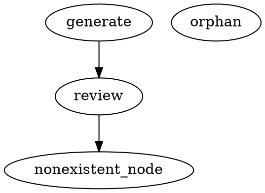
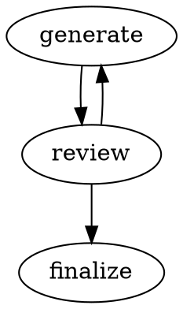

# Getting Started with Attractor: Run Your First LLM Pipeline

**What you'll learn**: By the end of this tutorial, you'll have installed Attractor,
defined a pipeline as a GraphViz DOT file, run it against a real LLM, and understood
what the output means. You'll also know how to validate a pipeline before running it
and how to resume one that was interrupted.

**Time required**: 30 minutes
**Prerequisites**: A terminal on macOS or Linux, Python 3.11 or newer, and an API key
for at least one provider (Anthropic, OpenAI, or Google Gemini).

---

## What You'll Build

You'll define and run three pipelines, each more capable than the last:

1. A single-node pipeline that asks an LLM to write a "Hello, World" Python script.
2. A validated pipeline, so you understand what Attractor checks before it executes.
3. A three-node pipeline that generates code, reviews it, and finalizes the output —
   with automatic routing based on whether the review passes.

Every pipeline is a plain-text `.dot` file. Attractor reads it, walks the graph node
by node, and sends each node's `prompt` to the LLM through the coding agent. The
agent can read files, write files, and run shell commands — it does real work, not
mock work.

---

## Before We Start

### Step 0: Check your Python version

```bash
python3 --version
# Expected output: Python 3.11.x  (or 3.12 / 3.13)
```

If you see `Python 3.10` or earlier, install a newer version with
`brew install python@3.13` (macOS) or your system package manager, then come back.

### Step 0b: Set your API key

Attractor reads API keys from environment variables. Export the key for whichever
provider you have access to:

```bash
# Anthropic (Claude models)
export ANTHROPIC_API_KEY="sk-ant-..."

# OpenAI (GPT models)
export OPENAI_API_KEY="sk-..."

# Google (Gemini models)
export GOOGLE_API_KEY="AIza..."
```

You only need one. Add the line to your `~/.zshrc` or `~/.bashrc` to make it
permanent, or place it in a `.env` file in your project directory (Attractor loads
`.env` automatically).

**Checkpoint**: Run `echo $ANTHROPIC_API_KEY` (or whichever key you set). You should
see a non-empty string. If you see nothing, the export did not take effect.

---

## Step 1: Install Attractor

Create a working directory and install Attractor into a virtual environment.

```bash
mkdir attractor-tutorial && cd attractor-tutorial
```

**With uv (recommended — much faster):**

```bash
uv venv
source .venv/bin/activate
uv pip install attractor
```

**Without uv:**

```bash
python3 -m venv .venv
source .venv/bin/activate
pip install attractor
```

Verify the install worked:

```bash
attractor --help
```

Expected output:

```
Usage: attractor [OPTIONS] COMMAND [ARGS]...

  Attractor — a non-interactive coding agent for software factories.

Options:
  --version  Show the version and exit.
  --help     Show this message and exit.

Commands:
  resume    Resume a pipeline from a checkpoint file.
  run       Execute a pipeline from a DOT file.
  validate  Validate a pipeline DOT file without executing it.
```

**Checkpoint**: You see the three subcommands listed above. If you see
`command not found: attractor`, make sure the virtual environment is activated
(`source .venv/bin/activate`).

---

## Step 2: Your First Pipeline — One Node

A pipeline is a GraphViz DOT file. Each node in the graph becomes a step that
Attractor executes. The simplest possible pipeline has one node and no edges.

Create a file called `hello.dot`:

```dot
digraph hello_pipeline {
    start [
        handler="codergen"
        prompt="Write a Python script named hello.py that prints 'Hello, Attractor!' and save it to disk."
        start=true
        terminal=true
    ]
}
```



What this file says:

- `digraph hello_pipeline` — the pipeline is named `hello_pipeline`.
- `start` — the node name. Because it is also named `"start"`, Attractor recognizes
  it as the entry point automatically (or you can use the `start=true` attribute
  explicitly, as shown here).
- `handler="codergen"` — use the built-in coding agent to execute this node.
- `prompt="..."` — the instruction passed to the LLM.
- `terminal=true` — this is the last node; stop the pipeline here.

Run the pipeline. Replace `claude-opus-4-6` with a model name that matches your API
key:

```bash
# Anthropic
attractor run hello.dot --model claude-opus-4-6 --verbose

# OpenAI
attractor run hello.dot --model gpt-4o --verbose

# Gemini
attractor run hello.dot --model gemini-2.0-flash --verbose
```

You will see structured log output as the agent works. When it finishes, Attractor
prints a "Final Context" table:

```
Running pipeline: hello_pipeline
INFO  Executing node 'start' (handler: codergen)
...
Pipeline completed.
              Final Context
┌──────────────────────────┬─────────────────────────────┐
│ Key                      │ Value                       │
├──────────────────────────┼─────────────────────────────┤
│ _completed_nodes         │ ['start']                   │
│ last_codergen_output     │ I've created hello.py ...   │
└──────────────────────────┴─────────────────────────────┘
```

**What just happened**: Attractor parsed `hello.dot`, sent the prompt to the LLM via
the coding agent, and the agent wrote `hello.py` to your working directory.

**Checkpoint**: Run `python3 hello.py`. You should see:

```
Hello, Attractor!
```

If `hello.py` does not exist, check the terminal output for errors. The most common
cause is a missing or invalid API key.

---

## Step 3: Validate a Pipeline Before Running It

Attractor can check a DOT file for structural problems without executing it. This is
useful before committing a pipeline to a repository or before running a long job.

```bash
attractor validate hello.dot
```

Expected output when the pipeline is valid:

```
Pipeline is valid.
```

Now try the strict flag, which also treats warnings as errors:

```bash
attractor validate hello.dot --strict
```

If the pipeline passes both checks, you'll see the same green message and exit code
zero. Let's deliberately introduce a problem so you can see what validation failure
looks like. Create a broken file called `broken.dot`:



This pipeline has three problems: `review` uses an unknown handler type
(`badhandler`), an edge targets a node that does not exist (`nonexistent_node`),
and `orphan` is unreachable from the start.

```bash
attractor validate broken.dot
```

Expected output:

```
                   Validation Results
┌─────────┬────────────────────────┬───────────────────────────────────────┐
│ Level   │ Location               │ Message                               │
├─────────┼────────────────────────┼───────────────────────────────────────┤
│ ERROR   │ review                 │ Unknown handler type 'badhandler'     │
│ ERROR   │ review -> nonexistent  │ Edge target 'nonexistent_node'...     │
│ WARNING │ orphan                 │ Node is unreachable from start        │
└─────────┴────────────────────────┴───────────────────────────────────────┘
```

Errors cause a non-zero exit code and block execution. Warnings are reported but do
not block execution unless you pass `--strict`.

**Checkpoint**: Running `attractor validate hello.dot` returns exit code zero. Confirm
with `echo $?` immediately after — it should print `0`.

---

## Step 4: A Multi-Node Pipeline with Condition Routing

Real workflows have multiple steps. This pipeline generates a Python script, asks the
LLM to review it, and then routes based on whether the review passed:

- If the review passes, execution moves to a `finalize` node.
- If the review fails, execution loops back to `generate` for another attempt.

Create `review_pipeline.dot`:



Key things to notice:

- Each node has its own `prompt`.
- Edges have `condition` attributes. Attractor evaluates them against the shared
  pipeline context. The `last_codergen_output` key is automatically set by the
  `codergen` handler after each node completes.
- `priority=1` means that edge is evaluated first. The first condition that evaluates
  to `true` wins.
- The `finalize` node has `terminal=true`, so the pipeline stops there.

Run it:

```bash
attractor run review_pipeline.dot --model claude-opus-4-6 --verbose
```

Watch the log output. You will see the engine move from `generate` to `review`, then
evaluate the condition on the outgoing edges, and route to `finalize` or back to
`generate` depending on the LLM's response.

Expected final output when the review passes on the first try:

```
Pipeline completed.
              Final Context
┌──────────────────────────┬──────────────────────────────────────┐
│ Key                      │ Value                                │
├──────────────────────────┼──────────────────────────────────────┤
│ _completed_nodes         │ ['generate', 'review', 'finalize']  │
│ last_codergen_output     │ I've written a short summary to ...  │
└──────────────────────────┴──────────────────────────────────────┘
```

**Checkpoint**: `add.py` and `summary.txt` both exist in your working directory. Open
them to confirm the LLM did real work.

---

## Step 5: Understanding the Final Context Table

Every time a pipeline completes, Attractor prints the Final Context table. This is
the shared "blackboard" that all nodes read from and write to during execution.

Here is what the keys mean:

| Key | Set by | Meaning |
|---|---|---|
| `last_codergen_output` | `codergen` handler | The text response from the LLM at the most recent `codergen` node. |
| `_completed_nodes` | Engine | Ordered list of node names that finished successfully. |
| `_last_error` | Engine | The error message from the most recent failed node (if any). |
| `_failed_node` | Engine | The name of the node that last failed (if any). |

Keys starting with `_` are internal engine keys. Your own pipeline conditions and
prompts should reference the non-underscore keys by their bare names (for example,
`last_codergen_output == 'PASS'`).

The table is truncated at 200 characters per value to keep it readable. Long outputs
from the agent are stored in full in the checkpoint file.

---

## Step 6: Resuming from a Checkpoint

Attractor saves a checkpoint file after each node completes. If a pipeline is
interrupted — by a network error, a rate limit, or you pressing Ctrl+C — you can
resume from where it left off instead of starting over.

Checkpoints are saved to `.attractor/checkpoints/` by default. Each file is named
`checkpoint_{timestamp_ms}.json`.

```bash
ls .attractor/checkpoints/
# checkpoint_1708432100123.json
# checkpoint_1708432115456.json
# ...
```

Each file captures the pipeline name, the node that was current when the checkpoint
was written, the full context, and the list of completed nodes.

To resume from the latest checkpoint:

```bash
attractor resume .attractor/checkpoints/checkpoint_1708432115456.json \
    --pipeline-dot review_pipeline.dot \
    --verbose
```

Replace the filename with an actual file from your checkpoints directory.

Attractor will print:

```
Resuming pipeline: review_pipeline from node 'review'
INFO  Executing node 'review' (handler: codergen)
...
Pipeline completed.
```

**Checkpoint**: After a successful resume, the Final Context table shows all
previously completed nodes in `_completed_nodes`, plus any newly completed nodes
appended to the list.

The `--pipeline-dot` flag is required because the checkpoint stores only the
execution state, not the full pipeline definition. Keep your `.dot` files alongside
your checkpoints.

---

## What You've Accomplished

You have:

- Installed Attractor and verified the CLI works.
- Defined a single-node pipeline as a GraphViz DOT file and ran it against a real
  LLM, producing an actual file on disk.
- Used `attractor validate` to check a pipeline for structural errors before running
  it.
- Built a three-node pipeline with condition-based routing between nodes.
- Read and interpreted the Final Context table that Attractor prints after every run.
- Used `attractor resume` to pick up a pipeline from its last checkpoint.

---

## Next Steps

You now have the foundation to build real automation pipelines. Here is where to go
from here:

- **Solve specific problems**: See [How-to Guides](../how-to/common-tasks.md) for
  tasks like adding a custom handler, using the `tool` handler to run shell commands,
  using context interpolation in prompts, and configuring retry policies.
- **Look up CLI flags and DOT attributes**: Browse the
  [Reference Documentation](../reference/api-reference.md) for the complete list of
  node attributes, edge attributes, handler types, and CLI options.
- **Understand how Attractor works inside**: Read
  [Explanation: Architecture](../explanation/architecture.md) to learn why the
  pipeline is a DAG, how the agent loop operates, and how the LLM client routes
  between providers.

---

## Troubleshooting

**Problem**: `attractor: command not found`
**Solution**: The virtual environment is not active. Run `source .venv/bin/activate`
and try again.

**Problem**: `No provider adapter found for model 'claude-opus-4-6'`
**Solution**: The environment variable for that provider is not set. Run
`echo $ANTHROPIC_API_KEY` to confirm it is exported. If it is empty, re-export it in
the current shell session.

**Problem**: The pipeline completes but `hello.py` (or `add.py`) does not exist.
**Solution**: The agent may have encountered a permission error or interpreted the
prompt differently. Run with `--verbose` and look for error lines in the output.
Check the `_last_error` key in the Final Context table.

**Problem**: The `review` node always routes back to `generate` in an infinite loop.
**Solution**: The LLM is not responding with exactly `PASS` or `FAIL`. Add
`--verbose` to see the raw output. Refine the review prompt to make the required
response format more explicit — for example, add the instruction "Your entire
response must be a single word with no punctuation or extra text." Condition
expressions support `==`, `!=`, `<`, `>`, `<=`, `>=`, `and`, `or`, and `not`. There
is no `in` operator; conditions must use exact equality (`== 'PASS'`).

**Problem**: `Failed to parse pipeline: No start node found`
**Solution**: Either add `start=true` to one node's attributes, or name one of your
nodes `start`. Both methods work.

**Problem**: `Failed to load checkpoint`
**Solution**: The checkpoint file may be from a different pipeline version. Pass the
correct `.dot` file with `--pipeline-dot` and verify the node names in the checkpoint
match the current pipeline definition.

For more troubleshooting guidance, see [How-to Guides](../how-to/common-tasks.md).
