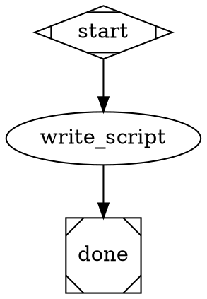
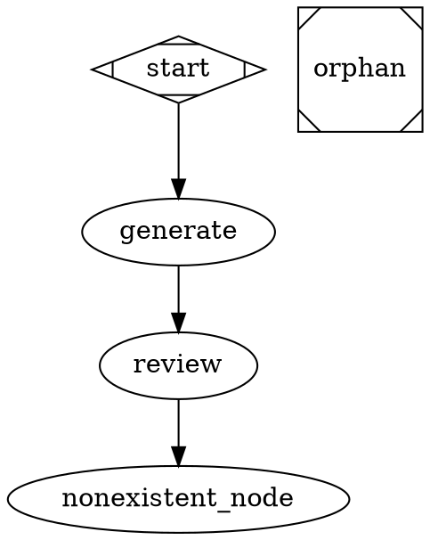
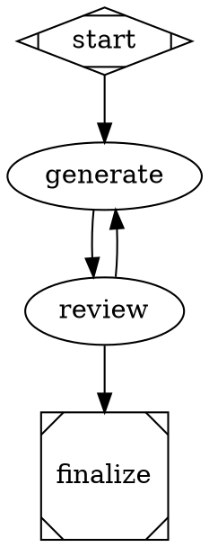
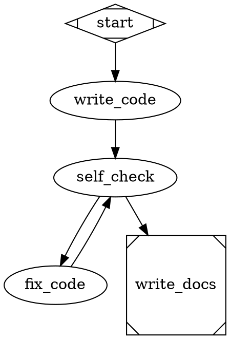

# Getting Started with Attractor: Run Your First LLM Pipeline

**What you'll learn**: By the end of this tutorial, you'll have installed Attractor,
defined a pipeline as a GraphViz DOT file, run it against a real LLM, and understood
what the output means. You'll also know how to validate a pipeline before running it
and how to resume one that was interrupted.

**Time required**: 30 minutes
**Prerequisites**: A terminal on macOS or Linux, Python 3.11 or newer, and an API key
for at least one provider (Anthropic, OpenAI, or Google Gemini).

---

## What You'll Build

You'll define and run three pipelines, each more capable than the last:

1. A single-node pipeline that asks an LLM to write a Python script and save it to disk.
2. A validated pipeline, so you understand what Attractor checks before it executes.
3. A three-node pipeline that generates code, reviews it, and routes based on whether
   the review passes — demonstrating real conditional branching.

Every pipeline is a plain-text `.dot` file. Attractor reads it, walks the graph node
by node, and sends each node's `prompt` to the LLM through the coding agent. The
agent can read files, write files, and run shell commands — it does real work, not
mock work.

---

## Before We Start

### Check Your Python Version

```bash
python3 --version
# Expected output: Python 3.11.x  (or 3.12 / 3.13)
```

If you see `Python 3.10` or earlier, install a newer version with
`brew install python@3.13` (macOS) or your system package manager, then come back.

### Set Your API Key

Attractor reads API keys from environment variables. Export the key for whichever
provider you have access to:

```bash
# Anthropic (Claude models)
export ANTHROPIC_API_KEY="sk-ant-..."

# OpenAI (GPT models)
export OPENAI_API_KEY="sk-..."

# Google (Gemini models)
export GOOGLE_API_KEY="AIza..."
```

You only need one. Add the line to your `~/.zshrc` or `~/.bashrc` to make it
permanent, or place it in a `.env` file in your project directory (Attractor loads
`.env` automatically).

**Checkpoint**: Run `echo $ANTHROPIC_API_KEY` (or whichever key you set). You should
see a non-empty string. If you see nothing, the export did not take effect — close and
reopen your terminal, then re-run the export command.

---

## Step 1: Install Attractor

Create a working directory and install Attractor into a virtual environment.

```bash
mkdir attractor-tutorial && cd attractor-tutorial
```

**With uv (recommended — much faster):**

```bash
uv venv
source .venv/bin/activate
uv pip install attractor
```

**Without uv:**

```bash
python3 -m venv .venv
source .venv/bin/activate
pip install attractor
```

Verify the install worked:

```bash
attractor --help
```

Expected output:

```
Usage: attractor [OPTIONS] COMMAND [ARGS]...

  Attractor — a non-interactive coding agent for software factories.

Options:
  --version  Show the version and exit.
  --help     Show this message and exit.

Commands:
  resume    Resume a pipeline from a checkpoint file.
  run       Execute a pipeline from a DOT file.
  validate  Validate a pipeline DOT file without executing it.
```

**Checkpoint**: You see the three subcommands listed above. If you see
`command not found: attractor`, make sure the virtual environment is activated
(`source .venv/bin/activate`) and try again.

---

## Step 2: Your First Pipeline — One Node

A pipeline is a GraphViz DOT file. Each node in the graph becomes a step that
Attractor executes. The simplest possible pipeline has one start node and one exit
node connected by an edge.

Create a file called `hello.dot`:



What this file says:

- `digraph hello_pipeline` — the pipeline is named `hello_pipeline`.
- `start [shape=Mdiamond]` — the diamond shape marks this as the entry point. Attractor
  detects the start node either by `shape=Mdiamond` or by the node being named `start`
  (case-insensitive). Both are true here, which is fine.
- `type="codergen"` — use the built-in coding agent to execute this node. This is the
  attribute name the parser recognizes. Do not use `handler=` — it will be ignored.
- `prompt="..."` — the instruction passed to the LLM.
- `done [shape=Msquare]` — the square shape marks this as a terminal node. Attractor
  stops after completing a terminal node.

Run the pipeline. Replace `claude-opus-4-6` with a model name that matches your API
key:

```bash
# Anthropic
attractor run hello.dot --model claude-opus-4-6 --verbose

# OpenAI
attractor run hello.dot --model gpt-4o --verbose

# Gemini
attractor run hello.dot --model gemini-2.0-flash --verbose
```

You will see structured log output as the agent works. When it finishes, Attractor
prints a summary:

```
Running pipeline: hello_pipeline
INFO  Executing node 'start' (handler: start)
INFO  Executing node 'write_script' (handler: codergen)
...
Pipeline completed.
              Final Context
┌──────────────────────────┬─────────────────────────────┐
│ Key                      │ Value                       │
├──────────────────────────┼─────────────────────────────┤
│ _completed_nodes         │ ['start', 'write_script',   │
│                          │  'done']                    │
│ last_codergen_output     │ I've created hello.py ...   │
└──────────────────────────┴─────────────────────────────┘
```

**What just happened**: Attractor parsed `hello.dot`, walked from `start` to
`write_script`, sent the prompt to the LLM via the coding agent, and the agent wrote
`hello.py` to your working directory. Then the engine advanced to `done`, recognized
it as terminal, and stopped.

**Checkpoint**: Run `python3 hello.py`. You should see:

```
Hello, Attractor!
```

If `hello.py` does not exist, check the terminal output for errors. The most common
cause is a missing or invalid API key (see Troubleshooting at the end of this tutorial).

---

## Step 3: Validate a Pipeline Before Running It

Attractor can check a DOT file for structural problems without executing it. This is
useful before committing a pipeline to a repository or before running a long job.

```bash
attractor validate hello.dot
```

Expected output when the pipeline is valid:

```
Pipeline is valid.
```

Now try the strict flag, which also treats warnings as errors:

```bash
attractor validate hello.dot --strict
```

If the pipeline passes both checks, you'll see the same message and exit code zero.
Let's deliberately introduce a problem so you can see what a validation failure looks
like. Create a broken file called `broken.dot`:



This pipeline has three problems: `review` uses an unknown handler type
(`badhandler`), an edge targets a node that does not exist (`nonexistent_node`),
and `orphan` is unreachable from `start`.

```bash
attractor validate broken.dot
```

Expected output:

```
                   Validation Results
┌─────────┬────────────────────────┬───────────────────────────────────────┐
│ Level   │ Location               │ Message                               │
├─────────┼────────────────────────┼───────────────────────────────────────┤
│ ERROR   │ review                 │ Unknown handler type 'badhandler'     │
│ ERROR   │ review -> nonexistent  │ Edge target 'nonexistent_node'...     │
│ WARNING │ orphan                 │ Node is unreachable from start        │
└─────────┴────────────────────────┴───────────────────────────────────────┘
```

Errors cause a non-zero exit code and block execution. Warnings are reported but do
not block execution unless you pass `--strict`.

**Checkpoint**: Running `attractor validate hello.dot` returns exit code zero. Confirm
with `echo $?` immediately after — it should print `0`.

---

## Step 4: Understanding the Context (the Blackboard)

Before building a branching pipeline, you need to understand how Attractor passes
information between nodes.

Every pipeline has a shared **context** — a key-value store that all nodes can read
from and write to. Think of it as a whiteboard in the room where all the nodes meet.
When a node finishes, it can write values to the context. The next node can read those
values via prompt interpolation, and edges can read those values in their conditions.

Here is a quick reference for the keys you'll see most often:

| Key | Set by | Meaning |
|---|---|---|
| `last_codergen_output` | `codergen` handler | The text response from the LLM at the most recent `codergen` node. |
| `_completed_nodes` | Engine | Ordered list of node names that finished successfully. |
| `_last_error` | Engine | The error message from the most recent failed node, if any. |
| `_failed_node` | Engine | The name of the node that last failed, if any. |

Keys starting with `_` are internal engine keys. Your pipeline conditions and prompts
reference the non-underscore keys by their bare names.

**Prompt interpolation**: Within a node's `prompt` attribute, use `{key}` to insert a
context value. For example, `prompt="The previous result was: {last_codergen_output}"`
will have the value substituted at execution time.

**Edge conditions**: Conditions reference context keys by bare name with no `$` or `{}`
wrapping. The condition language supports only `=`, `!=`, and `&&`. It does not
support `==`, `<`, `>`, `<=`, `>=`, `and`, `or`, or `not`. This is intentional —
conditions are kept deliberately simple.

---

## Step 5: A Multi-Node Pipeline with Condition Routing

Real workflows have multiple steps and make decisions. This pipeline generates a Python
function, asks the LLM to review it, and then routes based on whether the review
passed:

- If the review passes, execution moves to a `finalize` node.
- If the review fails, execution loops back to `generate` for another attempt.

Create `review_pipeline.dot`:



Key things to notice:

- Each node has its own `prompt`.
- The `review` node instructs the LLM to respond with a single word so that the
  condition check is reliable.
- Edges have `condition` attributes. Attractor evaluates them against the pipeline
  context. `last_codergen_output` is automatically set by the `codergen` handler.
- The condition operator is `=` (single equals), not `==`. Using `==` will cause a
  parse error.
- `weight=2` means that edge has higher priority. Outgoing edges are sorted by weight
  (higher number = evaluated first). When no weight is set, edges have equal priority
  and Attractor picks the first matching one.
- `finalize` uses both `type="codergen"` and `shape=Msquare` to be both a codergen
  node and a terminal node.

Run it:

```bash
attractor run review_pipeline.dot --model claude-opus-4-6 --verbose
```

Watch the log output. You will see the engine move from `start` to `generate` to
`review`, evaluate the conditions on the outgoing edges, and route to `finalize` or
back to `generate` depending on the LLM's response.

Expected final output when the review passes on the first try:

```
Pipeline completed.
              Final Context
┌──────────────────────────┬──────────────────────────────────────────────┐
│ Key                      │ Value                                        │
├──────────────────────────┼──────────────────────────────────────────────┤
│ _completed_nodes         │ ['start', 'generate', 'review', 'finalize'] │
│ last_codergen_output     │ I've written a short summary to ...          │
└──────────────────────────┴──────────────────────────────────────────────┘
```

**Checkpoint**: Both `add.py` and `summary.txt` exist in your working directory. Open
them to confirm the LLM did real work. Run `python3 -c "from add import add; print(add(2, 3))"` — it should print `5`.

---

## Step 6: Resuming from a Checkpoint

Attractor saves a checkpoint file after each node completes. If a pipeline is
interrupted — by a network error, a rate limit, or pressing Ctrl+C — you can resume
from where it left off instead of starting over.

Checkpoints are saved to `.attractor/checkpoints/` by default. Each file is named
`checkpoint_{timestamp_ms}.json`.

```bash
ls .attractor/checkpoints/
# checkpoint_1708432100123.json
# checkpoint_1708432115456.json
```

Each file captures the pipeline name, the node that was current when the checkpoint
was written, the full context, and the list of completed nodes.

To resume from a checkpoint:

```bash
attractor resume .attractor/checkpoints/checkpoint_1708432115456.json \
    --pipeline-dot review_pipeline.dot \
    --verbose
```

Replace the filename with an actual file from your checkpoints directory.

Attractor will pick up from the last completed node:

```
Resuming pipeline: review_pipeline from node 'review'
INFO  Executing node 'review' (handler: codergen)
...
Pipeline completed.
```

**Checkpoint**: After a successful resume, the Final Context table shows all
previously completed nodes in `_completed_nodes`, plus any newly completed nodes
appended to the list.

The `--pipeline-dot` flag is required because the checkpoint stores only the
execution state, not the full pipeline definition. Keep your `.dot` files alongside
your checkpoints.

---

## Step 7: A Complete Branching Pipeline — Putting It All Together

Now that you know all the pieces, here is a more complete pipeline that combines
everything: start/exit nodes, codergen nodes, prompt interpolation, and conditional
routing with weighted edges.

This pipeline writes a utility script, runs a self-check, and then either finalizes
or retries based on the outcome.

Create `full_pipeline.dot`:



New things in this pipeline:

- `fix_code` uses prompt interpolation: `{last_codergen_output}` will be replaced with
  the actual output from the `self_check` node at runtime, so the LLM knows what went
  wrong.
- The edge from `self_check` to `write_docs` has `weight=2` (higher priority), so it
  is evaluated first. The edge to `fix_code` has `weight=1`.
- `fix_code` loops back to `self_check`, creating a retry cycle. The pipeline only
  exits when the self-check passes.

Validate it first, then run it:

```bash
attractor validate full_pipeline.dot --strict
attractor run full_pipeline.dot --model claude-opus-4-6 --verbose
```

**Checkpoint**: When the pipeline completes, `calculator.py` and `README.md` both
exist. The `_completed_nodes` list in the Final Context includes `write_docs`.

---

## What You've Accomplished

- Installed Attractor and verified the CLI works.
- Defined a single-node pipeline as a GraphViz DOT file and ran it against a real LLM,
  producing an actual file on disk.
- Used `attractor validate` to check a pipeline for structural errors before running it,
  and saw what failure output looks like.
- Learned the DOT attribute names the parser actually recognizes: `type="codergen"`,
  `shape=Mdiamond` (start), `shape=Msquare` (terminal), `weight=` (edge priority), and
  `condition=` with the `=` operator.
- Understood the context (blackboard) and how nodes share information through it.
- Built a multi-node pipeline with condition-based routing and weighted edges.
- Used `attractor resume` to pick up a pipeline from its last checkpoint.
- Built a complete pipeline that combines prompt interpolation, retry loops, and exit
  conditions.

---

## Next Steps

You now have the foundation to build real automation pipelines. Here is where to go
from here:

- **Solve specific problems**: See [How-to Guides](../how-to/common-tasks.md) for tasks
  like adding a custom handler, using context interpolation in prompts, and configuring
  retry policies.
- **Look up CLI flags and DOT attributes**: Browse the
  [Reference Documentation](../reference/api-reference.md) for the complete list of
  node attributes (`model`, `temperature`, `max_tokens`, `max_retries`, `timeout`),
  edge attributes, handler types, and CLI options.
- **Understand how Attractor works inside**: Read
  [Explanation: Architecture](../explanation/architecture.md) to learn why the pipeline
  is a DAG, how the agentic loop operates, and how the LLM client routes between
  providers.

---

## Troubleshooting

**Problem**: `attractor: command not found`
**Solution**: The virtual environment is not active. Run `source .venv/bin/activate`
and try again. You need to activate the environment in every new terminal session.

**Problem**: `No provider adapter found for model 'claude-opus-4-6'`
**Solution**: The environment variable for that provider is not set. Run
`echo $ANTHROPIC_API_KEY` to confirm it is exported. If it is empty, re-export it in
the current shell session and try again.

**Problem**: The pipeline completes but `hello.py` (or `add.py`) does not exist.
**Solution**: The agent may have encountered a permission error or interpreted the
prompt differently. Run with `--verbose` and look for error lines in the output.
Check the `_last_error` key in the Final Context table.

**Problem**: The `review` node always routes back to `generate` in an infinite loop.
**Solution**: The LLM is not responding with exactly `PASS` or `FAIL`. Add `--verbose`
to see the raw output. Refine the review prompt to make the required response format
more explicit — for example: "Your entire response must be a single word with no
punctuation, no explanation, and no extra text. The word must be either PASS or FAIL."
Condition expressions only support `=`, `!=`, and `&&`. There is no fuzzy matching;
conditions require exact equality.

**Problem**: `ParseError: unexpected token '=='` or similar condition parse error.
**Solution**: The condition language uses single `=`, not `==`. Change `condition="x == y"`
to `condition="x = y"`. The operators `<`, `>`, `<=`, `>=`, `and`, `or`, and `not` are
also not supported — use only `=`, `!=`, and `&&`.

**Problem**: `Failed to parse pipeline: No start node found`
**Solution**: Add `shape=Mdiamond` to one node's attributes, or name one of your nodes
`start` (case-insensitive). Both methods work. Do not use `start=true` — that attribute
is not recognized by the parser.

**Problem**: `Failed to load checkpoint`
**Solution**: The checkpoint file may be from a different pipeline version. Pass the
correct `.dot` file with `--pipeline-dot` and verify the node names in the checkpoint
match the current pipeline definition.

For more troubleshooting guidance, see [How-to Guides](../how-to/common-tasks.md).
