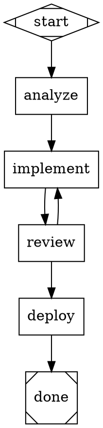

# Context Fidelity Modes — Spec Compliance Gap

## Status: Not Implemented

This document describes the context fidelity system required by the attractor
specification. Fidelity controls how much prior conversation state is carried
into each node's LLM session, managing context window usage across the pipeline.

---

## Overview

When a pipeline transitions between nodes, the engine must decide how much
context to carry forward. The fidelity mode determines whether the next node
reuses an existing LLM session (with full history) or starts fresh with a
constructed summary of varying detail.

This is critical for long pipelines where accumulated context would exceed the
model's context window.

---

## Fidelity Modes

| Mode | Session | Scope | Token Budget | Description |
|------|---------|-------|--------------|-------------|
| `full` | Reused (same thread) | Complete history | Unbounded | Preserves full conversation; uses compaction internally |
| `truncate` | Fresh | Minimal | Minimal | Only graph goal and run ID; nearly empty context |
| `compact` | Fresh | Structured summary | Moderate | Bullet-point summary of completed stages and outcomes |
| `summary:low` | Fresh | Brief text | ~600 tokens | Minimal event counts and stage names |
| `summary:medium` | Fresh | Moderate detail | ~1500 tokens | Recent outcomes, active context, notable events |
| `summary:high` | Fresh | Comprehensive | ~3000 tokens | Full context snapshot, tool call summaries |

### Mode Details

#### `full`

The LLM session is reused across nodes that share the same thread. The
conversation history grows unboundedly. Internal compaction (if supported by the
provider) may reduce history, but the logical session persists.

Use for tightly coupled stages where later nodes need to reference earlier
conversation turns (e.g., iterative code review → fix cycles).

#### `truncate`

A fresh session is started with almost no prior context. The preamble contains
only:

```
Pipeline: {pipeline_name}
Goal: {graph.goal}
Run ID: {run_id}
Current stage: {node.name}
```

Use for independent stages that should not be influenced by prior context.

#### `compact`

A fresh session is started with a structured bullet-point summary:

```
## Pipeline State

- Pipeline: {pipeline_name}
- Goal: {graph.goal}
- Completed stages: start (success), code_analysis (success), implement (partial_success)
- Current stage: review
- Key context values:
  - files_changed: ["src/auth.py", "src/login.py"]
  - test_results: "14 passed, 2 failed"
```

This is the **system default** when no fidelity is explicitly configured.

#### `summary:low`

Minimal summary (~600 tokens):

```
Pipeline "{name}" stage {n} of {total}. Goal: {goal}.
Completed: {stage_names}. Last outcome: {outcome}.
```

#### `summary:medium`

Moderate summary (~1500 tokens):

```
## Pipeline Progress

Pipeline: {name}
Goal: {goal}
Stage: {current} ({n}/{total})

### Recent Activity
- {stage_1}: {outcome} — {notes_excerpt}
- {stage_2}: {outcome} — {notes_excerpt}

### Active Context
- key1: value1
- key2: value2
```

#### `summary:high`

Comprehensive summary (~3000 tokens):

```
## Pipeline State (Comprehensive)

Pipeline: {name}
Goal: {goal}
Stage: {current} ({n}/{total})

### Execution History
- {stage_1}: {outcome} — {full_notes}
  Tools used: {tool_list}
  Duration: {elapsed}
- {stage_2}: {outcome} — {full_notes}
  ...

### Full Context
{json_formatted_context}

### Retry Information
- {node}: {retry_count}/{max_retries}
```

---

## Resolution Precedence

Fidelity is resolved in strict order. The first non-null value wins:

1. **Edge `fidelity` attribute** — on the incoming edge that was traversed
2. **Target node `fidelity` attribute** — on the node about to execute
3. **Graph `default_fidelity` attribute** — pipeline-wide default
4. **System default** — `compact`

```python
def resolve_fidelity(
    edge: PipelineEdge | None,
    node: PipelineNode,
    pipeline: Pipeline,
) -> str:
    if edge and edge.fidelity:
        return edge.fidelity
    if node.fidelity:
        return node.fidelity
    if pipeline.default_fidelity:
        return pipeline.default_fidelity
    return "compact"
```

---

## Thread Resolution (for `full` Fidelity)

When fidelity resolves to `full`, the engine must determine which thread
(LLM session) to use. Nodes sharing the same thread key reuse the same session.

Resolution order:

1. **Target node `thread_id` attribute**
2. **Edge `thread_id` attribute**
3. **Graph-level default thread** (if any)
4. **Derived class from enclosing subgraph** (subgraph label as class name)
5. **Fallback: previous node name**

```python
def resolve_thread_id(
    edge: PipelineEdge | None,
    node: PipelineNode,
    pipeline: Pipeline,
    prev_node_name: str,
) -> str:
    if node.thread_id:
        return node.thread_id
    if edge and edge.thread_id:
        return edge.thread_id
    # Graph-level default thread would be a pipeline attribute
    # Subgraph-derived class from node.classes
    if node.classes:
        return node.classes[0]
    return prev_node_name
```

### Thread Session Storage

The engine maintains a mapping of thread IDs to active LLM sessions:

```python
# In PipelineEngine
_thread_sessions: dict[str, Session] = {}

def _get_or_create_session(self, thread_id: str, node: PipelineNode) -> Session:
    if thread_id in self._thread_sessions:
        return self._thread_sessions[thread_id]
    session = Session(model=node.llm_model, ...)
    self._thread_sessions[thread_id] = session
    return session
```

---

## Resume Behavior

When resuming from a checkpoint:

- In-memory LLM sessions (`full` fidelity threads) **cannot be serialized**.
- On resume, if the previous node used `full` fidelity, the **first resumed
  node** degrades to `summary:high`.
- After this single degraded hop, subsequent nodes may use `full` fidelity
  again (creating new thread sessions).

```python
def _fidelity_on_resume(self, resolved: str, is_first_after_resume: bool) -> str:
    if is_first_after_resume and resolved == "full":
        return "summary:high"  # degrade because session can't be restored
    return resolved
```

---

## Summary Construction

For all non-`full` modes, the engine constructs a text preamble injected into
the system prompt or first user message of the fresh LLM session.

### Interface

```python
def build_fidelity_preamble(
    mode: str,
    pipeline: Pipeline,
    context: PipelineContext,
    completed_nodes: list[str],
    current_node: str,
    logs: list[dict[str, Any]],
) -> str:
    """Build the context preamble for the given fidelity mode.

    Returns a markdown-formatted string to prepend to the node's prompt.
    """
```

### Token Budgets

The summary builder should respect approximate token budgets:

| Mode | Target Tokens | Truncation Strategy |
|------|---------------|---------------------|
| `truncate` | ~100 | Only goal + stage name |
| `compact` | ~500 | Bullet points, recent stages only |
| `summary:low` | ~600 | Stage names, counts, last outcome |
| `summary:medium` | ~1500 | Recent outcomes, key context values |
| `summary:high` | ~3000 | Full history, context dump, tool summaries |

When the constructed summary exceeds the budget, truncate from the oldest
entries first (keep recent activity).

---

## Implementation Requirements

### New Module: `fidelity.py`

Create `src/attractor/pipeline/fidelity.py` with:

1. `resolve_fidelity(edge, node, pipeline) -> str`
2. `resolve_thread_id(edge, node, pipeline, prev_node) -> str`
3. `build_fidelity_preamble(mode, pipeline, context, completed, current, logs) -> str`

### Engine Changes (`engine.py`)

1. After edge selection, resolve fidelity for the target node
2. If `full`, look up or create a thread session
3. If non-`full`, build a preamble and inject into the handler's context
4. On resume, degrade the first node's fidelity if it was `full`
5. Store thread sessions in `_thread_sessions` dict, keyed by thread ID

### CodergenHandler Changes (`handlers.py`)

The codergen handler needs to:

1. Read the fidelity preamble from context (e.g., `context.get("_fidelity_preamble")`)
2. Prepend it to the prompt when starting a fresh LLM session
3. When using a thread session (`full` mode), skip the preamble

### Model Changes

Already implemented — `PipelineNode.fidelity`, `PipelineNode.thread_id`,
`PipelineEdge.fidelity`, `PipelineEdge.thread_id`, and
`Pipeline.default_fidelity` are all first-class fields in the models.

---

## DOT Usage Example



In this example:
- `implement` and `review` share the `"coding"` thread — their LLM session
  persists across iterations
- `deploy` starts completely fresh with `truncate`
- `analyze` gets a moderate summary of what came before

---

## Testing Requirements

1. **Fidelity resolution precedence** — edge > node > graph > default
2. **Thread resolution precedence** — node > edge > subgraph class > prev node
3. **Preamble construction** — verify each mode produces appropriate content
4. **Token budget enforcement** — verify truncation of long histories
5. **Resume degradation** — first node after resume degrades `full` to `summary:high`
6. **Thread session reuse** — same thread_id returns same session
7. **Thread session isolation** — different thread_id creates new session
8. **DOT parsing** — fidelity and thread_id parsed from node/edge/graph attributes
