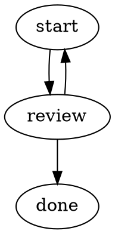

# CLAUDE.md — Pipeline Subsystem

The pipeline subsystem implements a DAG-based execution engine. Workflows are defined as GraphViz DOT files, parsed into a `Pipeline` graph, validated, and executed node-by-node with condition-based routing and checkpoint-based resumability.

## Module Map

| Module | Purpose |
|---|---|
| `models.py` | Core data structures: `Pipeline`, `PipelineNode`, `PipelineEdge`, `NodeResult`, `PipelineContext`, `Checkpoint`. |
| `engine.py` | `PipelineEngine` — walks the DAG, dispatches handlers, evaluates edges, checkpoints after each node. |
| `parser.py` | `parse_dot_file()` — reads DOT files via `pydot`, extracts nodes/edges/attributes. |
| `handlers.py` | `NodeHandler` protocol, `HandlerRegistry`, built-in `CodergenHandler`. |
| `conditions.py` | AST-based safe expression evaluator for edge conditions. No `eval`/`exec`. |
| `validator.py` | Static validation: start node, terminal nodes, handler types, edge references, reachability, cycles. |
| `state.py` | Checkpoint persistence: `save_checkpoint()`, `latest_checkpoint()`, `list_checkpoints()`. |
| `goals.py` | `GoalGate` — enforces required node completions and context conditions before terminal exit. |
| `stylesheet.py` | `ModelStylesheet` — rule-based default attributes (model, temperature, etc.) applied per-node. |
| `interviewer.py` | `Interviewer` protocol for human-in-the-loop. `CLIInterviewer` (Rich-based), `QueueInterviewer` (tests). |

## Key Patterns

- **Execution flow**: Start node → handler dispatch → context merge → edge evaluation → checkpoint → next node → repeat.
- **Edge routing**: Outgoing edges sorted by priority. First matching condition wins. Unconditional edges serve as fallback. No match on a non-terminal node is an error.
- **Condition expressions**: Evaluated via `ast.parse` — supports `==`, `!=`, `<`, `>`, `and`, `or`, `not`. Variables resolve from `PipelineContext`. No arbitrary code execution.
- **Handler override routing**: A handler can set `NodeResult.next_node` to bypass edge evaluation and force a specific next node.
- **Blackboard pattern**: `PipelineContext` is a shared key-value store. Nodes read/write context values. Internal keys prefixed with `_` (e.g., `_last_error`, `_failed_node`).
- **Terminal detection**: Nodes with `terminal=true` attribute OR no outgoing edges.
- **Start node detection**: Node with `start=true` attribute OR node named `"start"`.
- **Checkpoint naming**: `checkpoint_{timestamp_ms}.json` in the configured checkpoint directory.
- **Stylesheet cascading**: Rules match by `handler_type`, name glob, or attribute presence. Node-specific attributes always override stylesheet defaults.

## DOT File Format

Node attributes: `handler_type`, `prompt`, `model`, `temperature`, `max_tokens`, `start`, `terminal`.
Edge attributes: `condition`, `priority` (lower = higher priority).

## Adding a New Handler

1. Implement the `NodeHandler` protocol: `async execute(node, context) -> NodeResult`.
2. Register it in `HandlerRegistry` with a handler type string.
3. Add the handler type to `validator.py`'s known types set.
4. Use it in DOT files via `handler_type="your_type"`.
5. If it needs pipeline awareness, accept `pipeline` in the constructor (see `CodergenHandler`).

## Context Convention

- `_`-prefixed keys are engine-internal: `_last_error`, `_failed_node`, `_completed_nodes`, `_goal_gate_unmet`.
- User-defined keys are plain strings set by handlers via `NodeResult.context_updates`.
- Conditions reference context keys by bare name (no `$` or `{}`).
- Prompt interpolation uses `{key}` syntax within handler prompt strings.
